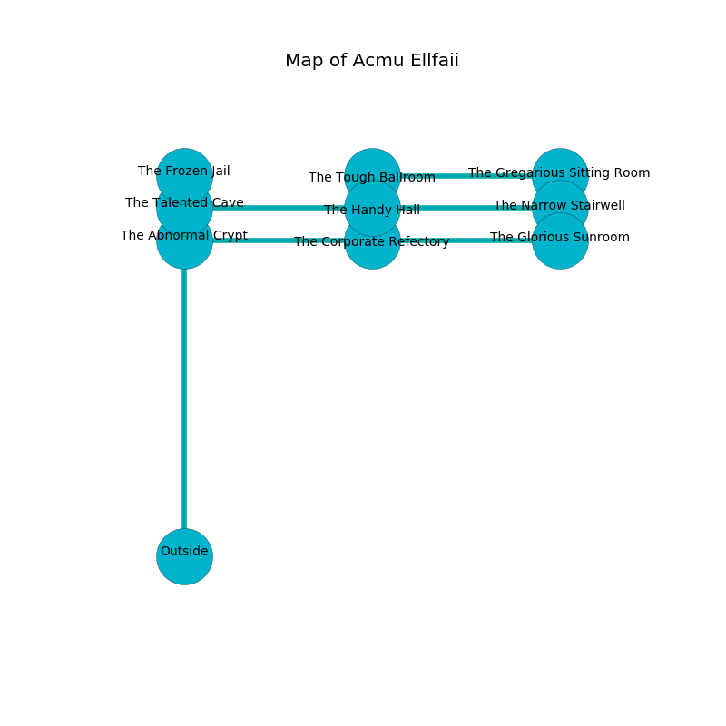

%Ruin Dogs

##Acmu Ellfaii
###Overview
Acmu Ellfaii is located in a crystal city. Some rooms of it are flooded. A battle between raiders is happening outside. It is occupied by Thri-Kreens. Granville Wadsworth The Mean, a Mind Flayer Arcanist is here. The Thri-Kreens are the slaves of Granville Wadsworth The Mean. He  is founding a new religion. 

###Artifact
####The Military Extension

The Military Extension is a powerful artifact in the shape of a glassy sphere. Psychic energy bends from it. It smells like umami. When gazed upon it illuminates its surroundings. 

###Locations

####the talented cave
There are a Sahuagin, a Mammoth, an Ettercap, and a Black Pudding here. There is a trap here. When activated, a magical proximity detector will fire an acid arrow. Blue lichens are growing in broken urns. The air tastes like leek here. 

* There is a belt here.
* There is a horse here.
* To the south is the entrance.
* To the east a torchlit opening connects to [the handy hall](#the-handy-hall).
* To the north a windy threshold opens to [the frozen jail](#the-frozen-jail).

####the handy hall
The glass walls are pristine. The floor is cluttered with broken glass. 

* To the east a flooded artery opens to [the narrow stairwell](#the-narrow-stairwell).
* To the north a flooded opening connects to [the tough ballroom](#the-tough-ballroom).
* To the west a torchlit opening opens to [the talented cave](#the-talented-cave).

####the frozen jail
The air tastes like sweet pea here. The floor is flooded with three inch deep scalding water. The obsidion walls are caving in. 

* There is a seed here.
* To the south a windy threshold leads to [the talented cave](#the-talented-cave).

####the tough ballroom
There are a Sahuagin Baron, a Lizardfolk, a Mule, an Ice Mephit, and a Wyvern here. 

* There is a bell here.
* There is a coat here.
* To the south a flooded opening connects to [the handy hall](#the-handy-hall).
* To the east a small walkway leads to [the gregarious sitting Room](#the-gregarious-sitting-Room).

####the narrow stairwell
The glass walls are scratched. 

* To the south a twisted hallway connects to [the glorious sunroom](#the-glorious-sunroom).
* To the west a flooded artery opens to [the handy hall](#the-handy-hall).

####the glorious sunroom
There are a Scarecrow, a Steam Mephit, a Quipper, an Elk, an Animated Armor, a Bugbear Chief, and a Doppelganger here. 

* [Granville Wadsworth The Mean](#Granville-Wadsworth-The-Mean) is here.
* To the north a twisted hallway connects to [the narrow stairwell](#the-narrow-stairwell).
* To the west a long passageway leads to [the corporate refectory](#the-corporate-refectory).

####the corporate refectory
The floor is bloodstained. Gray moss is sprouting in cracks in the floor. There is a trap here. When activated, a pressure plate will launch a rolling boulder. 

* [The Military Extension](#The-Military-Extension) is here.
* To the east a long passageway connects to [the glorious sunroom](#the-glorious-sunroom).
* To the west a narrow passageway opens to [the abnormal crypt](#the-abnormal-crypt).

####the gregarious sitting Room
The stone walls are pristine. 

* To the west a small walkway leads to [the tough ballroom](#the-tough-ballroom).

####the abnormal crypt
There are a Githzerai Zerth and an Intellect Devourer here. The air tastes like pineapple here. 

* To the east a narrow passageway opens to [the corporate refectory](#the-corporate-refectory).

