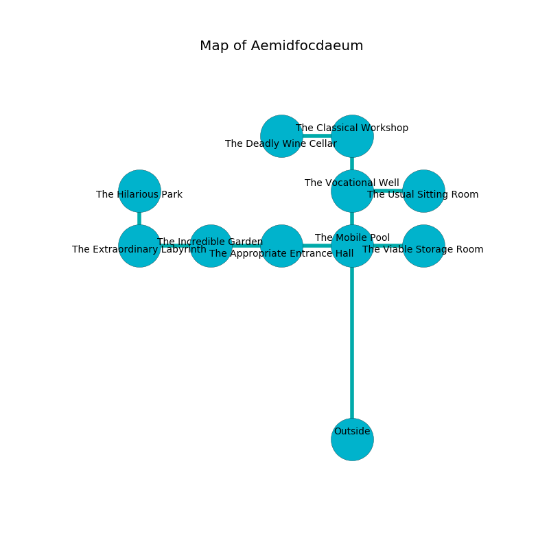

%Ruin Dogs

##Aemidfocdaeum
###Overview
Aemidfocdaeum is located under an obsidion tree. Parts of Aemidfocdaeum are incredibly cold. The ruin is flooding. It is occupied by Kenku. Burl Patino The Callous, a Cloud Giant is here. The Kenku are the soldiers of Burl Patino The Callous. He  is trying to recover [Hamafedaeum Iae](#Hamafedaeum-Iae). 

###Artifact
####Hamafedaeum Iae

Hamafedaeum Iae is a powerful artifact in the shape of a warm sphere. It smells like cologne. When eaten it become energized with a powerful vibration. 

###Locations

####the mobile pool
The floor is bloodstained. The obsidion walls are ruined. 

* To the south is the entrance.
* To the east a dark threshold leads to [the viable storage room](#the-viable-storage-room).
* To the north a narrow cave connects to [the vocational well](#the-vocational-well).
* To the west a hazy cavern leads to [the appropriate entrance hall](#the-appropriate-entrance-hall).

####the appropriate entrance hall
The mirrored walls are caving in. 

There is an engraving on the wall written in Kenku Script. 

> Oh my! life is sadistic
>
> it is never realistic
>
> it is always acute
>
> nothing is cute
>

* To the east a hazy cavern connects to [the mobile pool](#the-mobile-pool).
* To the west a dripping hall leads to [the incredible garden](#the-incredible-garden).

####the incredible garden
The floor is glossy. Red ferns are decaying in broken urns. The stone walls are ruined. 

* [Burl Patino The Callous](#Burl-Patino-The-Callous) is here.
* To the east a dripping hall opens to [the appropriate entrance hall](#the-appropriate-entrance-hall).
* To the west a windy pathway opens to [the extraordinary labyrinth](#the-extraordinary-labyrinth).

####the vocational well
There is a trap here. When activated, a magical rune will make the ceiling slowly lower. The floor is flooded with two inch deep cold water. Yellow moss is swaying in cracks in the floor. 

* [Hamafedaeum Iae](#Hamafedaeum-Iae) is here.
* To the south a narrow cave leads to [the mobile pool](#the-mobile-pool).
* To the east a dark hallway leads to [the usual sitting Room](#the-usual-sitting-Room).
* To the north a flooded passageway leads to [the classical workshop](#the-classical-workshop).

####the extraordinary labyrinth
The air smells like caramel here. Green ferns are swaying in broken urns. The floor is cluttered with ashes. 

* To the east a windy pathway connects to [the incredible garden](#the-incredible-garden).
* To the north a long hallway connects to [the hilarious park](#the-hilarious-park).

####the hilarious park
There are forty Kenkus here. The air smells like sugar here. One of the Kenku is on watch, the rest are sleeping. 

There is an engraving on a stone written in Kenku Script. 

> All of us are sorrowful
>
> distinct and flawed
>
> terminal, indoor, junior
>
> commercial and harmful
>
> [Hamafedaeum Iae](#Hamafedaeum-Iae)
>
> raw, stunning, eloquent
>

* To the south a long hallway opens to [the extraordinary labyrinth](#the-extraordinary-labyrinth).

####the classical workshop
The brick walls are unsettled. The floor is bloodstained. The air tastes like forest here. 

* To the south a flooded passageway leads to [the vocational well](#the-vocational-well).
* To the west a torchlit hallway connects to [the deadly wine cellar](#the-deadly-wine-cellar).

####the viable storage room
The brick walls are pristine. The floor is glossy. There are a Nycaloth and a Revenant here. Red ferns are growing in broken urns. 

There is an engraving on a tablet written in common. 

> Oh sorry fate
>
> ever current
>
> diplomatic, surprising, great
>
> hope is different
>

* To the west a dark threshold connects to [the mobile pool](#the-mobile-pool).

####the deadly wine cellar
The floor is bloodstained. 

* To the east a torchlit hallway opens to [the classical workshop](#the-classical-workshop).

####the usual sitting Room
Red razorgrass is swaying from the ceiling. The concrete walls are scratched. 

* There is a horse here.
* To the west a dark hallway opens to [the vocational well](#the-vocational-well).

