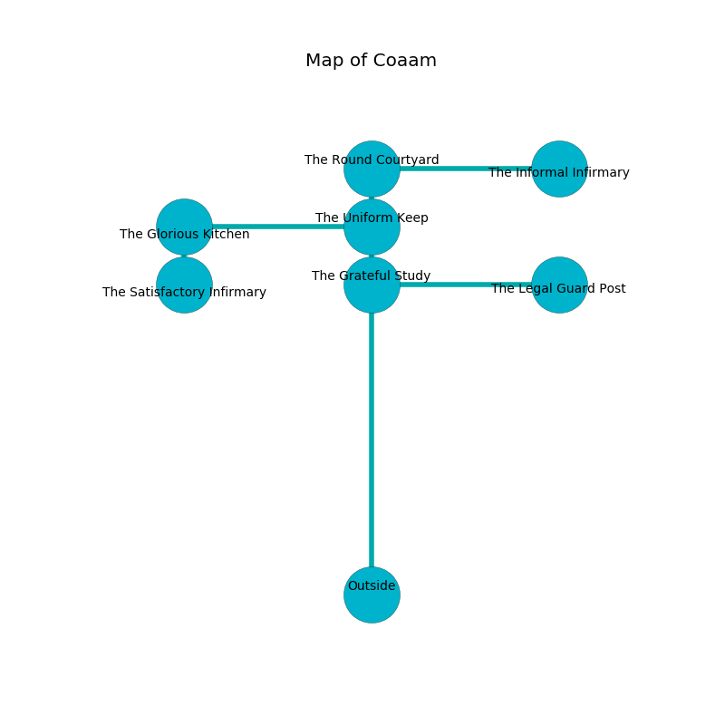

%Ruin Dogs

##Coaam
###Overview
Coaam is located in an obsidion tree. Parts of it are corrupted. The ruin is larger on the inside than the outside. It is occupied by Sahuagins. Kellye Jack The Pusillanimous, a Githzerai Monk is here. The Sahuagins worship Kellye Jack The Pusillanimous. She  is founding a new religion. 

###Artifact
####Lefc Mehg

Lefc Mehg has the form of a hard prism. Cacophony bends away from it. It smells like cardamom. It is a sickly brown color. When picked up it dissappears. 

###Locations

####the grateful study
The obsidion walls are pristine. The floor is bloodstained. There are a Drow, a Crocodile, a Rat, a Kuo-Toa Whip, an Elk, and a Blue Dragon Wyrmling here. 

* To the south is the entrance.
* To the east a narrow walkway connects to [the legal guard post](#the-legal-guard-post).
* To the north a torchlit path opens to [the uniform keep](#the-uniform-keep).

####the uniform keep
The wooden walls are bloodstained. The floor is glossy. There are a Giant Centipede, a Pony, a Magmin, an Axe Beak, a Worg, and a Bugbear here. 

* To the south a torchlit path connects to [the grateful study](#the-grateful-study).
* To the north a windy artery opens to [the round courtyard](#the-round-courtyard).
* To the west a hazy corridor connects to [the glorious kitchen](#the-glorious-kitchen).

####the glorious kitchen
The air smells like narcissus here. The floor is bloodstained. The stone walls are bloodstained. Red lichens are growing in broken urns. There are a Troglodyte, a Centaur, and a Myconid Sovereign here. 

* There is a pig here.
* To the south a torchlit artery leads to [the satisfactory infirmary](#the-satisfactory-infirmary).
* To the east a hazy corridor leads to [the uniform keep](#the-uniform-keep).

####the legal guard post
There is a trap here. When activated, a tripwire will make the walls close in. The crystal walls are caving in. The floor is glossy. 

* To the west a narrow walkway leads to [the grateful study](#the-grateful-study).

####the round courtyard
The air tastes like oily here. The floor is flooded with eight inch deep cool water. 

* [Lefc Mehg](#Lefc-Mehg) is here.
* To the south a windy artery connects to [the uniform keep](#the-uniform-keep).
* To the east a flooded threshold leads to [the informal infirmary](#the-informal-infirmary).

####the satisfactory infirmary
The air smells like papaya here. 

* [Kellye Jack The Pusillanimous](#Kellye-Jack-The-Pusillanimous) is here.
* To the north a torchlit artery opens to [the glorious kitchen](#the-glorious-kitchen).

####the informal infirmary
White lichens are swaying in cracks in the floor. The air smells like jasmin here. There are two Sahuagin Priestesses here. The Sahuagins are defending this room from intruders. 

There is an engraving on the wall written in Sahuagins Script. 

> A chest is a slice
>
> always vicious
>
> A chest is a slice
>

* To the west a flooded threshold connects to [the round courtyard](#the-round-courtyard).

