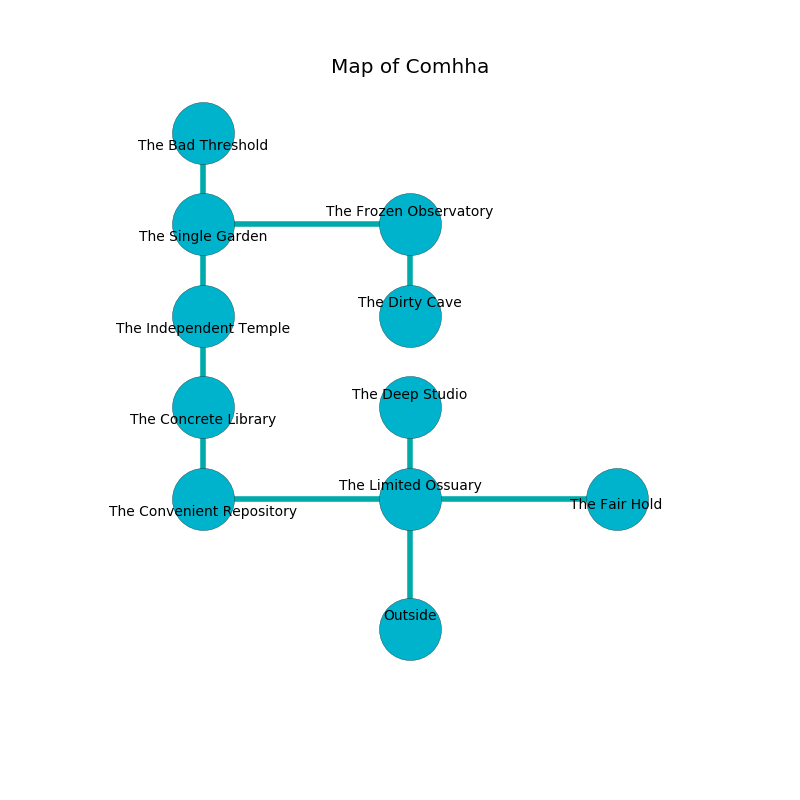

%Ruin Dogs

##Comhha
###Overview
Comhha is located on a cursed rift. Some rooms of it are flooded. A battle between raiders is happening outside. It is occupied by Sahuagin. Hollis Hutchinson The Pusillanimous, a Myconid Sprout is here. The Sahuagin have been charmed by Hollis Hutchinson The Pusillanimous. He  is trying to destroy [The Dirty Maze](#The-Dirty-Maze). 

###Artifact
####The Dirty Maze

The Dirty Maze looks like a soft orb. It is a dark gray color. When cradled it become energized with a powerful vibration. 

###Locations

####the limited ossuary
Green ferns are decaying from the walls. The stone walls are covered in mold. The floor is smooth. 

There is an engraving on a tablet written in common. 

> I hid something in this place.
>
> Dig here.
>

* To the south is the entrance.
* To the east a twisted walkway connects to [the fair hold](#the-fair-hold).
* To the north a dripping hallway opens to [the deep studio](#the-deep-studio).
* To the west a flooded path leads to [the convenient repository](#the-convenient-repository).

####the fair hold
There is a trap here. When activated, a magical proximity detector will launch a swinging block. Yellow ferns are decaying in cracks in the floor. There is a Ghast here. 

* To the west a twisted walkway connects to [the limited ossuary](#the-limited-ossuary).

####the deep studio
There are four Sahuagin here. The air smells like pennyroyal here. The crystal walls are ruined. The Sahuagin are performing a ritual. If not interrupted, a powerful monster will be summoned. 

* There is a bee here.
* To the south a dripping hallway opens to [the limited ossuary](#the-limited-ossuary).

####the convenient repository
Blue lichens are swaying in a patch on the floor. The floor is glossy. 

* To the east a flooded path opens to [the limited ossuary](#the-limited-ossuary).
* To the north a dark passageway leads to [the concrete library](#the-concrete-library).

####the concrete library
The air tastes like tolu here. The floor is smooth. The stone walls are bloodstained. Yellow lichens are swaying from the ceiling. There are a Giant Vulture and a Ghast here. 

There is an engraving on the wall written in Sahuagin Script. 

> Dear me! death is sadistic
>
> vacant, representative, educational
>
> always realistic
>
> death is vocational
>

* To the south a dark passageway connects to [the convenient repository](#the-convenient-repository).
* To the north a hazy corridor leads to [the independent temple](#the-independent-temple).

####the independent temple
There are a Brass Dragon Wyrmling and a Giant Toad here. White mushrooms are growing in a patch on the floor. The floor is glossy. 

* To the south a hazy corridor opens to [the concrete library](#the-concrete-library).
* To the north a dark cavern leads to [the single garden](#the-single-garden).

####the single garden
The brick walls are unsettled. The air smells like hazelnut here. Gray ferns are growing in broken urns. 

* There is a sponge here.
* There is a stick here.
* There is a spoon here.
* To the south a dark cavern opens to [the independent temple](#the-independent-temple).
* To the east a windy passageway leads to [the frozen observatory](#the-frozen-observatory).
* To the north a small cavern leads to [the bad threshold](#the-bad-threshold).

####the bad threshold
The floor is bloodstained. Red moss is growing in a patch on the floor. 

* To the south a small cavern connects to [the single garden](#the-single-garden).

####the frozen observatory
There is a trap here. When activated, a magical rune will launch a fusillade of darts. White razorgrass is sprouting in broken urns. The stone walls are unsettled. The air smells like spice here. 

There is an engraving on a tablet written in common. 

> I was injured in Comhha.
>
> Dig here.
>

* [The Dirty Maze](#The-Dirty-Maze) is here.
* To the south a windy walkway opens to [the dirty cave](#the-dirty-cave).
* To the west a windy passageway connects to [the single garden](#the-single-garden).

####the dirty cave
The air tastes like custard here. The floor is smooth. The concrete walls are covered in mold. There are four Sahuagin here. If the Sahuagin notice the Ruin Dogs, one of them will retreat and alert the others. 

* There is a trousers here.
* [Hollis Hutchinson The Pusillanimous](#Hollis-Hutchinson-The-Pusillanimous) is here.
* To the north a windy walkway opens to [the frozen observatory](#the-frozen-observatory).

