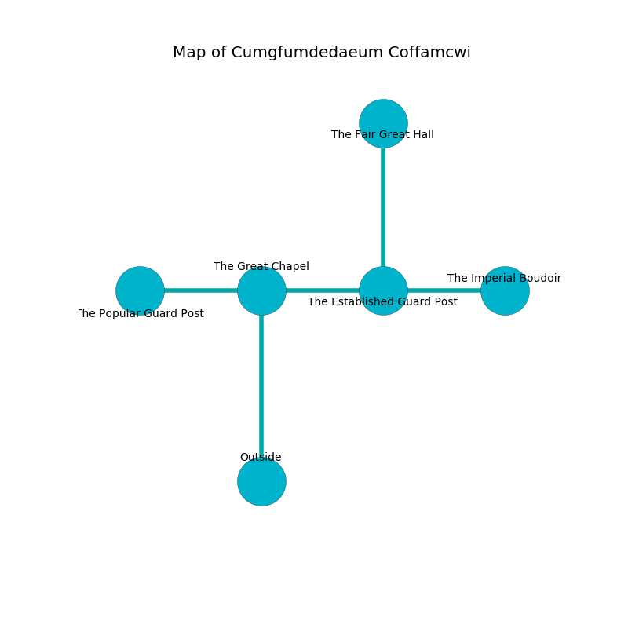

%Ruin Dogs

##Cumgfumdedaeum Coffamcwi
###Overview
Cumgfumdedaeum Coffamcwi is constructed on a giant rift. Regions of Cumgfumdedaeum Coffamcwi are corrupted. The ruin is collapsing slowly. It is occupied by Myconids. Williams Catalano The Intolerant, a Bulette is here. The Myconids are the slaves of Williams Catalano The Intolerant. He  is founding a new religion. 

###Artifact
####Iiaaed Bumefcmwi

Iiaaed Bumefcmwi is a powerful artifact in the shape of a warm orb. It is a dark black color. Magic bends around it. When eaten it shows an image of the future. 

###Locations

####the great chapel
There are three Myconid Sovereigns here. Gray ferns are swaying in a patch on the floor. The floor is smooth. There is a trap here. When activated, a magical sound detector will launch a swinging block. The air smells like celery here. One of the Myconids is working a mechanism that can pour hornets from the ceiling. 

* To the south is the entrance.
* To the east a narrow cavern opens to [the established guard post](#the-established-guard-post).
* To the west a twisted pathway leads to [the popular guard post](#the-popular-guard-post).

####the established guard post
The air tastes like wine here. The obsidion walls are scratched. The floor is flooded with eight inch deep cold water. 

* [Iiaaed Bumefcmwi](#Iiaaed-Bumefcmwi) is here.
* To the east a torchlit threshold leads to [the imperial boudoir](#the-imperial-boudoir).
* To the north a torchlit path connects to [the fair great hall](#the-fair-great-hall).
* To the west a narrow cavern leads to [the great chapel](#the-great-chapel).

####the popular guard post
Gray moss is growing from the ceiling. 

* To the east a twisted pathway opens to [the great chapel](#the-great-chapel).

####the imperial boudoir
Red razorgrass is sprouting in broken urns. There are a Lizard King, a Green Hag, and a Badger here. The floor is bloodstained. 

* There is a horse here.
* There is a finger here.
* To the west a torchlit threshold leads to [the established guard post](#the-established-guard-post).

####the fair great hall
The air smells like nut skin here. 

* There is a kettle here.
* There is a pig here.
* [Williams Catalano The Intolerant](#Williams-Catalano-The-Intolerant) is here.
* To the south a torchlit path connects to [the established guard post](#the-established-guard-post).

