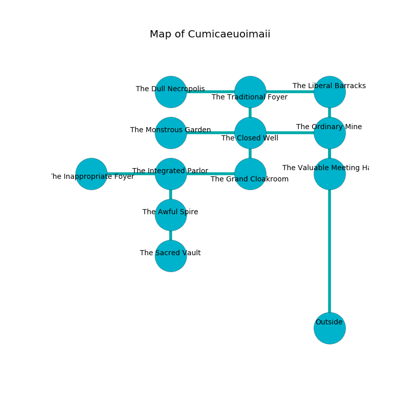

%Ruin Dogs

##Cumicaeuoimaii
###Overview
Cumicaeuoimaii is located under a ruined tree. Regions of it are cursed. A massive storm is happening outside. It is occupied by Giants. Halina Perdue The Mean, a Fire Giant is here. The Giants are the soldiers of Halina Perdue The Mean. She  is founding a new religion. 

###Artifact
####Cmehhamha

Cmehhamha is a powerful artifact in the shape of a wet rock. It is a pale black color. It smells like roasted almond. When touched it turns surrounding objects to ashes. 

###Locations

####the liberal barracks
The floor is bloodstained. There are a Cloud Giant and a Frost Giant here. The air smells like soap here. The Giants are berserk with rage. 

* There is a jewel here.
* To the south is the entrance.
* To the west a narrow hallway connects to [the traditional foyer](#the-traditional-foyer).

####the traditional foyer
There are a Giant Rat, a Wight, a Medusa, a Draft Horse, a Gargoyle, a Raven, and a Gold Dragon Wyrmling here. There is a trap here. When activated, a magical rune will launch a fireball. Yellow mushrooms are swaying from the walls. 

* To the south a twisted walkway connects to [the closed well](#the-closed-well).
* To the east a narrow hallway connects to [the liberal barracks](#the-liberal-barracks).
* To the west a torchlit cave leads to [the dull necropolis](#the-dull-necropolis).

####the closed well
The floor is glossy. White ferns are sprouting in a patch on the floor. The obsidion walls are bloodstained. The air tastes like peony here. 

There is an engraving on the floor written in common. 

> Do not try swimming.
>

* [Halina Perdue The Mean](#Halina-Perdue-The-Mean) is here.
* To the south a hazy opening leads to [the grand cloakroom](#the-grand-cloakroom).
* To the east a torchlit corridor leads to [the ordinary mine](#the-ordinary-mine).
* To the north a twisted walkway leads to [the traditional foyer](#the-traditional-foyer).
* To the west a twisted opening opens to [the monstrous garden](#the-monstrous-garden).

####the grand cloakroom
The concrete walls are caving in. There are a Plesiosaurus, a Vrock, a Grick Alpha, and a Giant Spider here. The air smells like linden flower here. White mushrooms are growing in a patch on the floor. 

* To the north a hazy opening leads to [the closed well](#the-closed-well).
* To the west a narrow path opens to [the integrated parlor](#the-integrated-parlor).

####the monstrous garden
The air smells like pear skin here. There are a Giant Goat, a Goblin Boss, a Troll, and a Grick Alpha here. The brick walls are unsettled. Yellow razorgrass is decaying in cracks in the floor. 

There is an engraving on a monolith written in Giants Script. 

> A bucket is a frame
>
> shy and large
>

* To the east a twisted opening connects to [the closed well](#the-closed-well).

####the ordinary mine
The air smells like cocoa here. There are a Stone Giant and a Hill Giant here. The floor is cluttered with ashes. The brick walls are pristine. If the Giants notice the Ruin Dogs, one of them will retreat and alert [Halina Perdue](#Halina-Perdue). 

* To the south a hazy opening opens to [the valuable meeting hall](#the-valuable-meeting-hall).
* To the west a torchlit corridor connects to [the closed well](#the-closed-well).

####the valuable meeting hall
There are a Troglodyte, a Bone Naga, an Awakened Tree, a Rhinoceros, a Giant Goat, and a Drow Elite Warrior here. There is a trap here. When activated, a magical sound detector will collapse a wall. 

* To the north a hazy opening leads to [the ordinary mine](#the-ordinary-mine).

####the integrated parlor
The floor is smooth. The air tastes like dairy here. There are a Stone Giant and a Frost Giant here. One of the Giants is pointing a ballista at the entrance. 

There is an engraving on a stone written in common. 

> I am seeking [Cmehhamha](#Cmehhamha).
>

* To the south a small cavern connects to [the awful spire](#the-awful-spire).
* To the east a narrow path opens to [the grand cloakroom](#the-grand-cloakroom).
* To the west a dark corridor leads to [the inappropriate foyer](#the-inappropriate-foyer).

####the dull necropolis
The glass walls are covered in mold. The air smells like old wood here. The floor is flooded with seven inch deep lukewarm water. 

* To the east a torchlit cave leads to [the traditional foyer](#the-traditional-foyer).

####the awful spire
The floor is glossy. The air smells like medicine here. There are two Hill Giants here. The Giants are performing a ritual. If not interrupted, [Halina Perdue](#Halina-Perdue) will be magically alarmed. 

* [Cmehhamha](#Cmehhamha) is here.
* To the south a small passageway connects to [the sacred vault](#the-sacred-vault).
* To the north a small cavern opens to [the integrated parlor](#the-integrated-parlor).

####the inappropriate foyer
The floor is smooth. Red mushrooms are growing from the walls. 

* To the east a dark corridor connects to [the integrated parlor](#the-integrated-parlor).

####the sacred vault
There is a trap here. When activated, a magical sound detector will launch a poison dart. There are an Ankylosaurus, a Hyena, a Giant Goat, a Giant Eagle, a Knight, a Quadrone, a Young Faerie Dragon, and a Bugbear here. White ferns are swaying in cracks in the floor. 

There is an engraving on the wall written in common. 

> I discovered [Cmehhamha](#Cmehhamha).
>
> Leave now.
>

* To the north a small passageway opens to [the awful spire](#the-awful-spire).

