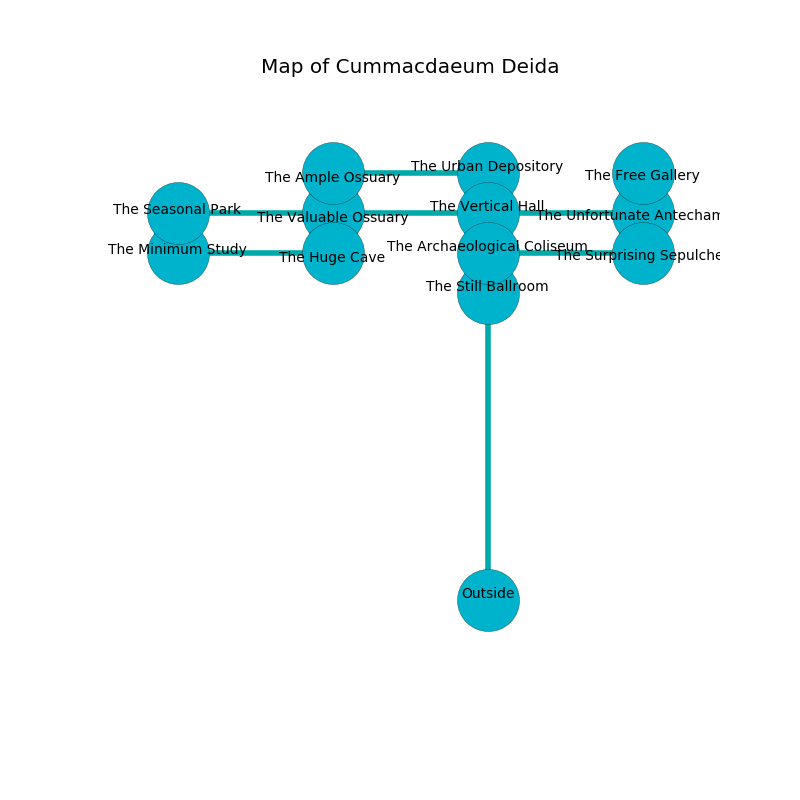

%Ruin Dogs

##Cummacdaeum Deida
###Overview
Cummacdaeum Deida is constructed on a giant plain. Parts of it are foggy. The ruin is burning. It is occupied by Githyanki. Edgardo Schreiner The Indecisive, a Vampire Spawn is here. The Githyanki worship Edgardo Schreiner The Indecisive. He  is founding a new religion. 

###Artifact
####The Effective Margin

The Effective Margin has the form of an opaque meteorite. Water shifts towards it. It smells like banana peel. When touched it curses all nearby. 

###Locations

####the vertical hall
Gray mushrooms are growing from the walls. The concrete walls are bloodstained. 

* There is a scissors here.
* To the south is the entrance.
* To the east a flooded artery connects to [the unfortunate antechamber](#the-unfortunate-antechamber).
* To the north a twisted walkway connects to [the urban depository](#the-urban-depository).
* To the west a torchlit pathway leads to [the valuable ossuary](#the-valuable-ossuary).

####the urban depository
There are a Blood Hawk, an Owlbear, an Imp, a Homunculus, and a Druid here. 

* To the south a twisted walkway connects to [the vertical hall](#the-vertical-hall).
* To the west a dark cavern opens to [the ample ossuary](#the-ample-ossuary).

####the unfortunate antechamber
Gray mushrooms are growing from the ceiling. The air smells like fennel here. The floor is bloodstained. 

* There is a drake here.
* There is an arch here.
* To the south a torchlit gap opens to [the surprising sepulcher](#the-surprising-sepulcher).
* To the north a narrow pathway opens to [the free gallery](#the-free-gallery).
* To the west a flooded artery leads to [the vertical hall](#the-vertical-hall).

####the valuable ossuary
The air smells like mandarin here. 

* There is a plow here.
* To the south a windy hall opens to [the huge cave](#the-huge-cave).
* To the east a torchlit pathway connects to [the vertical hall](#the-vertical-hall).
* To the west a long threshold leads to [the seasonal park](#the-seasonal-park).

####the huge cave
The crystal walls are scratched. Blue moss is decaying from the walls. The floor is bloodstained. 

* [Edgardo Schreiner The Indecisive](#Edgardo-Schreiner-The-Indecisive) is here.
* To the north a windy hall leads to [the valuable ossuary](#the-valuable-ossuary).
* To the west a dripping artery leads to [the minimum study](#the-minimum-study).

####the seasonal park
The obsidion walls are bloodstained. The air smells like guava here. 

* To the east a long threshold connects to [the valuable ossuary](#the-valuable-ossuary).

####the surprising sepulcher
There are two Githyanki Warriors here. The air smells like ocean here. The crystal walls are ruined. One of the Githyanki is on watch, the rest are sleeping. 

* To the north a torchlit gap connects to [the unfortunate antechamber](#the-unfortunate-antechamber).
* To the west a small pathway opens to [the archaeological coliseum](#the-archaeological-coliseum).

####the archaeological coliseum
Yellow mushrooms are growing in a patch on the floor. The air tastes like cedarwood here. The obsidion walls are ruined. 

* [The Effective Margin](#The-Effective-Margin) is here.
* To the south a twisted cave leads to [the still ballroom](#the-still-ballroom).
* To the east a small pathway opens to [the surprising sepulcher](#the-surprising-sepulcher).

####the minimum study
The floor is flooded with two inch deep hot water. There are two Githyanki Warriors here. The Githyanki are performing a ritual. If not interrupted, [Edgardo Schreiner](#Edgardo-Schreiner) will be magically alarmed. 

* There is a brick here.
* To the east a dripping artery connects to [the huge cave](#the-huge-cave).

####the ample ossuary
There are a Poltergeist and an Elephant here. The air tastes like hyssop here. Red mushrooms are sprouting in a patch on the floor. 

* To the east a dark cavern leads to [the urban depository](#the-urban-depository).

####the free gallery
The stone walls are covered in mold. There are two Githyanki Warriors here. The floor is sticky. The Githyanki are performing a ritual. If not interrupted, the ruin dogs will be weakened. 

* To the south a narrow pathway opens to [the unfortunate antechamber](#the-unfortunate-antechamber).

####the still ballroom
The floor is bloodstained. 

There is an engraving on the wall written in common. 

> I am free.
>
> Try giving up.
>

* To the north a twisted cave connects to [the archaeological coliseum](#the-archaeological-coliseum).

