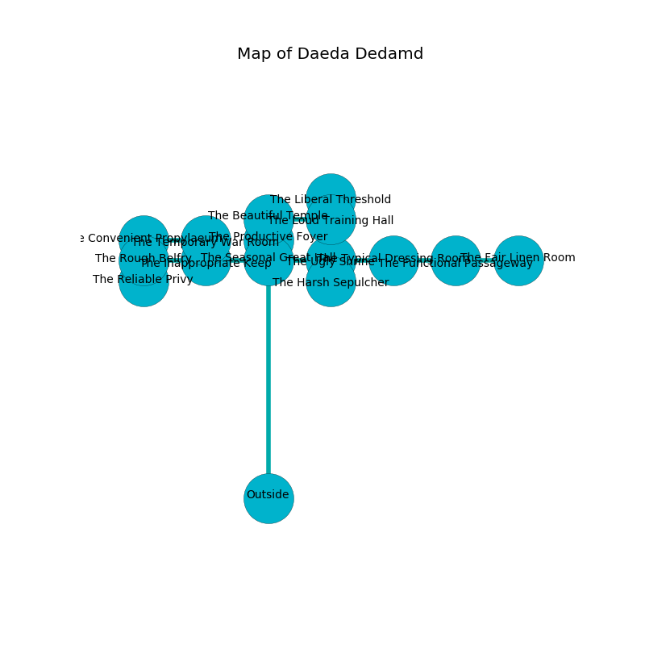

%Ruin Dogs

##Daeda Dedamd
###Overview
Daeda Dedamd is constructed on a poisoned mountain. Some areas of Daeda Dedamd are flooded. The ruin is flooding. It is occupied by Deep Gnomes. Chin Larue The Tactless, a Drow Priestess of Lolth is here. The Deep Gnomes are the soldiers of Chin Larue The Tactless. She  is trying to use [Mufia](#Mufia). 

###Artifact
####Mufia

Mufia looks like a transparent amulet. It smells like geranium. When held it tunnels into the earth. 

###Locations

####the seasonal great hall
The air tastes like elderberry here. There is a trap here. When activated, a magical sound detector will blast flames. The mirrored walls are caving in. 

* There is a horse here.
* [Chin Larue The Tactless](#Chin-Larue-The-Tactless) is here.
* To the south is the entrance.
* To the east a torchlit hallway connects to [the ugly shrine](#the-ugly-shrine).
* To the north a torchlit gap connects to [the productive foyer](#the-productive-foyer).
* To the west a twisted opening opens to [the inappropriate keep](#the-inappropriate-keep).

####the productive foyer
There is a trap here. When activated, a magical sound detector will fire a scything blade. There are sixteen Deep Gnomes here. The air smells like turni here. The floor is sticky. The brick walls are bloodstained. One of the Deep Gnomes is pointing a ballista at the entrance. 

* There is a pin here.
* To the south a torchlit gap opens to [the seasonal great hall](#the-seasonal-great-hall).
* To the north a small gap connects to [the beautiful temple](#the-beautiful-temple).

####the beautiful temple
White ferns are decaying in a patch on the floor. There are sixteen Deep Gnomes here. The wooden walls are pristine. One of the Deep Gnomes is on watch, the rest are celebrating. 

* There is a bee here.
* To the south a small gap leads to [the productive foyer](#the-productive-foyer).
* To the east a flooded hall connects to [the loud training hall](#the-loud-training-hall).

####the ugly shrine
Red lichens are sprouting from the walls. There are a Vampire Spawn, a Black Dragon Wyrmling, and a Weretiger here. 

* To the south a flooded gap connects to [the harsh sepulcher](#the-harsh-sepulcher).
* To the east a flooded threshold connects to [the typical dressing room](#the-typical-dressing-room).
* To the west a torchlit hallway opens to [the seasonal great hall](#the-seasonal-great-hall).

####the harsh sepulcher
The floor is bloodstained. 

There is an engraving on the wall written in common. 

> Poor me! pitiful soul
>
> it is always whole
>
> professional, painful, sexual
>
> hope is whole
>

* To the north a flooded gap connects to [the ugly shrine](#the-ugly-shrine).

####the inappropriate keep
The wooden walls are scratched. There are sixteen Deep Gnomes here. The air smells like red rose here. The Deep Gnomes are defending this room from intruders. 

* To the east a twisted opening leads to [the seasonal great hall](#the-seasonal-great-hall).
* To the north a long path connects to [the temporary war Room](#the-temporary-war-Room).
* To the west a twisted passageway opens to [the rough belfry](#the-rough-belfry).

####the typical dressing room
There is a trap here. When activated, a pressure plate will launch stone blocks from the ceiling. There are a Violet Fungus, a Giant Shark, a Kenku, a Deep Gnome, and an Orc Eye of Gruumsh here. The mirrored walls are caving in. The floor is glossy. 

* To the east a small threshold connects to [the functional passageway](#the-functional-passageway).
* To the west a flooded threshold connects to [the ugly shrine](#the-ugly-shrine).

####the rough belfry
Green ferns are sprouting in a patch on the floor. The mirrored walls are unsettled. 

* There is a whistle here.
* To the south a long passageway leads to [the reliable privy](#the-reliable-privy).
* To the east a twisted passageway connects to [the inappropriate keep](#the-inappropriate-keep).

####the loud training hall
Blue ferns are swaying in cracks in the floor. The crystal walls are ruined. There are sixteen Deep Gnomes here. The floor is cluttered with bones. The Deep Gnomes are willing to negotiate. 

* There is a frame here.
* [Mufia](#Mufia) is here.
* To the north a windy pathway opens to [the liberal threshold](#the-liberal-threshold).
* To the west a flooded hall leads to [the beautiful temple](#the-beautiful-temple).

####the reliable privy
There is a trap here. When activated, a magical sound detector will open a trapdoor in the floor. There are sixteen Deep Gnomes here. One of the Deep Gnomes is pointing a ballista at the entrance. 

* To the north a long passageway connects to [the rough belfry](#the-rough-belfry).

####the functional passageway
The air tastes like hyacinth here. 

* To the east a flooded cavern opens to [the fair linen room](#the-fair-linen-room).
* To the west a small threshold connects to [the typical dressing room](#the-typical-dressing-room).

####the fair linen room
There are sixteen Deep Gnomes here. The stone walls are ruined. One of the Deep Gnomes is on watch, the rest are feasting. 

* To the west a flooded cavern leads to [the functional passageway](#the-functional-passageway).

####the temporary war Room
Blue moss is swaying in cracks in the floor. The metallic walls are scratched. There are sixteen Deep Gnomes here. The floor is flooded with four inch deep lukewarm water. The Deep Gnomes are drunk. 

There is an engraving on the ceiling written in common. 

> A sun is a lip
>
> sympathetic and ashamed
>
> primary and decorative
>
> neutral, constitutional, particular
>
> you must never be hidden
>

* To the south a long path leads to [the inappropriate keep](#the-inappropriate-keep).
* To the west a windy gap leads to [the convenient propylaeum](#the-convenient-propylaeum).

####the convenient propylaeum
The brick walls are bloodstained. The air tastes like weed here. The floor is sticky. There are a Drow Mage, a Bone Naga, a Tridrone, and a Quipper here. 

* To the east a windy gap leads to [the temporary war Room](#the-temporary-war-Room).

####the liberal threshold
The obsidion walls are pristine. The floor is sticky. 

* To the south a windy pathway leads to [the loud training hall](#the-loud-training-hall).

