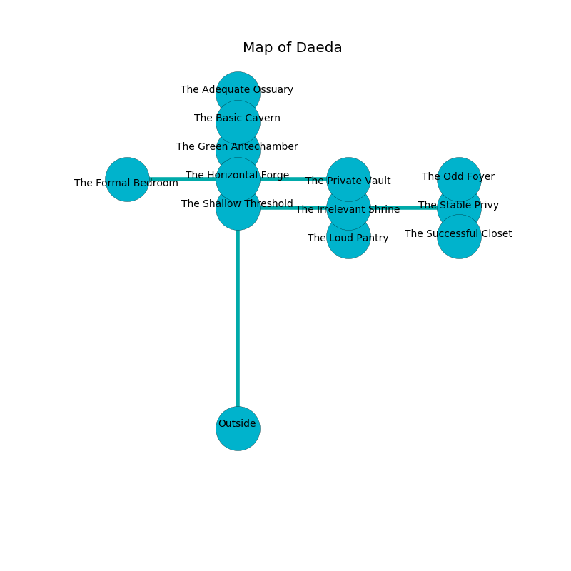

%Ruin Dogs

##Daeda
###Overview
Daeda is located on an obsidion tree. Some rooms of Daeda are inaccessible. The ruin is larger on the inside than the outside. It is occupied by Centaurs. Dillon Malley The Pessimistic, a Veteran is here. The Centaurs worship Dillon Malley The Pessimistic. He  is founding a new religion. 

###Artifact
####Ceb Hul

Ceb Hul has the form of a mushy doll. Psychic energy glows around it. It smells like muguet. When worn it flies into the air. 

###Locations

####the shallow threshold
The air tastes like basil here. The crystal walls are ruined. The floor is sticky. 

There is an engraving on the floor written in Centaurs Script. 

> Dear me! meak soul
>
> it is never offensive
>
> it is never whole
>
> the world is expensive
>

* To the south is the entrance.
* To the east a windy hallway opens to [the irrelevant shrine](#the-irrelevant-shrine).
* To the north a dripping path connects to [the horizontal forge](#the-horizontal-forge).

####the irrelevant shrine
The metallic walls are unsettled. There are two Centaurs here. One of the Centaurs is pointing a ballista at the entrance. 

* [Ceb Hul](#Ceb-Hul) is here.
* To the south a flooded corridor opens to [the loud pantry](#the-loud-pantry).
* To the east a torchlit hall opens to [the stable privy](#the-stable-privy).
* To the west a windy hallway opens to [the shallow threshold](#the-shallow-threshold).

####the stable privy
The crystal walls are pristine. Gray mushrooms are sprouting from the ceiling. There are a Winter Wolf, a Lizard King, and a Noble here. 

There is an engraving on the ceiling written in common. 

> Dig here.
>

* To the south a narrow pathway connects to [the successful closet](#the-successful-closet).
* To the north a windy artery connects to [the odd foyer](#the-odd-foyer).
* To the west a torchlit hall leads to [the irrelevant shrine](#the-irrelevant-shrine).

####the horizontal forge
The air tastes like cucumber here. The floor is smooth. There are two Centaurs here. The Centaurs are willing to negotiate. 

* To the south a dripping path opens to [the shallow threshold](#the-shallow-threshold).
* To the east a windy cave opens to [the private vault](#the-private-vault).
* To the north a small cavern connects to [the green antechamber](#the-green-antechamber).
* To the west a flooded opening connects to [the formal bedroom](#the-formal-bedroom).

####the private vault
There are two Centaurs here. The brick walls are covered in mold. One of the Centaurs is on watch, the rest are feasting. 

There is an engraving on a stone written in common. 

> Go away.
>

* To the west a windy cave opens to [the horizontal forge](#the-horizontal-forge).

####the formal bedroom
There are two Centaurs here. Gray mushrooms are sprouting from the walls. The Centaurs are crazy with bloodlust. 

* To the east a flooded opening connects to [the horizontal forge](#the-horizontal-forge).

####the green antechamber
The air smells like almond here. The floor is bloodstained. Blue moss is sprouting in a patch on the floor. 

* There is a wheel here.
* To the south a small cavern opens to [the horizontal forge](#the-horizontal-forge).
* To the north a dark hall connects to [the basic cavern](#the-basic-cavern).

####the basic cavern
The floor is cluttered with shells. The air tastes like hops here. 

There is an engraving on a tablet written in Centaurs Script. 

> Run away.
>

* To the south a dark hall opens to [the green antechamber](#the-green-antechamber).
* To the north a torchlit artery leads to [the adequate ossuary](#the-adequate-ossuary).

####the odd foyer
The brick walls are scratched. 

There is an engraving on the wall written in common. 

> A fish is a medicine
>
> yet mature
>
> A fish is a medicine
>

* To the south a windy artery leads to [the stable privy](#the-stable-privy).

####the successful closet
Red mushrooms are growing in cracks in the floor. The floor is glossy. The air smells like mastic here. 

* To the north a narrow pathway leads to [the stable privy](#the-stable-privy).

####the adequate ossuary
Blue moss is swaying from the ceiling. The concrete walls are unsettled. There are a Stirge, a Guard, an Acolyte, a Jackalwere, a Poisonous Snake, a Wereboar, and a Cockatrice here. 

* There is a ring here.
* [Dillon Malley The Pessimistic](#Dillon-Malley-The-Pessimistic) is here.
* To the south a torchlit artery connects to [the basic cavern](#the-basic-cavern).

####the loud pantry
The concrete walls are bloodstained. The air smells like cognac here. 

There is an engraving on a stone written in Centaurs Script. 

> A glove is a sleep
>
> ever agile
>
> A nail is an excuse
>
> always integrated
>

* To the north a flooded corridor connects to [the irrelevant shrine](#the-irrelevant-shrine).

