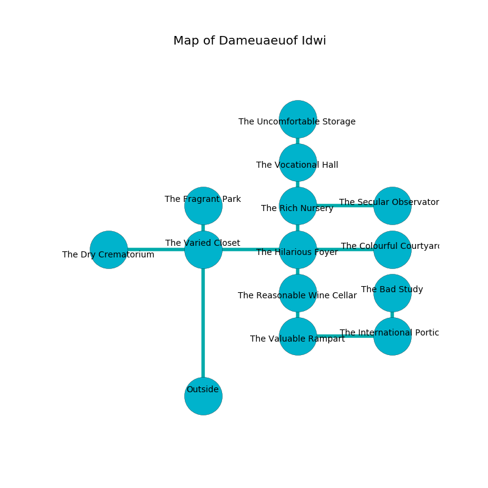

%Ruin Dogs

##Dameuaeuof Idwi
###Overview
Dameuaeuof Idwi is located on a haunted tree. Some rooms of it are cursed. The ruin is collapsing slowly. It is occupied by Troglodytes. Erich Blanchard The Conservative, a Cloud Giant is here. The Troglodytes are the soldiers of Erich Blanchard The Conservative. He  is trying to find [The Insufficient Structure](#The-Insufficient-Structure). 

###Artifact
####The Insufficient Structure

The Insufficient Structure is a powerful artifact in the shape of a sharp cube. Gravity shifts around it. When eaten it illuminates its surroundings. 

###Locations

####the varied closet
The air smells like leather here. Yellow lichens are swaying in broken urns. 

* To the south is the entrance.
* To the east a narrow hall opens to [the hilarious foyer](#the-hilarious-foyer).
* To the north a flooded gap connects to [the fragrant park](#the-fragrant-park).
* To the west a torchlit threshold leads to [the dry crematorium](#the-dry-crematorium).

####the dry crematorium
The concrete walls are unsettled. The floor is bloodstained. The air smells like fig here. There are thirty six Troglodytes here. There is a trap here. When activated, a magical rune will collapse a wall. The Troglodytes are performing a ritual. If not interrupted, [Erich Blanchard](#Erich-Blanchard) will be magically alarmed. 

* To the east a torchlit threshold connects to [the varied closet](#the-varied-closet).

####the fragrant park
The air tastes like nut flesh here. 

There is an engraving on the floor written in Troglodytes Script. 

> O my life is woe
>
> serious and slow
>
> but tense
>
> life is slow
>

* To the south a flooded gap connects to [the varied closet](#the-varied-closet).

####the hilarious foyer
There are thirty six Troglodytes here. The crystal walls are unsettled. The Troglodytes are performing a ritual. If not interrupted, [Erich Blanchard](#Erich-Blanchard) will be magically alarmed. 

* There is a cart here.
* There is a spade here.
* To the south a dripping passageway connects to [the reasonable wine cellar](#the-reasonable-wine-cellar).
* To the east a hazy walkway leads to [the colourful courtyard](#the-colourful-courtyard).
* To the north a dark artery connects to [the rich nursery](#the-rich-nursery).
* To the west a narrow hall leads to [the varied closet](#the-varied-closet).

####the rich nursery
The floor is smooth. There are thirty six Troglodytes here. The Troglodytes are defending this room from intruders. 

* [The Insufficient Structure](#The-Insufficient-Structure) is here.
* To the south a dark artery opens to [the hilarious foyer](#the-hilarious-foyer).
* To the east a long gap leads to [the secular observatory](#the-secular-observatory).
* To the north a twisted passageway leads to [the vocational hall](#the-vocational-hall).

####the reasonable wine cellar
The glass walls are caving in. 

* There is a brooch here.
* To the south a torchlit path leads to [the valuable rampart](#the-valuable-rampart).
* To the north a dripping passageway leads to [the hilarious foyer](#the-hilarious-foyer).

####the valuable rampart
Green razorgrass is sprouting in a patch on the floor. There are thirty six Troglodytes here. The Troglodytes are performing a ritual. If not interrupted, [Erich Blanchard](#Erich-Blanchard) will be magically alarmed. 

* [Erich Blanchard The Conservative](#Erich-Blanchard-The-Conservative) is here.
* To the east a long gap connects to [the international portico](#the-international-portico).
* To the north a torchlit path opens to [the reasonable wine cellar](#the-reasonable-wine-cellar).

####the colourful courtyard
The air tastes like lovage here. The obsidion walls are scratched. 

* To the west a hazy walkway opens to [the hilarious foyer](#the-hilarious-foyer).

####the vocational hall
The floor is sticky. There are an Incubus, a Roper, and a Flying Snake here. Red ferns are sprouting in broken urns. The air smells like onion here. There is a trap here. When activated, a magical proximity detector will shoot a lightning bolt. 

* To the south a twisted passageway connects to [the rich nursery](#the-rich-nursery).
* To the north a windy cavern connects to [the uncomfortable storage](#the-uncomfortable-storage).

####the international portico
The air tastes like black tea here. The floor is bloodstained. Green ferns are sprouting in a patch on the floor. There are a Quaggoth, a Gorgon, and a Ghast here. 

* To the north a small hall connects to [the bad study](#the-bad-study).
* To the west a long gap opens to [the valuable rampart](#the-valuable-rampart).

####the uncomfortable storage
Red mushrooms are swaying from the ceiling. The floor is cluttered with broken glass. The brick walls are ruined. 

* To the south a windy cavern connects to [the vocational hall](#the-vocational-hall).

####the bad study
The floor is cluttered with bones. The obsidion walls are caving in. 

* To the south a small hall connects to [the international portico](#the-international-portico).

####the secular observatory
The air tastes like roasted barley here. The floor is cluttered with rocks. 

There is an engraving on the ceiling written in Troglodytes Script. 

> Poor me! pitiful god
>
> healthy, retired, odd
>
> it is never residential
>
> hope is essential
>

* There is a net here.
* There is an orange here.
* To the west a long gap connects to [the rich nursery](#the-rich-nursery).

