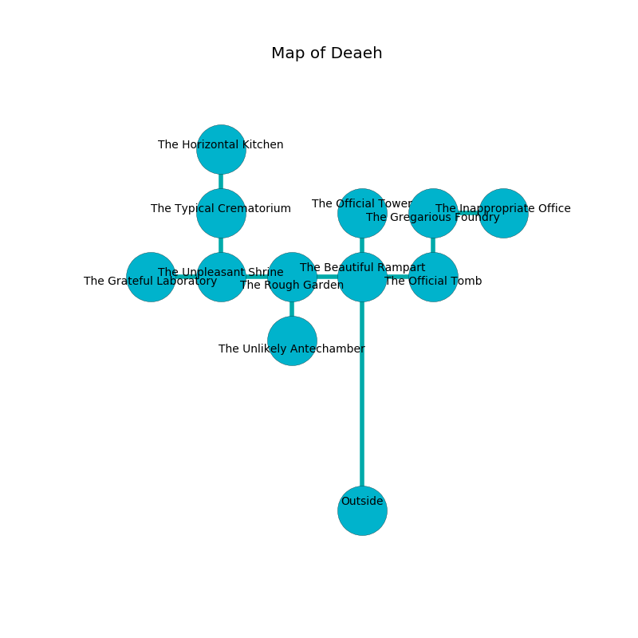

%Ruin Dogs

##Deaeh
###Overview
Deaeh is located under a volcanic tree. Regions of it are inaccessible. The ruin is flooding. It is occupied by Humans. Ilana Carrillo The Detached, a Myconid Sprout is here. The Humans have been charmed by Ilana Carrillo The Detached. She  is trying to discover [Gedmaf Dued](#Gedmaf-Dued). 

###Artifact
####Gedmaf Dued

Gedmaf Dued is a powerful artifact in the shape of a warm amulet. It smells like balsamic. It is a sickly gray color. When eaten it flies into the air. 

###Locations

####the beautiful rampart
There is a trap here. When activated, a magical rune will launch a javelin. The floor is glossy. There is a Druid here. The metallic walls are pristine. The Druid is meditating. 

* To the south is the entrance.
* To the east a dark pathway connects to [the official tomb](#the-official-tomb).
* To the north a dark artery leads to [the official tower](#the-official-tower).
* To the west a twisted cavern leads to [the rough garden](#the-rough-garden).

####the official tomb
There are an Awakened Tree and a Giant Spider here. The floor is cluttered with debris. 

* To the north a flooded cavern opens to [the gregarious foundry](#the-gregarious-foundry).
* To the west a dark pathway connects to [the beautiful rampart](#the-beautiful-rampart).

####the rough garden
The air tastes like kumquat here. The glass walls are covered in mold. 

There is an engraving on a monolith written in common. 

> I am powerful.
>
> Treasure here.
>

* There is a head here.
* [Gedmaf Dued](#Gedmaf-Dued) is here.
* To the south a dark walkway opens to [the unlikely antechamber](#the-unlikely-antechamber).
* To the east a twisted cavern leads to [the beautiful rampart](#the-beautiful-rampart).
* To the west a narrow cavern opens to [the unpleasant shrine](#the-unpleasant-shrine).

####the gregarious foundry
There are a Dryad, a Crawling Claw, a Kenku, a Copper Dragon Wyrmling, and a Badger here. The concrete walls are bloodstained. The air tastes like macadamia here. 

* [Ilana Carrillo The Detached](#Ilana-Carrillo-The-Detached) is here.
* To the south a flooded cavern opens to [the official tomb](#the-official-tomb).
* To the east a narrow hall connects to [the inappropriate office](#the-inappropriate-office).

####the inappropriate office
There is a Bandit Captain here. The floor is bloodstained. Yellow ferns are decaying in broken urns. The obsidion walls are bloodstained. The air smells like sassafrass here. The Bandit Captain is performing a ritual. If not interrupted, [Ilana Carrillo](#Ilana-Carrillo) will be magically alarmed. 

There is an engraving on a monolith written in Humans Script. 

> Poor me! everything is poor
>
> thoughtful, dark, international
>
> it is never mature
>
> life is national
>

* To the west a narrow hall opens to [the gregarious foundry](#the-gregarious-foundry).

####the unpleasant shrine
There is a trap here. When activated, a magical proximity detector will launch a rolling boulder. The floor is sticky. 

* There is an arch here.
* To the east a narrow cavern connects to [the rough garden](#the-rough-garden).
* To the north a twisted pathway connects to [the typical crematorium](#the-typical-crematorium).
* To the west a torchlit threshold connects to [the grateful laboratory](#the-grateful-laboratory).

####the typical crematorium
The air tastes like cinnamon here. The floor is glossy. There is a Druid here. The stone walls are covered in mold. The Druid is sleeping. 

* To the south a twisted pathway opens to [the unpleasant shrine](#the-unpleasant-shrine).
* To the north a small opening connects to [the horizontal kitchen](#the-horizontal-kitchen).

####the official tower
The floor is flooded with two inch deep lukewarm water. The air smells like frying here. There is a trap here. When activated, a magical proximity detector will fire a scything blade. There is an Allosaurus here. The wooden walls are caving in. 

There is an engraving on the wall written in Humans Script. 

> I could not try hiding.
>

* To the south a dark artery opens to [the beautiful rampart](#the-beautiful-rampart).

####the horizontal kitchen
The brick walls are unsettled. The floor is sticky. The air smells like unripe banana here. 

There is an engraving on the ceiling written in Humans Script. 

> A trap ahead.
>

* To the south a small opening leads to [the typical crematorium](#the-typical-crematorium).

####the grateful laboratory
The air smells like black currant here. The glass walls are pristine. Yellow lichens are decaying in cracks in the floor. 

There is an engraving on the ceiling written in common. 

> I am alone.
>
> A trap ahead.
>

* There is a blade here.
* To the east a torchlit threshold leads to [the unpleasant shrine](#the-unpleasant-shrine).

####the unlikely antechamber
The obsidion walls are bloodstained. 

* To the north a dark walkway connects to [the rough garden](#the-rough-garden).

