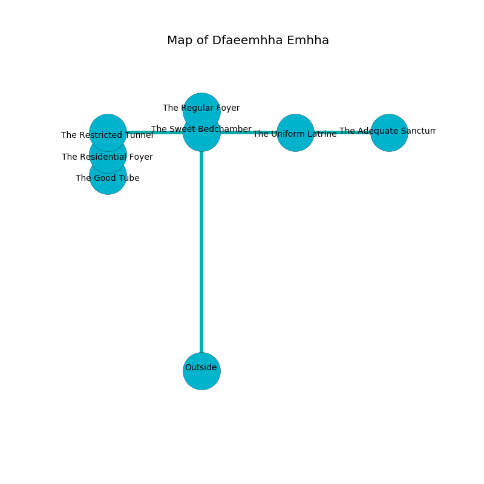

%Ruin Dogs

##Dfaeemhha Emhha
###Overview
Dfaeemhha Emhha is located on a cursed city. Regions of Dfaeemhha Emhha are frozen. The ruin is burning. It is occupied by Deep Gnomes. Dustin Littlefield The Belligerent, a Cyclops is here. The Deep Gnomes are the slaves of Dustin Littlefield The Belligerent. He  is trying to recover [Cmefd](#Cmefd). 

###Artifact
####Cmefd

Cmefd has the form of a warm figurine. It is a sickly pink color. Power incinerates away from it. When touched it turns surrounding objects to ashes. 

###Locations

####the sweet bedchamber
There is a trap here. When activated, a magical proximity detector will launch a poison needle. The air smells like corn here. 

There is an engraving on the floor written in Deep Gnomes Script. 

> O! meak god
>
> subjective and bad
>
> obscure, reckless, odd
>
> everything is sad
>

* To the south is the entrance.
* To the east a narrow threshold connects to [the uniform latrine](#the-uniform-latrine).
* To the north a dripping hallway leads to [the regular foyer](#the-regular-foyer).
* To the west a flooded corridor connects to [the restricted tunnel](#the-restricted-tunnel).

####the restricted tunnel
There are twelve Deep Gnomes here. The Deep Gnomes are berserk with rage. 

* There is a leprechaun here.
* To the south a twisted cavern opens to [the residential foyer](#the-residential-foyer).
* To the east a flooded corridor connects to [the sweet bedchamber](#the-sweet-bedchamber).

####the uniform latrine
The air smells like green onion here. Red lichens are sprouting from the ceiling. 

* [Dustin Littlefield The Belligerent](#Dustin-Littlefield-The-Belligerent) is here.
* To the east a long gap connects to [the adequate sanctum](#the-adequate-sanctum).
* To the west a narrow threshold opens to [the sweet bedchamber](#the-sweet-bedchamber).

####the residential foyer
The floor is cluttered with ashes. The air tastes like pimenta here. 

* There is an egg here.
* [Cmefd](#Cmefd) is here.
* To the south a windy corridor connects to [the good tube](#the-good-tube).
* To the north a twisted cavern leads to [the restricted tunnel](#the-restricted-tunnel).

####the adequate sanctum
The glass walls are scratched. Red mushrooms are decaying from the walls. There are twelve Deep Gnomes here. The floor is cluttered with shells. The Deep Gnomes are caring for babies. 

* To the west a long gap connects to [the uniform latrine](#the-uniform-latrine).

####the regular foyer
The concrete walls are unsettled. The air smells like toast here. 

There is an engraving on a tablet written in common. 

> Try leaving.
>

* To the south a dripping hallway opens to [the sweet bedchamber](#the-sweet-bedchamber).

####the good tube
The floor is smooth. The air smells like liver here. 

* To the north a windy corridor leads to [the residential foyer](#the-residential-foyer).

