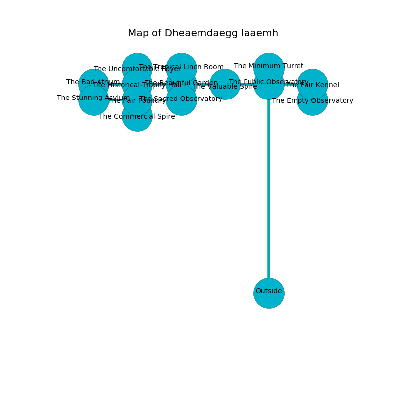

%Ruin Dogs

##Dheaemdaegg Iaaemh
###Overview
Dheaemdaegg Iaaemh is constructed on a crystal mountain. Some rooms of it are unbearably hot. The ruin is flooding. It is occupied by Humans. Karleen Stamm The Cruel, a Yuan-Ti Malison is here. The Humans are ruled by Karleen Stamm The Cruel. She  is founding a new religion. 

###Artifact
####The Close Slave

The Close Slave has the form of a transparent prism. It smells like smoke. Light shifts away from it. When picked up it floats in the air. 

###Locations

####the public observatory
There are a Scout, a Priest, and a Druid here. The air tastes like chive here. The floor is flooded with four inch deep cold water. One of the Humans is on watch, the rest are feasting. 

There is an engraving on the ceiling written in common. 

> I could not try cowering.
>

* To the south is the entrance.
* To the east a twisted pathway leads to [the fair kennel](#the-fair-kennel).
* To the north a long artery connects to [the minimum turret](#the-minimum-turret).
* To the west a small hallway opens to [the valuable spire](#the-valuable-spire).

####the valuable spire
There are a Berserker and a Veteran here. There is a trap here. When activated, a magical sound detector will launch a swinging block. The floor is smooth. The Humans are performing a ritual. If not interrupted, the ruin dogs will be weakened. 

* There is a brake here.
* There is a finger here.
* To the east a small hallway opens to [the public observatory](#the-public-observatory).
* To the west a torchlit hall connects to [the beautiful garden](#the-beautiful-garden).

####the beautiful garden
The crystal walls are caving in. 

* [The Close Slave](#The-Close-Slave) is here.
* To the south a twisted walkway opens to [the sacred observatory](#the-sacred-observatory).
* To the east a torchlit hall connects to [the valuable spire](#the-valuable-spire).
* To the north a windy pathway leads to [the tropical linen room](#the-tropical-linen-room).
* To the west a dripping threshold opens to [the historical trophy hall](#the-historical-trophy-hall).

####the historical trophy hall
There is a trap here. When activated, a pressure plate will fire an acid arrow. There are a Knight, a Berserker, and a Thug here. If the Humans notice the Ruin Dogs, one of them will retreat and alert the others. 

* To the south a narrow opening opens to [the fair foundry](#the-fair-foundry).
* To the east a dripping threshold leads to [the beautiful garden](#the-beautiful-garden).
* To the north a dripping artery leads to [the uncomfortable foyer](#the-uncomfortable-foyer).
* To the west a long hall opens to [the bad atrium](#the-bad-atrium).

####the uncomfortable foyer
The floor is flooded with one inch deep cool water. 

* To the south a dripping artery opens to [the historical trophy hall](#the-historical-trophy-hall).

####the fair foundry
The air smells like petroleum here. The floor is sticky. There are a Draft Horse, a Giant Elk, a Warhorse, and a Pseudodragon here. 

* There is a rowboat here.
* There is a baby here.
* There is a key here.
* To the south a hazy cavern connects to [the commercial spire](#the-commercial-spire).
* To the north a narrow opening connects to [the historical trophy hall](#the-historical-trophy-hall).
* To the west a flooded path leads to [the stunning asylum](#the-stunning-asylum).

####the sacred observatory
The air smells like nut skin here. There is a trap here. When activated, a magical proximity detector will launch a poison needle. Blue moss is decaying in a patch on the floor. There are a Constrictor Snake, an Elk, a Flumph, a Monodrone, a Silver Dragon Wyrmling, a Sahuagin, a Lion, and a Cat here. 

* To the north a twisted walkway connects to [the beautiful garden](#the-beautiful-garden).

####the commercial spire
There are a Gnoll and a Doppelganger here. The floor is sticky. Yellow ferns are swaying in cracks in the floor. 

* To the north a hazy cavern connects to [the fair foundry](#the-fair-foundry).

####the bad atrium
Blue ferns are sprouting in cracks in the floor. The mirrored walls are covered in mold. 

* To the east a long hall leads to [the historical trophy hall](#the-historical-trophy-hall).

####the stunning asylum
The floor is cluttered with shells. There is a Blue Dragon Wyrmling here. Red ferns are swaying from the ceiling. 

* To the east a flooded path opens to [the fair foundry](#the-fair-foundry).

####the minimum turret
The floor is sticky. The mirrored walls are pristine. There are a Giant Wasp, a Violet Fungus, a Hippogriff, a Kuo-Toa, a Wight, a Poisonous Snake, and an Awakened Shrub here. 

There is an engraving on the wall written in common. 

> Dig here.
>

* There is a worm here.
* To the south a long artery connects to [the public observatory](#the-public-observatory).

####the fair kennel
Red moss is swaying from the ceiling. 

* There is a spoon here.
* [Karleen Stamm The Cruel](#Karleen-Stamm-The-Cruel) is here.
* To the south a flooded walkway leads to [the empty observatory](#the-empty-observatory).
* To the west a twisted pathway connects to [the public observatory](#the-public-observatory).

####the empty observatory
White moss is swaying in cracks in the floor. The wooden walls are covered in mold. There is a Veteran here. The Veteran is performing a ritual. If not interrupted, [Karleen Stamm](#Karleen-Stamm) will be magically alarmed. 

* To the north a flooded walkway opens to [the fair kennel](#the-fair-kennel).

####the tropical linen room
The air tastes like privet blossom here. White mushrooms are sprouting in a patch on the floor. There are a Guard, a Tribal Warrior, two Berserkers, and  here. One of the Humans is on watch, the rest are fighting amongst themselves. 

* To the south a windy pathway connects to [the beautiful garden](#the-beautiful-garden).

