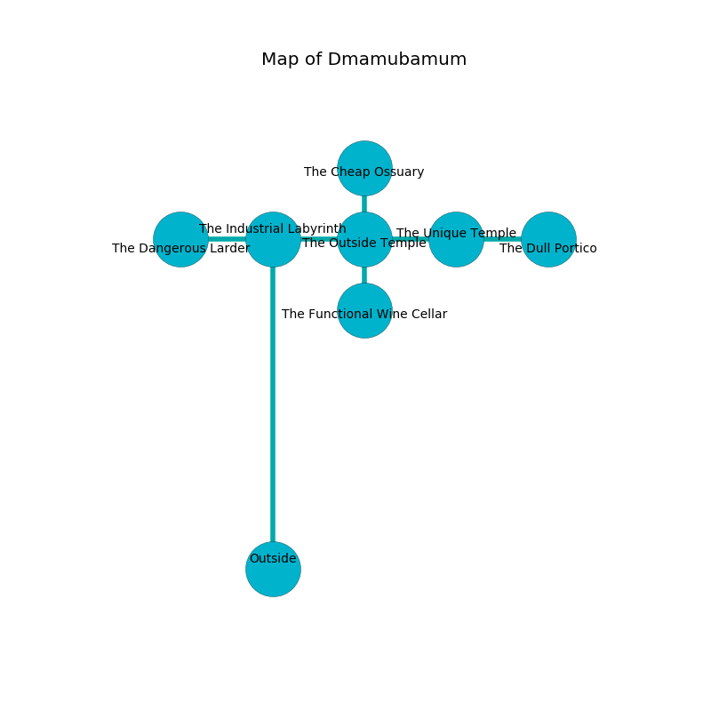

%Ruin Dogs

##Dmamubamum
###Overview
Dmamubamum is located in a crystal mountain. Some rooms of Dmamubamum are cursed. The ruin is sinking into the earth. It is occupied by Kuo-Toa. Dale Stillman The Dishonest, a Drow Mage is here. The Kuo-Toa have been charmed by Dale Stillman The Dishonest. He  is trying to recover [The Childish Rate](#The-Childish-Rate). 

###Artifact
####The Childish Rate

The Childish Rate looks like a cold prism. Psychic energy bends from it. When eaten it makes its owner invisible. 

###Locations

####the industrial labyrinth
The metallic walls are covered in mold. Yellow lichens are sprouting in broken urns. 

* To the south is the entrance.
* To the east a dripping cavern leads to [the outside temple](#the-outside-temple).
* To the west a narrow cave opens to [the dangerous larder](#the-dangerous-larder).

####the dangerous larder
The brick walls are caving in. Red moss is swaying from the walls. There are an Intellect Devourer and a Giant Shark here. 

* There is a dog here.
* To the east a narrow cave leads to [the industrial labyrinth](#the-industrial-labyrinth).

####the outside temple
The stone walls are unsettled. Gray razorgrass is swaying in cracks in the floor. There are a Thri-Kreen, an Aarakocra, and an Earth Elemental here. 

There is an engraving on a stone written in common. 

> I can not find [The Childish Rate](#The-Childish-Rate).
>
> Try praying.
>

* There is a baby here.
* There is a heart here.
* There is a cow here.
* To the south a torchlit cavern connects to [the functional wine cellar](#the-functional-wine-cellar).
* To the east a torchlit passageway opens to [the unique temple](#the-unique-temple).
* To the north a windy hall connects to [the cheap ossuary](#the-cheap-ossuary).
* To the west a dripping cavern connects to [the industrial labyrinth](#the-industrial-labyrinth).

####the unique temple
The floor is bloodstained. 

* [The Childish Rate](#The-Childish-Rate) is here.
* To the east a windy opening opens to [the dull portico](#the-dull-portico).
* To the west a torchlit passageway leads to [the outside temple](#the-outside-temple).

####the functional wine cellar
Gray ferns are swaying in broken urns. The floor is flooded with nine inch deep cold water. 

There is an engraving on a monolith written in Kuo-Toa Script. 

> They are frozen
>
> legal and tropical
>
> experimental, smooth, annual
>
> ever basic
>
> archaeological, late, sweet
>
> careful and unlawful
>
> frequent and organic
>
> They are frozen
>

* [Dale Stillman The Dishonest](#Dale-Stillman-The-Dishonest) is here.
* To the north a torchlit cavern leads to [the outside temple](#the-outside-temple).

####the cheap ossuary
The wooden walls are ruined. 

* To the south a windy hall leads to [the outside temple](#the-outside-temple).

####the dull portico
The floor is smooth. There is a Medusa here. The metallic walls are pristine. Gray lichens are decaying in a patch on the floor. 

* To the west a windy opening connects to [the unique temple](#the-unique-temple).

