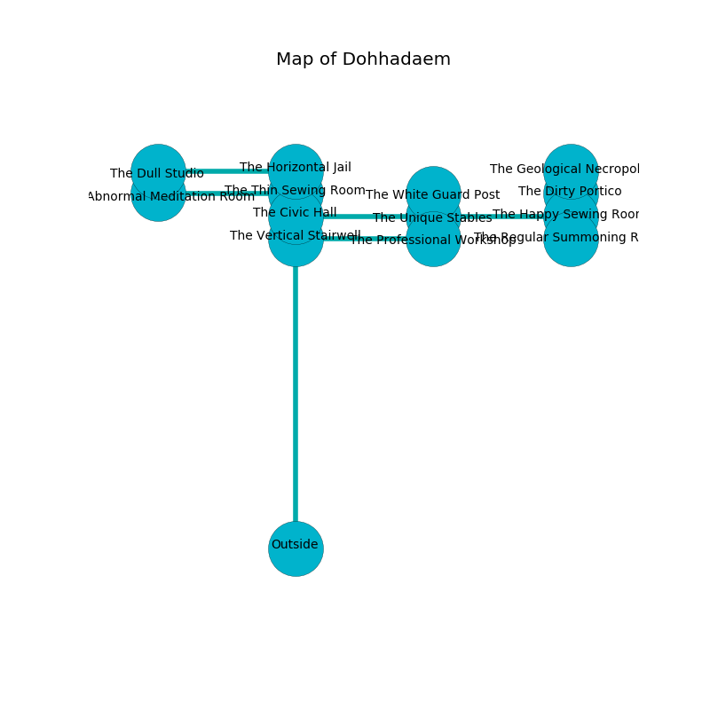

%Ruin Dogs

##Dohhadaem
###Overview
Dohhadaem is located on a volcanic plain. Some areas of Dohhadaem are flooded. The ruin is coming to life. It is occupied by Sahuagin. Colin Gore The Irresponsible, a Frost Giant is here. The Sahuagin have been charmed by Colin Gore The Irresponsible. He  is trying to research [Abdhuwiaf](#Abdhuwiaf). 

###Artifact
####Abdhuwiaf

Abdhuwiaf looks like a soft doll. It smells like cooked onion. Water slides away from it. When picked up it glows with an eerie light. 

###Locations

####the vertical stairwell
The floor is sticky. There are a Banshee, a Succubus, a Worg, and a Shadow here. The air smells like gasoline here. 

* There is a berry here.
* [Colin Gore The Irresponsible](#Colin-Gore-The-Irresponsible) is here.
* To the south is the entrance.
* To the east a dripping gap leads to [the professional workshop](#the-professional-workshop).
* To the north a torchlit threshold leads to [the civic hall](#the-civic-hall).

####the civic hall
There are a Giant Poisonous Snake, a Grell, a Pseudodragon, a Giant Sea Horse, a Yuan-Ti Pureblood, and an Intellect Devourer here. The air smells like cocoa here. 

* To the south a torchlit threshold leads to [the vertical stairwell](#the-vertical-stairwell).
* To the east a hazy hall opens to [the unique stables](#the-unique-stables).
* To the north a small passageway leads to [the thin sewing room](#the-thin-sewing-room).

####the unique stables
There are four Sahuagin and a Sahuagin Baron here. The wooden walls are caving in. One of the Sahuagin is on watch, the rest are drunk. 

* To the east a flooded path leads to [the happy sewing room](#the-happy-sewing-room).
* To the north a twisted hallway connects to [the white guard post](#the-white-guard-post).
* To the west a hazy hall opens to [the civic hall](#the-civic-hall).

####the white guard post
The floor is smooth. There are a Sahuagin and two Sahuagin Barons here. White moss is growing in a patch on the floor. The air smells like acerola here. The Sahuagin are willing to negotiate. 

* To the south a twisted hallway leads to [the unique stables](#the-unique-stables).

####the happy sewing room
The air smells like chemicals here. The floor is bloodstained. There are a Cambion and a Bugbear Chief here. There is a trap here. When activated, a magical sound detector will collapse a column. Gray razorgrass is sprouting in broken urns. The obsidion walls are covered in mold. 

* To the south a dripping walkway connects to [the regular summoning room](#the-regular-summoning-room).
* To the north a small cavern leads to [the dirty portico](#the-dirty-portico).
* To the west a flooded path leads to [the unique stables](#the-unique-stables).

####the thin sewing room
Blue lichens are sprouting in a patch on the floor. The floor is flooded with nine inch deep lukewarm water. 

There is an engraving on a monolith written in common. 

> Oh weak you
>
> but bare
>
> irrelevant, incredible, new
>
> hope is square
>

* To the south a small passageway leads to [the civic hall](#the-civic-hall).
* To the north a flooded walkway connects to [the horizontal jail](#the-horizontal-jail).
* To the west a narrow cavern opens to [the abnormal meditation room](#the-abnormal-meditation-room).

####the professional workshop
There are a Night Hag, a Bugbear, a Flying Sword, and an Owlbear here. The brick walls are unsettled. The air smells like coconut here. Yellow ferns are growing in broken urns. 

* To the west a dripping gap opens to [the vertical stairwell](#the-vertical-stairwell).

####the horizontal jail
The floor is cluttered with broken glass. The concrete walls are bloodstained. 

* To the south a flooded walkway opens to [the thin sewing room](#the-thin-sewing-room).
* To the west a windy corridor opens to [the dull studio](#the-dull-studio).

####the regular summoning room
The floor is flooded with two inch deep lukewarm water. The air tastes like prune here. The mirrored walls are pristine. 

There is an engraving on the wall written in Sahuagin Script. 

> [Abdhuwiaf](#Abdhuwiaf)
>
> but interesting
>
> you are not frozen
>

* To the north a dripping walkway leads to [the happy sewing room](#the-happy-sewing-room).

####the dirty portico
There is a trap here. When activated, a magical proximity detector will open a large pit in the floor. The brick walls are unsettled. The floor is sticky. 

There is an engraving on the floor written in common. 

> I could not try jumping.
>

* [Abdhuwiaf](#Abdhuwiaf) is here.
* To the south a small cavern opens to [the happy sewing room](#the-happy-sewing-room).
* To the north a flooded path opens to [the geological necropolis](#the-geological-necropolis).

####the dull studio
The floor is cluttered with rocks. The air tastes like meat here. There are three Sahuagin and two Sahuagin Barons here. The Sahuagin are fighting amongst themselves. 

* To the east a windy corridor opens to [the horizontal jail](#the-horizontal-jail).

####the abnormal meditation room
Yellow mushrooms are swaying from the ceiling. The stone walls are covered in mold. 

* To the east a narrow cavern leads to [the thin sewing room](#the-thin-sewing-room).

####the geological necropolis
The concrete walls are bloodstained. The air tastes like oats here. The floor is smooth. 

* To the south a flooded path opens to [the dirty portico](#the-dirty-portico).

