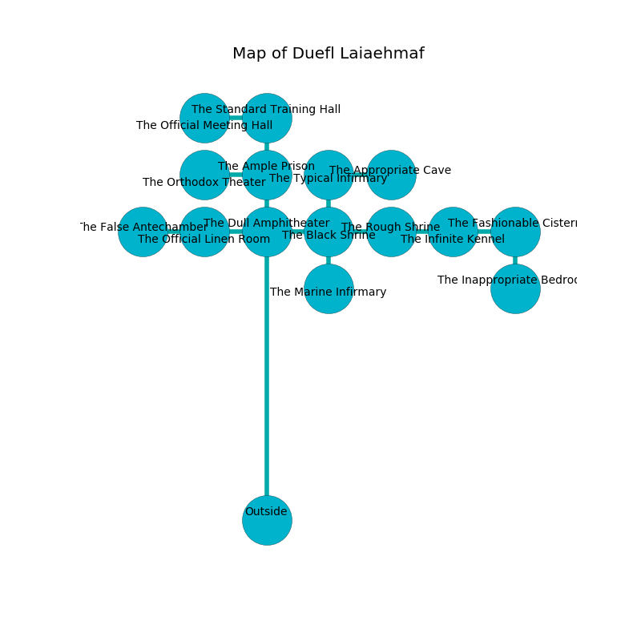

%Ruin Dogs

##Duefl Laiaehmaf
###Overview
Duefl Laiaehmaf is located in a cursed tree. Regions of it are foggy. A massive storm is happening outside. It is occupied by Deep Gnomes. Charley Gonzalez The Overcritical, an Assassin is here. The Deep Gnomes are the soldiers of Charley Gonzalez The Overcritical. He  is trying to hide [The Balanced Parallel](#The-Balanced-Parallel). 

###Artifact
####The Balanced Parallel

The Balanced Parallel has the form of a broken sphere. Air pours away from it. It smells like quince. When carried it dissappears. 

###Locations

####the dull amphitheater
The obsidion walls are ruined. There are a Ghast, a Polar Bear, a White Dragon Wyrmling, and a Giant Scorpion here. Blue lichens are growing from the ceiling. 

* To the south is the entrance.
* To the east a twisted walkway opens to [the black shrine](#the-black-shrine).
* To the north a dripping passageway opens to [the ample prison](#the-ample-prison).
* To the west a dripping gap connects to [the official linen room](#the-official-linen-room).

####the ample prison
White lichens are swaying in a patch on the floor. 

* To the south a dripping passageway connects to [the dull amphitheater](#the-dull-amphitheater).
* To the north a dark passageway connects to [the standard training hall](#the-standard-training-hall).
* To the west a twisted opening connects to [the orthodox theater](#the-orthodox-theater).

####the black shrine
The stone walls are scratched. The floor is flooded with five inch deep lukewarm water. 

* To the south a torchlit hall leads to [the marine infirmary](#the-marine-infirmary).
* To the east a narrow opening connects to [the rough shrine](#the-rough-shrine).
* To the north a hazy pathway opens to [the typical infirmary](#the-typical-infirmary).
* To the west a twisted walkway leads to [the dull amphitheater](#the-dull-amphitheater).

####the official linen room
The air smells like rancid butter here. The floor is bloodstained. There are an Eagle, a Lizardfolk Shaman, a Young Copper Dragon, a Succubus, and a Flying Snake here. The metallic walls are bloodstained. 

There is an engraving on the ceiling written in Deep Gnomes Script. 

> [The Balanced Parallel](#The-Balanced-Parallel)
>
> frank, blind, joint
>
> A lock is a confession
>
> cooperative and interesting
>
> ever visible
>
> [The Balanced Parallel](#The-Balanced-Parallel)
>
> but never trivial
>
> A box is a flock
>
> revolutionary, clean, regular
>
> A shirt is a food
>
> cautious and eligible
>
> rational and equal
>
> open, likely, single
>
> All of us are maddened
>
> constitutional, helpless, lively
>
> but never exact
>
> encouraging and realistic
>
> surprising and single
>
> [The Balanced Parallel](#The-Balanced-Parallel)
>
> always universal
>
> You are corrupted
>
> civic, incredible, raw
>
> you shall be destroyed
>

* There is a wall here.
* To the east a dripping gap opens to [the dull amphitheater](#the-dull-amphitheater).
* To the west a flooded cavern leads to [the false antechamber](#the-false-antechamber).

####the marine infirmary
The floor is bloodstained. The air tastes like leather here. Red lichens are sprouting in cracks in the floor. 

* To the north a torchlit hall connects to [the black shrine](#the-black-shrine).

####the typical infirmary
There are sixteen Deep Gnomes here. The Deep Gnomes are performing a ritual. If not interrupted, a powerful monster will be summoned. 

* There is a scissors here.
* To the south a hazy pathway opens to [the black shrine](#the-black-shrine).
* To the east a windy hall leads to [the appropriate cave](#the-appropriate-cave).

####the orthodox theater
The floor is bloodstained. The air tastes like fenugreek here. There are sixteen Deep Gnomes here. The glass walls are pristine. The Deep Gnomes are meditating. 

* [Charley Gonzalez The Overcritical](#Charley-Gonzalez-The-Overcritical) is here.
* To the east a twisted opening leads to [the ample prison](#the-ample-prison).

####the rough shrine
The air smells like cedarwood here. 

* To the east a twisted walkway leads to [the infinite kennel](#the-infinite-kennel).
* To the west a narrow opening connects to [the black shrine](#the-black-shrine).

####the appropriate cave
There are a Draft Horse, a Scarecrow, a Hezrou, a Giant Centipede, and a Green Dragon Wyrmling here. 

* To the west a windy hall connects to [the typical infirmary](#the-typical-infirmary).

####the false antechamber
The brick walls are bloodstained. White lichens are swaying in broken urns. 

* There is a hammer here.
* To the east a flooded cavern opens to [the official linen room](#the-official-linen-room).

####the standard training hall
Gray mushrooms are swaying in a patch on the floor. There are a Guard, a Gnoll Fang of Yeenoghu, a Cockatrice, a Hook Horror, and a Spectator here. 

* There is a gold coin here.
* There is a nail here.
* [The Balanced Parallel](#The-Balanced-Parallel) is here.
* To the south a dark passageway leads to [the ample prison](#the-ample-prison).
* To the west a hazy walkway opens to [the official meeting hall](#the-official-meeting-hall).

####the infinite kennel
The metallic walls are caving in. The floor is smooth. There are a Bat, a Young Green Dragon, and a Giant Centipede here. 

* There is a monkey here.
* To the east a windy cave connects to [the fashionable cistern](#the-fashionable-cistern).
* To the west a twisted walkway leads to [the rough shrine](#the-rough-shrine).

####the fashionable cistern
There is a Young Green Dragon here. There is a trap here. When activated, a tripwire will make the walls close in. 

* There is a frame here.
* There is a card here.
* There is a lock here.
* To the south a hazy threshold connects to [the inappropriate bedroom](#the-inappropriate-bedroom).
* To the west a windy cave opens to [the infinite kennel](#the-infinite-kennel).

####the inappropriate bedroom
The floor is bloodstained. The air smells like opoponax here. 

There is an engraving on a stone written in common. 

> Dig here.
>

* To the north a hazy threshold connects to [the fashionable cistern](#the-fashionable-cistern).

####the official meeting hall
The brick walls are bloodstained. There are a Tridrone, an Ogre Zombie, a Giant Eagle, a Triceratops, and a Wereboar here. 

There is an engraving on a tablet written in Deep Gnomes Script. 

> Hide here.
>

* To the east a hazy walkway connects to [the standard training hall](#the-standard-training-hall).

