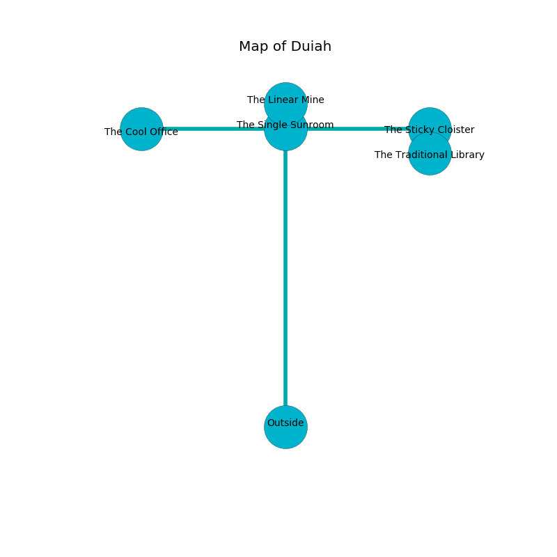

%Ruin Dogs

##Duiah
###Overview
Duiah is located on a haunted plain. Parts of it are inaccessible. The ruin is sinking into the earth. It is occupied by Humans. Marci Puente The Cruel, a Vampire Spawn is here. The Humans are battling Marci Puente The Cruel. She  is founding a new religion. 

###Artifact
####The Foolish Label

The Foolish Label looks like a soft gem. Light slips around it. It smells like neroli. When touched it grants a wish. 

###Locations

####the single sunroom
Red mushrooms are sprouting in a patch on the floor. The air tastes like tallow here. 

* To the south is the entrance.
* To the east a narrow pathway connects to [the sticky cloister](#the-sticky-cloister).
* To the north a twisted cavern leads to [the linear mine](#the-linear-mine).
* To the west a narrow hall connects to [the cool office](#the-cool-office).

####the linear mine
There are a Couatl and a Mummy here. The air tastes like coriander here. Red moss is swaying in cracks in the floor. 

* To the south a twisted cavern leads to [the single sunroom](#the-single-sunroom).

####the sticky cloister
Yellow moss is decaying in broken urns. There are a Green Dragon Wyrmling, a Giant Constrictor Snake, and a Bearded Devil here. The floor is bloodstained. 

* [The Foolish Label](#The-Foolish-Label) is here.
* [Marci Puente The Cruel](#Marci-Puente-The-Cruel) is here.
* To the south a long passageway opens to [the traditional library](#the-traditional-library).
* To the west a narrow pathway connects to [the single sunroom](#the-single-sunroom).

####the cool office
White lichens are sprouting in a patch on the floor. There are a Guard, a Bandit Captain, a Knight, a Berserker, and a Cultist here. The floor is glossy. The Humans are performing a ritual. If not interrupted, the Humans will become more powerful. 

* To the east a narrow hall leads to [the single sunroom](#the-single-sunroom).

####the traditional library
The floor is smooth. 

* To the north a long passageway leads to [the sticky cloister](#the-sticky-cloister).

