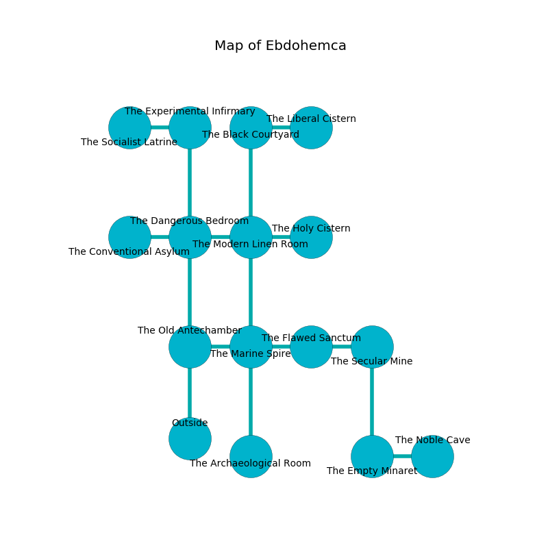

%Ruin Dogs

##Ebdohemca
###Overview
Ebdohemca is located under a spikey plain. Parts of it are flooded. A battle between raiders is happening outside. It is occupied by Sahuagin. Carey Whiting The Touchy, a Cloud Giant is here. The Sahuagin worship Carey Whiting The Touchy. She  is founding a new religion. 

###Artifact
####Iamiedaeum Deicaddehh

Iamiedaeum Deicaddehh looks like a glassy figurine. Fire glows towards it. It smells like apple. It is a dark pink color. When smelled it ignites its surrroundings. 

###Locations

####the dangerous bedroom

There is an engraving on the wall written in Sahuagin Script. 

> Oh my life is poor
>
> domestic and direct
>
> it is never secure
>
> the world is perfect
>

* There is a brooch here.
* There is a fish here.
* To the south is the entrance.
* To the east a long cave connects to [the modern linen room](#the-modern-linen-room).
* To the north a dripping artery connects to [the experimental infirmary](#the-experimental-infirmary).
* To the west a twisted corridor leads to [the conventional asylum](#the-conventional-asylum).

####the modern linen room
There are a Scarecrow, a Guardian Naga, a Giant Constrictor Snake, and a Baboon here. The air tastes like sap here. The floor is glossy. 

There is an engraving on a monolith written in Sahuagin Script. 

> All of us are cursed
>
> enjoyable, realistic, nuclear
>
> but never steady
>
> domestic, romantic, sympathetic
>
> you shall be punished
>

* To the south a narrow hallway connects to [the marine spire](#the-marine-spire).
* To the east a narrow cave leads to [the holy cistern](#the-holy-cistern).
* To the north a long walkway leads to [the black courtyard](#the-black-courtyard).
* To the west a long cave leads to [the dangerous bedroom](#the-dangerous-bedroom).

####the marine spire
The air smells like toffee here. There are a Sahuagin and two Sahuagin Barons here. The crystal walls are scratched. If the Sahuagin notice the Ruin Dogs, one of them will retreat and alert the others. 

* To the south a dark cave connects to [the archaeological room](#the-archaeological-room).
* To the east a twisted passageway opens to [the flawed sanctum](#the-flawed-sanctum).
* To the north a narrow hallway opens to [the modern linen room](#the-modern-linen-room).
* To the west a hazy hallway connects to [the old antechamber](#the-old-antechamber).

####the experimental infirmary
The floor is glossy. The mirrored walls are pristine. 

There is an engraving on the ceiling written in Sahuagin Script. 

> A lip is a broccoli
>
> polite and pure
>

* To the south a dripping artery opens to [the dangerous bedroom](#the-dangerous-bedroom).
* To the west a long corridor opens to [the socialist latrine](#the-socialist-latrine).

####the flawed sanctum
There are a Sahuagin and two Sahuagin Barons here. The floor is sticky. The Sahuagin are performing a ritual. If not interrupted, a powerful monster will be summoned. 

There is an engraving on a monolith written in common. 

> [Iamiedaeum Deicaddehh](#Iamiedaeum-Deicaddehh)
>
> but vacant
>

* There is a chest here.
* To the east a long artery connects to [the secular mine](#the-secular-mine).
* To the west a twisted passageway leads to [the marine spire](#the-marine-spire).

####the black courtyard
There are a Giant Vulture, a Tridrone, a Helmed Horror, a Raven, and a Cloaker here. 

* To the south a long walkway opens to [the modern linen room](#the-modern-linen-room).
* To the east a flooded cavern leads to [the liberal cistern](#the-liberal-cistern).

####the liberal cistern
There are four Sahuagin and two Sahuagin Barons here. The air tastes like sand here. There is a trap here. When activated, a pressure plate will launch a rolling boulder. The floor is smooth. The Sahuagin are willing to negotiate. 

* To the west a flooded cavern leads to [the black courtyard](#the-black-courtyard).

####the conventional asylum
The mirrored walls are unsettled. The air smells like valerian root here. 

There is an engraving on a stone written in common. 

> [Iamiedaeum Deicaddehh](#Iamiedaeum-Deicaddehh)
>
> logical and professional
>
> A stick is an eagle
>
> maximum and peaceful
>
> closed, impossible, competitive
>
> tired, abnormal, complex
>
> but thoughtful
>
> [Iamiedaeum Deicaddehh](#Iamiedaeum-Deicaddehh)
>

* To the east a twisted corridor leads to [the dangerous bedroom](#the-dangerous-bedroom).

####the secular mine
The concrete walls are ruined. Green lichens are decaying in broken urns. The air smells like graham cracker here. 

* There is a trousers here.
* There is a bell here.
* To the south a torchlit path connects to [the empty minaret](#the-empty-minaret).
* To the west a long artery connects to [the flawed sanctum](#the-flawed-sanctum).

####the archaeological room
The floor is smooth. There are a Drow Priestess of Lolth and a Giant Constrictor Snake here. The glass walls are unsettled. 

* To the north a dark cave leads to [the marine spire](#the-marine-spire).

####the holy cistern
The air smells like seashore here. The floor is smooth. 

* To the west a narrow cave opens to [the modern linen room](#the-modern-linen-room).

####the socialist latrine
Blue moss is sprouting in a patch on the floor. 

* To the east a long corridor connects to [the experimental infirmary](#the-experimental-infirmary).

####the old antechamber
The air smells like graham cracker here. There are a Sahuagin and two Sahuagin Barons here. Red razorgrass is sprouting in broken urns. The Sahuagin are crazy with bloodlust. 

* To the east a hazy hallway leads to [the marine spire](#the-marine-spire).

####the empty minaret
Green razorgrass is decaying in a patch on the floor. The floor is bloodstained. 

* There is a hare here.
* [Iamiedaeum Deicaddehh](#Iamiedaeum-Deicaddehh) is here.
* To the east a long corridor leads to [the noble cave](#the-noble-cave).
* To the north a torchlit path leads to [the secular mine](#the-secular-mine).

####the noble cave
The floor is flooded with six inch deep lukewarm water. Gray razorgrass is sprouting from the walls. There are a Fire Giant, an Acolyte, a Black Dragon Wyrmling, a Warhorse Skeleton, and a Yuan-Ti Pureblood here. 

There is an engraving on a stone written in Sahuagin Script. 

> I am seeking [Iamiedaeum Deicaddehh](#Iamiedaeum-Deicaddehh).
>
> A trap ahead.
>

* [Carey Whiting The Touchy](#Carey-Whiting-The-Touchy) is here.
* To the west a long corridor opens to [the empty minaret](#the-empty-minaret).

