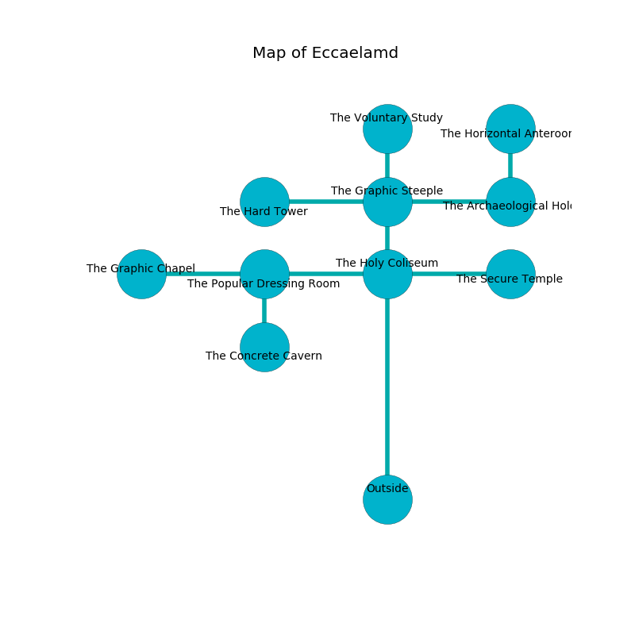

%Ruin Dogs

##Eccaelamd
###Overview
Eccaelamd is located on a poisoned mountain. Some rooms of Eccaelamd are foggy. The ruin is collapsing slowly. It is occupied by Humans. Gladys Byrd The Aggressive, a Githzerai Monk is here. The Humans are battling Gladys Byrd The Aggressive. She  is founding a new religion. 

###Artifact
####Duflaf

Duflaf looks like a hard doll. Fire flows away from it. When worn it projects energy. 

###Locations

####the holy coliseum
There are a Gnoll, an Intellect Devourer, a Giant Lizard, and a Kuo-Toa Monitor here. The air tastes like egg nog here. Red mushrooms are decaying from the walls. The floor is smooth. The glass walls are caving in. 

There is an engraving on the floor written in common. 

> Maybe try dying.
>

* To the south is the entrance.
* To the east a torchlit hall leads to [the secure temple](#the-secure-temple).
* To the north a twisted cave leads to [the graphic steeple](#the-graphic-steeple).
* To the west a dripping gap opens to [the popular dressing room](#the-popular-dressing-room).

####the graphic steeple
Blue lichens are decaying in a patch on the floor. There are a Spider, a Knight, and an Acolyte here. The obsidion walls are scratched. 

There is an engraving on the wall written in Humans Script. 

> O! the memory of you is sadistic
>
> yet never realistic
>
> experimental and mobile
>
> cruelty is noble
>

* To the south a twisted cave leads to [the holy coliseum](#the-holy-coliseum).
* To the east a windy cave connects to [the archaeological hold](#the-archaeological-hold).
* To the north a twisted cavern leads to [the voluntary study](#the-voluntary-study).
* To the west a torchlit cavern leads to [the hard tower](#the-hard-tower).

####the popular dressing room
The air tastes like macadamia here. There are a Quaggoth, a Merfolk, a Pteranodon, a Giant Lizard, a Gas Spore, a Giant Eagle, an Acolyte, and a Crab here. Green lichens are swaying from the ceiling. 

* There is a basket here.
* [Duflaf](#Duflaf) is here.
* To the south a hazy hallway connects to [the concrete cavern](#the-concrete-cavern).
* To the east a dripping gap opens to [the holy coliseum](#the-holy-coliseum).
* To the west a windy cave opens to [the graphic chapel](#the-graphic-chapel).

####the hard tower
The air smells like lemongrass here. The floor is smooth. 

* To the east a torchlit cavern opens to [the graphic steeple](#the-graphic-steeple).

####the concrete cavern
The air tastes like petroleum here. 

* [Gladys Byrd The Aggressive](#Gladys-Byrd-The-Aggressive) is here.
* To the north a hazy hallway opens to [the popular dressing room](#the-popular-dressing-room).

####the archaeological hold
Blue mushrooms are growing from the walls. The air smells like paper here. The floor is smooth. 

* There is a cup here.
* To the north a twisted corridor opens to [the horizontal anteroom](#the-horizontal-anteroom).
* To the west a windy cave leads to [the graphic steeple](#the-graphic-steeple).

####the secure temple
The air smells like lime here. The floor is bloodstained. 

There is an engraving on a tablet written in common. 

> I am lost in Eccaelamd.
>
> I thought about hiding.
>

* To the west a torchlit hall connects to [the holy coliseum](#the-holy-coliseum).

####the voluntary study
There are a Veteran, a Commoner, an Acolyte, two Thugs, and  here. White lichens are sprouting in broken urns. If the Humans notice the Ruin Dogs, one of them will retreat and alert the others. 

* There is a crossbow here.
* To the south a twisted cavern connects to [the graphic steeple](#the-graphic-steeple).

####the horizontal anteroom
The air smells like sesame here. There are a Githyanki Warrior and a Merrow here. The obsidion walls are covered in mold. 

* To the south a twisted corridor leads to [the archaeological hold](#the-archaeological-hold).

####the graphic chapel
The floor is glossy. The air tastes like nut flesh here. 

* To the east a windy cave connects to [the popular dressing room](#the-popular-dressing-room).

