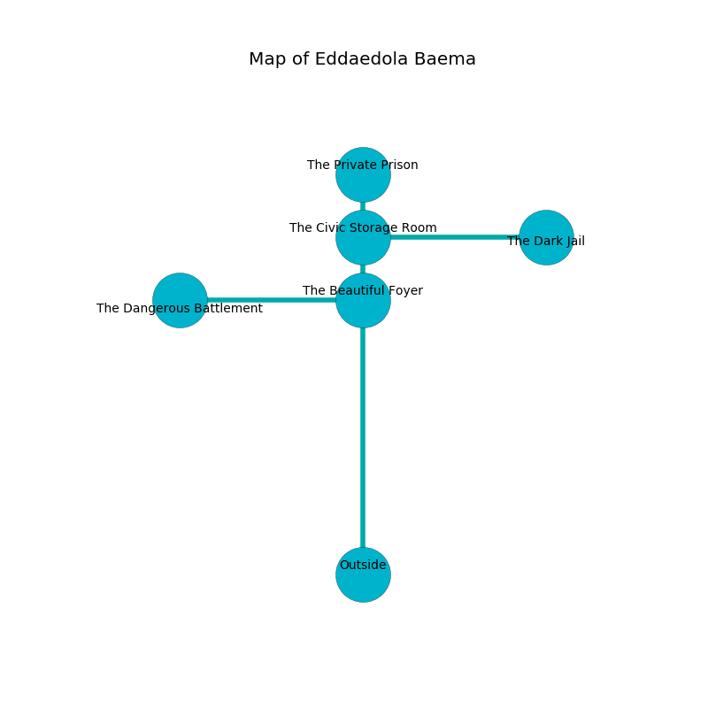

%Ruin Dogs

##Eddaedola Baema
###Overview
Eddaedola Baema is located under a cursed city. Parts of it are flooded. A massive flood is happening outside. It is occupied by Drows. Trista Ramsay The Tactless, a Bulette is here. The Drows are ruled by Trista Ramsay The Tactless. She  is trying to research [The Good Pleasure](#The-Good-Pleasure). 

###Artifact
####The Good Pleasure

The Good Pleasure has the form of a warm orb. When carried it grants power to its owner. 

###Locations

####the beautiful foyer
The concrete walls are ruined. The floor is glossy. Red moss is swaying in a patch on the floor. 

* To the south is the entrance.
* To the north a narrow hall opens to [the civic storage room](#the-civic-storage-room).
* To the west a dark cave leads to [the dangerous battlement](#the-dangerous-battlement).

####the civic storage room
There are twenty four Drows here. The air smells like chocolate here. One of the Drows is on watch, the rest are fighting amongst themselves. 

* [The Good Pleasure](#The-Good-Pleasure) is here.
* To the south a narrow hall opens to [the beautiful foyer](#the-beautiful-foyer).
* To the east a hazy hallway leads to [the dark jail](#the-dark-jail).
* To the north a windy hall opens to [the private prison](#the-private-prison).

####the private prison
The crystal walls are caving in. 

* To the south a windy hall connects to [the civic storage room](#the-civic-storage-room).

####the dangerous battlement
The floor is cluttered with shells. 

* [Trista Ramsay The Tactless](#Trista-Ramsay-The-Tactless) is here.
* To the east a dark cave opens to [the beautiful foyer](#the-beautiful-foyer).

####the dark jail
Red moss is growing from the walls. The air smells like mango here. There are a Berserker, a Monodrone, a Wolf, a Drider, a Cultist, and a Sahuagin Priestess here. The obsidion walls are covered in mold. 

* To the west a hazy hallway opens to [the civic storage room](#the-civic-storage-room).

