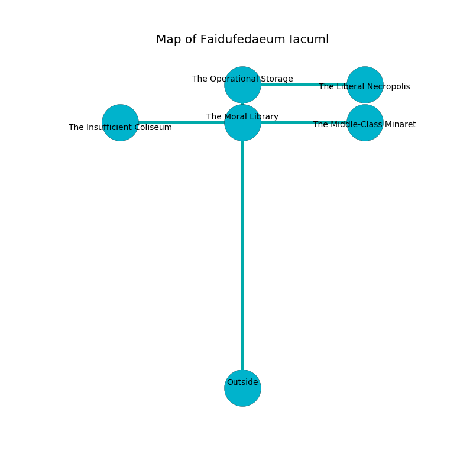

%Ruin Dogs

##Faidufedaeum Iacuml
###Overview
Faidufedaeum Iacuml is located on a poisoned rift. Some rooms of Faidufedaeum Iacuml are unbearably cold. A solar eclipse is happening outside. It is occupied by Kenku. Karlene Canfield The Intolerant, a Cloud Giant is here. The Kenku are the slaves of Karlene Canfield The Intolerant. She  is founding a new religion. 

###Artifact
####The Real Pedestrian

The Real Pedestrian has the form of a sharp orb. It is a pale green color. It smells like orangeflower. When carried it levitates those nearby. 

###Locations

####the moral library
There are a Werebear, a Wererat, and a Bone Devil here. The floor is flooded with seven inch deep hot water. The air smells like linden flower here. The mirrored walls are unsettled. 

* [The Real Pedestrian](#The-Real-Pedestrian) is here.
* To the south is the entrance.
* To the east a narrow pathway leads to [the middle-class minaret](#the-middle-class-minaret).
* To the north a small walkway leads to [the operational storage](#the-operational-storage).
* To the west a torchlit threshold opens to [the insufficient coliseum](#the-insufficient-coliseum).

####the operational storage
White mushrooms are sprouting from the ceiling. The wooden walls are scratched. There is a trap here. When activated, a magical sound detector will launch stone blocks from the ceiling. The floor is cluttered with ashes. 

* To the south a small walkway leads to [the moral library](#the-moral-library).
* To the east a windy gap connects to [the liberal necropolis](#the-liberal-necropolis).

####the liberal necropolis
Blue moss is sprouting from the ceiling. There are a Giant Frog, a Piercer, a Yuan-Ti Pureblood, an Elephant, and an Invisible Stalker here. 

* There is a plate here.
* To the west a windy gap connects to [the operational storage](#the-operational-storage).

####the middle-class minaret
The air smells like grapefruit here. Yellow razorgrass is growing in broken urns. 

* To the west a narrow pathway connects to [the moral library](#the-moral-library).

####the insufficient coliseum
White lichens are growing from the ceiling. The metallic walls are scratched. The floor is glossy. 

There is an engraving on a stone written in common. 

> A cart is a cut
>
> but productive
>
> left, molecular, nuclear
>

* There is a ghost here.
* There is a brush here.
* [Karlene Canfield The Intolerant](#Karlene-Canfield-The-Intolerant) is here.
* To the east a torchlit threshold opens to [the moral library](#the-moral-library).

