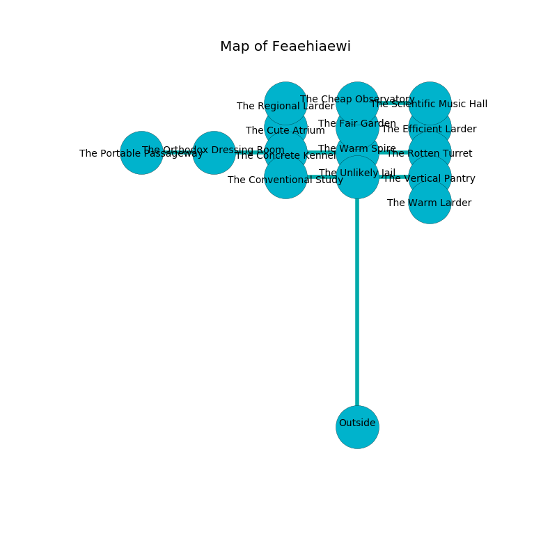

%Ruin Dogs

##Feaehiaewi
###Overview
Feaehiaewi is constructed on a poisoned plain. Regions of Feaehiaewi are flooded. A lunar eclipse is happening outside. It is occupied by Orc. Antoine Lopes The Quarrelsome, an Assassin is here. The Orc are the slaves of Antoine Lopes The Quarrelsome. He  is founding a new religion. 

###Artifact
####The Deaf Index

The Deaf Index is a powerful artifact in the shape of a wet sphere. It is a sickly gray color. When picked up it becomes hot. 

###Locations

####the unlikely jail
The obsidion walls are ruined. The air tastes like urine here. 

* There is a trousers here.
* To the south is the entrance.
* To the east a hazy pathway connects to [the vertical pantry](#the-vertical-pantry).
* To the north a flooded corridor connects to [the warm spire](#the-warm-spire).
* To the west a dark artery opens to [the conventional study](#the-conventional-study).

####the conventional study
There are sixteen Orcs here. The air tastes like mold here. Blue ferns are sprouting from the ceiling. The mirrored walls are pristine. If the Orc notice the Ruin Dogs, one of them will retreat and alert [Antoine Lopes](#Antoine-Lopes). 

* To the east a dark artery leads to [the unlikely jail](#the-unlikely-jail).

####the warm spire
The floor is glossy. The concrete walls are ruined. There are a Grick Alpha and a Young Black Dragon here. Red ferns are swaying in a patch on the floor. 

There is an engraving on a tablet written in common. 

> A spade is an impulse
>
> archaeological, color-blind, satisfactory
>
> you must be consumed
>

* There is a drake here.
* There is a feather here.
* To the south a flooded corridor leads to [the unlikely jail](#the-unlikely-jail).
* To the east a dripping threshold opens to [the rotten turret](#the-rotten-turret).
* To the north a narrow cave leads to [the fair garden](#the-fair-garden).
* To the west a torchlit opening leads to [the concrete kennel](#the-concrete-kennel).

####the vertical pantry
The floor is flooded with eight inch deep scalding water. There are a Yuan-Ti Malison and a Mind Flayer Arcanist here. The air smells like frankincense here. 

* To the south a narrow hall leads to [the warm larder](#the-warm-larder).
* To the west a hazy pathway leads to [the unlikely jail](#the-unlikely-jail).

####the rotten turret
The floor is bloodstained. Green mushrooms are sprouting in cracks in the floor. 

* To the north a long gap connects to [the efficient larder](#the-efficient-larder).
* To the west a dripping threshold connects to [the warm spire](#the-warm-spire).

####the fair garden
The brick walls are unsettled. The air smells like milk here. The floor is glossy. There are a Deer, a Shadow, a Bronze Dragon Wyrmling, a Gibbering Mouther, a Panther, an Ettin, a Giant Owl, a Twig Blight, and a Black Dragon Wyrmling here. Blue lichens are growing in a patch on the floor. 

* There is a chainmail here.
* There is an amulet here.
* To the south a narrow cave connects to [the warm spire](#the-warm-spire).
* To the north a dripping hallway leads to [the cheap observatory](#the-cheap-observatory).

####the concrete kennel

* To the east a torchlit opening opens to [the warm spire](#the-warm-spire).
* To the north a hazy passageway connects to [the cute atrium](#the-cute-atrium).
* To the west a hazy artery connects to [the orthodox dressing room](#the-orthodox-dressing-room).

####the orthodox dressing room
The metallic walls are scratched. The floor is sticky. Blue razorgrass is sprouting from the ceiling. 

There is an engraving on the floor written in Orc Script. 

> I want to find [The Deaf Index](#The-Deaf-Index).
>

* [The Deaf Index](#The-Deaf-Index) is here.
* To the east a hazy artery opens to [the concrete kennel](#the-concrete-kennel).
* To the west a torchlit threshold leads to [the portable passageway](#the-portable-passageway).

####the efficient larder
There are a Giant Crocodile and a Xorn here. 

* There is a hare here.
* There is a box here.
* There is a sceptre here.
* To the south a long gap leads to [the rotten turret](#the-rotten-turret).

####the warm larder
The floor is flooded with one inch deep cold water. White razorgrass is decaying from the walls. The air tastes like pine here. There are a Polar Bear, a Troll, and a Giant Spider here. 

There is an engraving on a tablet written in Orc Script. 

> I am hiding in this place.
>

* To the north a narrow hall leads to [the vertical pantry](#the-vertical-pantry).

####the cute atrium
The wooden walls are bloodstained. Blue razorgrass is sprouting in cracks in the floor. 

* To the south a hazy passageway opens to [the concrete kennel](#the-concrete-kennel).
* To the north a dripping pathway opens to [the regional larder](#the-regional-larder).

####the cheap observatory
Blue lichens are decaying in a patch on the floor. There are a Pseudodragon, a Piercer, a Spectator, and a Wraith here. There is a trap here. When activated, a tripwire will open a trapdoor in the floor. 

There is an engraving on a stone written in common. 

> I am seeking [The Deaf Index](#The-Deaf-Index).
>
> Leave now.
>

* There is a boat here.
* There is a tome here.
* To the south a dripping hallway opens to [the fair garden](#the-fair-garden).
* To the east a torchlit cave opens to [the scientific music hall](#the-scientific-music-hall).

####the scientific music hall
White razorgrass is sprouting in a patch on the floor. 

There is an engraving on the ceiling written in Orc Script. 

> Hide here.
>

* There is a button here.
* [Antoine Lopes The Quarrelsome](#Antoine-Lopes-The-Quarrelsome) is here.
* To the west a torchlit cave connects to [the cheap observatory](#the-cheap-observatory).

####the regional larder
The obsidion walls are pristine. Red ferns are sprouting in broken urns. 

* To the south a dripping pathway connects to [the cute atrium](#the-cute-atrium).

####the portable passageway
The floor is bloodstained. 

There is an engraving on a stone written in common. 

> [The Deaf Index](#The-Deaf-Index)
>
> yet never valuable
>

* To the east a torchlit threshold leads to [the orthodox dressing room](#the-orthodox-dressing-room).

