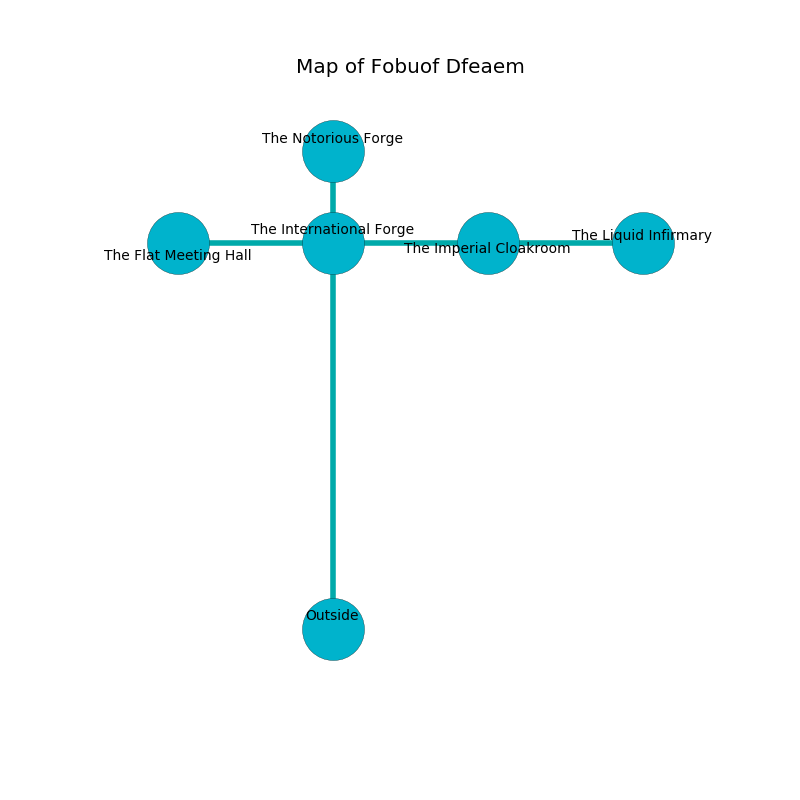

%Ruin Dogs

##Fobuof Dfeaem
###Overview
Fobuof Dfeaem is located under a giant plain. Parts of it are foggy. A blizzard is happening outside. It is occupied by Ogres. Merlin Mcdaniel The Compulsive, a Yuan-Ti Abomination is here. The Ogres have been charmed by Merlin Mcdaniel The Compulsive. He  is founding a new religion. 

###Artifact
####Hoaehd Iaeha

Hoaehd Iaeha has the form of a broken rock. It is a pale yellow color. When rubbed it changes the past. 

###Locations

####the international forge
The floor is glossy. The air smells like animal here. There are a Quaggoth, a Bulette, and a Giant Elk here. 

* [Hoaehd Iaeha](#Hoaehd-Iaeha) is here.
* To the south is the entrance.
* To the east a windy threshold opens to [the imperial cloakroom](#the-imperial-cloakroom).
* To the north a flooded walkway leads to [the notorious forge](#the-notorious-forge).
* To the west a windy path leads to [the flat meeting hall](#the-flat-meeting-hall).

####the imperial cloakroom
Blue ferns are decaying in cracks in the floor. There are three Half-Ogres and two Ogres here. The floor is smooth. The stone walls are covered in mold. The air tastes like leek here. If the Ogres notice the Ruin Dogs, one of them will retreat and alert the others. 

* To the east a twisted passageway opens to [the liquid infirmary](#the-liquid-infirmary).
* To the west a windy threshold connects to [the international forge](#the-international-forge).

####the flat meeting hall
White razorgrass is sprouting in cracks in the floor. The air tastes like soap here. The floor is cluttered with broken glass. There are three Ogres here. If the Ogres notice the Ruin Dogs, one of them will retreat and alert the others. 

There is an engraving on the floor written in common. 

> Run away.
>

* [Merlin Mcdaniel The Compulsive](#Merlin-Mcdaniel-The-Compulsive) is here.
* To the east a windy path opens to [the international forge](#the-international-forge).

####the liquid infirmary
There are three Ogres here. The air tastes like sausage here. The brick walls are caving in. Gray mushrooms are growing in a patch on the floor. One of the Ogres is on watch, the rest are feasting. 

* To the west a twisted passageway opens to [the imperial cloakroom](#the-imperial-cloakroom).

####the notorious forge
The floor is bloodstained. The air tastes like patchouli here. The concrete walls are caving in. Green mushrooms are swaying in cracks in the floor. There is a trap here. When activated, a pressure plate will swing a tripping chain. There are four Half-Ogres and an Ogre here. The Ogres are meditating. 

* To the south a flooded walkway connects to [the international forge](#the-international-forge).

