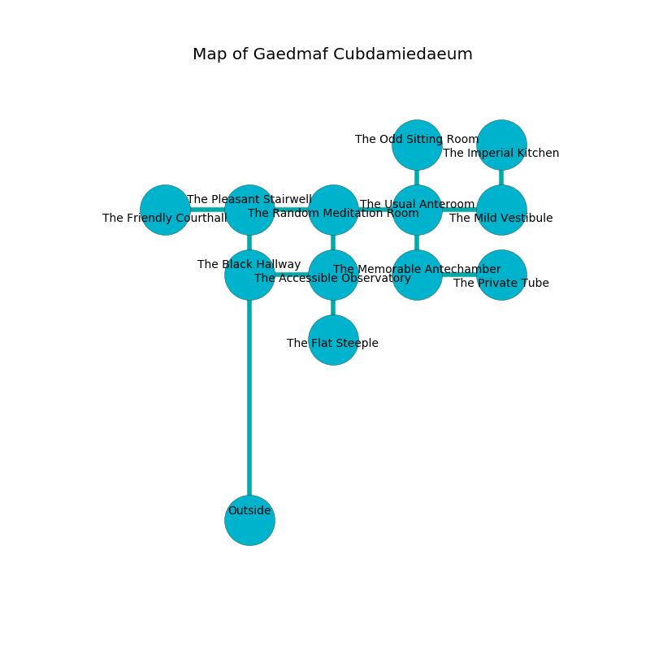

%Ruin Dogs

##Gaedmaf Cubdamiedaeum
###Overview
Gaedmaf Cubdamiedaeum is located in a volcanic mountain. Some rooms of it are corrupted. A lunar eclipse is happening outside. It is occupied by Kuo-Toa. Samuel Hoyle The Pusillanimous, a Vampire Spawn is here. The Kuo-Toa are battling Samuel Hoyle The Pusillanimous. He  is founding a new religion. 

###Artifact
####Cubduiaf

Cubduiaf looks like an opaque gem. It is a dark gray color. Power flows near it. When smelled it shows an image of the future. 

###Locations

####the pleasant stairwell
There are a Kuo-Toa Monitor, three Kuo-Toa Whips, a Kuo-Toa,  here. White mushrooms are growing from the ceiling. The Kuo-Toa are performing a ritual. If not interrupted, a powerful monster will be summoned. 

* To the south is the entrance.
* To the east a dripping opening connects to [the random meditation room](#the-random-meditation-room).
* To the west a dark artery opens to [the friendly courthall](#the-friendly-courthall).

####the friendly courthall
The floor is smooth. There is a trap here. When activated, a tripwire will launch a fireball. The air tastes like beef here. There are a Blink Dog, a Half-Red Dragon Veteran, an Ice Mephit, and a Badger here. 

* There is a roof here.
* [Samuel Hoyle The Pusillanimous](#Samuel-Hoyle-The-Pusillanimous) is here.
* To the east a dark artery connects to [the pleasant stairwell](#the-pleasant-stairwell).

####the random meditation room
The floor is glossy. There are a Kuo-Toa Whip, two Kuo-Toa Monitors, two Kuo-Toa,  here. The air tastes like dried fruit here. One of the Kuo-Toa is on watch, the rest are feasting. 

There is an engraving on a stone written in common. 

> Hide here.
>

* To the south a torchlit walkway leads to [the accessible observatory](#the-accessible-observatory).
* To the east a narrow hall leads to [the usual anteroom](#the-usual-anteroom).
* To the west a dripping opening leads to [the pleasant stairwell](#the-pleasant-stairwell).

####the usual anteroom
There is a Cambion here. The obsidion walls are pristine. Gray lichens are swaying from the ceiling. 

There is an engraving on a monolith written in common. 

> Leave now.
>

* To the south a long opening leads to [the memorable antechamber](#the-memorable-antechamber).
* To the east a hazy hall opens to [the mild vestibule](#the-mild-vestibule).
* To the north a torchlit corridor leads to [the odd sitting Room](#the-odd-sitting-Room).
* To the west a narrow hall connects to [the random meditation room](#the-random-meditation-room).

####the accessible observatory
Gray razorgrass is sprouting from the ceiling. The air tastes like coffee here. 

* To the south a torchlit path leads to [the flat steeple](#the-flat-steeple).
* To the north a torchlit walkway leads to [the random meditation room](#the-random-meditation-room).
* To the west a torchlit hall leads to [the black hallway](#the-black-hallway).

####the memorable antechamber
The floor is flooded with four inch deep cold water. The brick walls are covered in mold. The air tastes like beef here. 

* There is a sword here.
* To the east a small walkway opens to [the private tube](#the-private-tube).
* To the north a long opening leads to [the usual anteroom](#the-usual-anteroom).

####the black hallway
Red mushrooms are growing from the ceiling. The metallic walls are pristine. There are a Giant Crocodile and a Gargoyle here. 

* There is a potato here.
* There is a key here.
* There is a spring here.
* To the east a torchlit hall opens to [the accessible observatory](#the-accessible-observatory).

####the private tube
The floor is sticky. The brick walls are ruined. 

* There is a bird here.
* To the west a small walkway connects to [the memorable antechamber](#the-memorable-antechamber).

####the flat steeple
The wooden walls are covered in mold. White razorgrass is swaying in cracks in the floor. There are a Bulette, a Pteranodon, and a Hell Hound here. 

* To the north a torchlit path leads to [the accessible observatory](#the-accessible-observatory).

####the odd sitting Room
The floor is smooth. The air smells like oats here. The glass walls are ruined. Yellow ferns are growing in cracks in the floor. 

There is an engraving on a stone written in common. 

> I am starving.
>
> Run away.
>

* To the south a torchlit corridor leads to [the usual anteroom](#the-usual-anteroom).

####the mild vestibule
There are an Orc Eye of Gruumsh, a Myconid Sovereign, a Giant Crab, a Thug, a Swarm of Bats, and a Flesh Golem here. 

* [Cubduiaf](#Cubduiaf) is here.
* To the north a small pathway leads to [the imperial kitchen](#the-imperial-kitchen).
* To the west a hazy hall connects to [the usual anteroom](#the-usual-anteroom).

####the imperial kitchen
The air smells like walnut here. The concrete walls are pristine. There are two Kuo-Toa Whips, a Kuo-Toa Monitor, a Kuo-Toa, and  here. The Kuo-Toa are willing to fight to the death. 

* To the south a small pathway opens to [the mild vestibule](#the-mild-vestibule).

