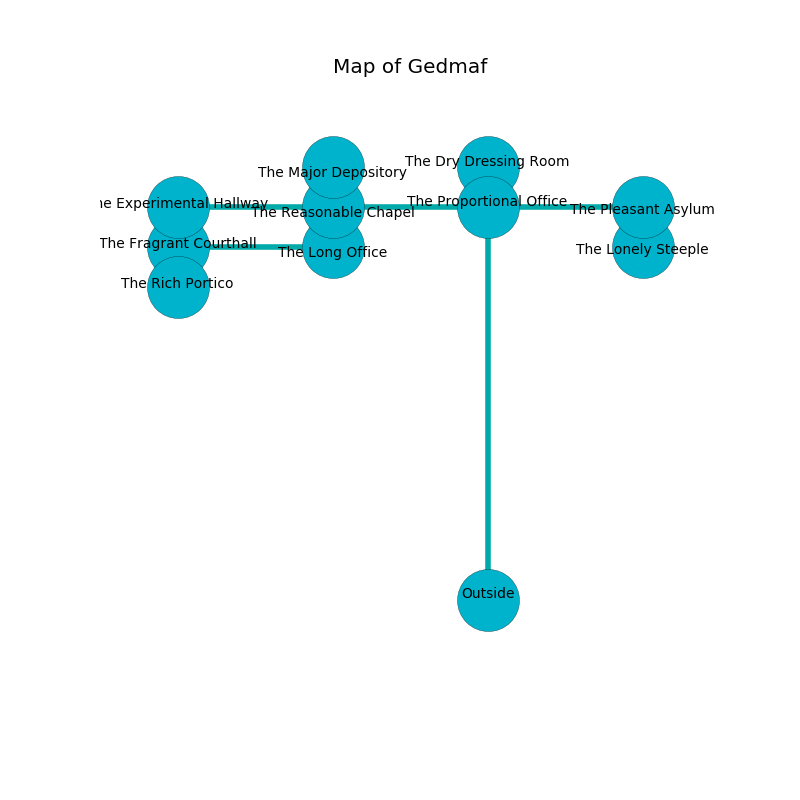

%Ruin Dogs

##Gedmaf
###Overview
Gedmaf is located under a poisoned plain. Some rooms of Gedmaf are frozen. The ruin is burning. It is occupied by Kenku. Jenice Downey The Vague, a Cloud Giant is here. The Kenku are the soldiers of Jenice Downey The Vague. She  is trying to understand [The Unpleasant Empire](#The-Unpleasant-Empire). 

###Artifact
####The Unpleasant Empire

The Unpleasant Empire has the form of a soft amulet. It is a light orange color. Cacophony glows from it. When picked up it grants power to its owner. 

###Locations

####the proportional office
The obsidion walls are pristine. 

* To the south is the entrance.
* To the east a small threshold opens to [the pleasant asylum](#the-pleasant-asylum).
* To the north a small path leads to [the dry dressing room](#the-dry-dressing-room).
* To the west a flooded cavern connects to [the reasonable chapel](#the-reasonable-chapel).

####the reasonable chapel
The air tastes like camphoreous here. Yellow ferns are swaying from the ceiling. 

* To the south a narrow opening connects to [the long office](#the-long-office).
* To the east a flooded cavern leads to [the proportional office](#the-proportional-office).
* To the north a small passageway connects to [the major depository](#the-major-depository).
* To the west a dripping walkway connects to [the experimental hallway](#the-experimental-hallway).

####the experimental hallway
The glass walls are unsettled. 

There is an engraving on a stone written in common. 

> They are joyful
>
> quantitative and safe
>

* To the east a dripping walkway opens to [the reasonable chapel](#the-reasonable-chapel).

####the pleasant asylum
There is a trap here. When activated, a magical sound detector will launch an arrow. The floor is flooded with six inch deep hot water. Green mushrooms are decaying from the ceiling. There are forty Kenkus here. The air smells like verbena here. One of the Kenku is pointing a ballista at the entrance. 

* To the south a hazy walkway connects to [the lonely steeple](#the-lonely-steeple).
* To the west a small threshold opens to [the proportional office](#the-proportional-office).

####the long office
The floor is glossy. The metallic walls are bloodstained. Yellow mushrooms are growing in a patch on the floor. 

* To the north a narrow opening opens to [the reasonable chapel](#the-reasonable-chapel).
* To the west a twisted walkway connects to [the fragrant courthall](#the-fragrant-courthall).

####the dry dressing room
There are forty Kenkus here. If the Kenku notice the Ruin Dogs, one of them will retreat and alert [Jenice Downey](#Jenice-Downey). 

* There is a spring here.
* To the south a small path opens to [the proportional office](#the-proportional-office).

####the major depository
The floor is sticky. The obsidion walls are bloodstained. 

There is an engraving on the floor written in Kenku Script. 

> A chain is a leisure
>
> but never optimistic
>
> you must never be joined
>

* To the south a small passageway connects to [the reasonable chapel](#the-reasonable-chapel).

####the fragrant courthall
The air smells like privet here. 

There is an engraving on a tablet written in Kenku Script. 

> Poor me! meak fate
>
> aware, welcome, great
>
> it is never light
>
> death is great
>

* [The Unpleasant Empire](#The-Unpleasant-Empire) is here.
* To the south a hazy path connects to [the rich portico](#the-rich-portico).
* To the east a twisted walkway leads to [the long office](#the-long-office).

####the lonely steeple

* [Jenice Downey The Vague](#Jenice-Downey-The-Vague) is here.
* To the north a hazy walkway opens to [the pleasant asylum](#the-pleasant-asylum).

####the rich portico
The metallic walls are ruined. There are a Gray Ooze, a Giant Lizard, a Minotaur Skeleton, an Invisible Stalker, a Zombie, and a Specter here. The floor is flooded with nine inch deep cool water. Red mushrooms are swaying in broken urns. 

* To the north a hazy path opens to [the fragrant courthall](#the-fragrant-courthall).

