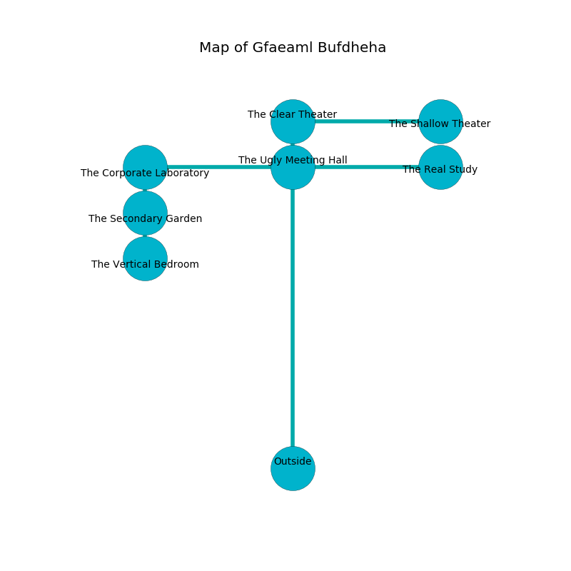

%Ruin Dogs

##Gfaeaml Bufdheha
###Overview
Gfaeaml Bufdheha is located in an obsidion plain. Some rooms of Gfaeaml Bufdheha are flooded. A battle between raiders is happening outside. It is occupied by Gnolls. Terri Melancon The Cynical, a Vampire Spawn is here. The Gnolls are the slaves of Terri Melancon The Cynical. She  is founding a new religion. 

###Artifact
####Cubbomaedwi

Cubbomaedwi looks like a glassy prism. Power shifts from it. It smells like animal. When worshipped it floats above the ground. 

###Locations

####the ugly meeting hall
The metallic walls are ruined. Yellow razorgrass is swaying from the ceiling. The floor is bloodstained. 

* There is a cat here.
* [Terri Melancon The Cynical](#Terri-Melancon-The-Cynical) is here.
* To the south is the entrance.
* To the east a small cave connects to [the real study](#the-real-study).
* To the north a flooded gap opens to [the clear theater](#the-clear-theater).
* To the west a long cave opens to [the corporate laboratory](#the-corporate-laboratory).

####the clear theater
There are a Young Remorhaz, a Spined Devil, a Winged Kobold, and an Awakened Shrub here. The wooden walls are caving in. The floor is flooded with three inch deep cool water. 

* There is a pot here.
* There is a gold coin here.
* To the south a flooded gap leads to [the ugly meeting hall](#the-ugly-meeting-hall).
* To the east a flooded opening connects to [the shallow theater](#the-shallow-theater).

####the corporate laboratory
The floor is cluttered with rocks. The mirrored walls are ruined. 

* To the south a hazy gap connects to [the secondary garden](#the-secondary-garden).
* To the east a long cave connects to [the ugly meeting hall](#the-ugly-meeting-hall).

####the real study
The air smells like chemicals here. The mirrored walls are ruined. The floor is bloodstained. There are a Silver Dragon Wyrmling, a Scarecrow, a Shadow Demon, and a Grick here. 

There is an engraving on a tablet written in Gnolls Script. 

> A window is an absence
>
> yet conventional
>
> uneasy and reasonable
>

* To the west a small cave opens to [the ugly meeting hall](#the-ugly-meeting-hall).

####the shallow theater
The floor is smooth. The mirrored walls are caving in. The air smells like watermelon here. There is a Cyclops here. 

* To the west a flooded opening opens to [the clear theater](#the-clear-theater).

####the secondary garden
There are a Gnoll Fang of Yeenoghu and a Gnoll Pack Lord here. The metallic walls are scratched. Red lichens are decaying in cracks in the floor. The Gnolls are willing to negotiate. 

There is an engraving on the wall written in common. 

> I am defending Gfaeaml Bufdheha.
>
> Dig here.
>

* There is a bucket here.
* [Cubbomaedwi](#Cubbomaedwi) is here.
* To the south a small cavern opens to [the vertical bedroom](#the-vertical-bedroom).
* To the north a hazy gap opens to [the corporate laboratory](#the-corporate-laboratory).

####the vertical bedroom
Gray mushrooms are decaying in a patch on the floor. The wooden walls are pristine. The air smells like praline here. There are four Gnolls, a Gnoll Pack Lord, a Gnoll Fang of Yeenoghu,  here. One of the Gnolls is pointing a ballista at the entrance. 

There is an engraving on a tablet written in common. 

> I discovered [Cubbomaedwi](#Cubbomaedwi).
>

* To the north a small cavern leads to [the secondary garden](#the-secondary-garden).

