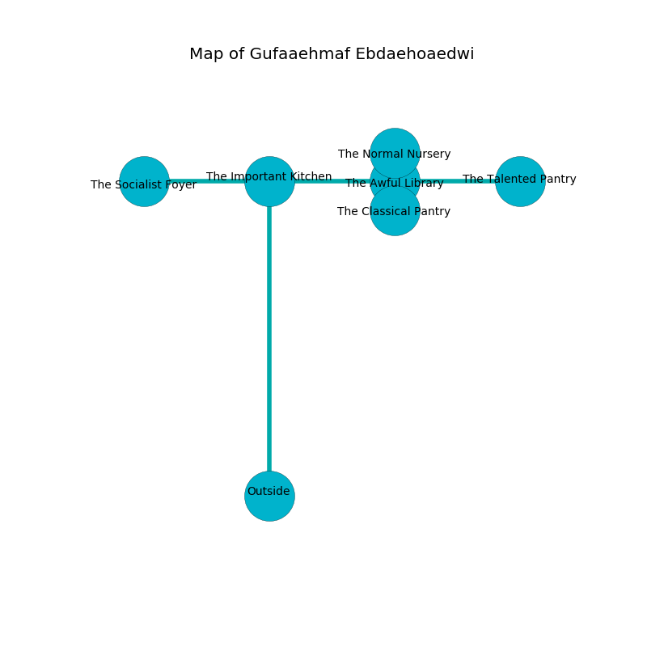

%Ruin Dogs

##Gufaaehmaf Ebdaehoaedwi
###Overview
Gufaaehmaf Ebdaehoaedwi is located on a cursed tree. Some rooms of it are corrupted. The ruin is collapsing slowly. It is occupied by Duergars. Reta Wilbanks The Self-Centred, a Bandit Captain is here. The Duergars have been charmed by Reta Wilbanks The Self-Centred. She  is founding a new religion. 

###Artifact
####Bemoeh Iaemhaf

Bemoeh Iaemhaf has the form of a hard crystal. It smells like lemon. Magic flows near it. It is a dark gray color. When worn it levitates those nearby. 

###Locations

####the important kitchen
The air tastes like stringent here. The floor is flooded with one inch deep scalding water. 

There is an engraving on the wall written in common. 

> Oh dire god
>
> it is always odd
>
> steep and premature
>
> nothing is poor
>

* There is a pendant here.
* To the south is the entrance.
* To the east a flooded hallway opens to [the awful library](#the-awful-library).
* To the west a flooded hall connects to [the socialist foyer](#the-socialist-foyer).

####the awful library
The floor is glossy. The air tastes like cooked apple here. 

* [Bemoeh Iaemhaf](#Bemoeh-Iaemhaf) is here.
* [Reta Wilbanks The Self-Centred](#Reta-Wilbanks-The-Self-Centred) is here.
* To the south a narrow path opens to [the classical pantry](#the-classical-pantry).
* To the east a long passageway connects to [the talented pantry](#the-talented-pantry).
* To the north a narrow corridor opens to [the normal nursery](#the-normal-nursery).
* To the west a flooded hallway leads to [the important kitchen](#the-important-kitchen).

####the classical pantry
Yellow lichens are decaying from the walls. The floor is sticky. 

* To the north a narrow path opens to [the awful library](#the-awful-library).

####the socialist foyer
Yellow mushrooms are sprouting in a patch on the floor. The floor is glossy. There are a Jackalwere and a Hunter Shark here. 

* There is a bee here.
* There is a match here.
* There is a dragon here.
* To the east a flooded hall connects to [the important kitchen](#the-important-kitchen).

####the talented pantry
Red mushrooms are swaying from the ceiling. There are a Draft Horse and a Green Dragon Wyrmling here. The mirrored walls are bloodstained. 

* There is a lyre here.
* To the west a long passageway opens to [the awful library](#the-awful-library).

####the normal nursery
The air tastes like blueberry here. The floor is bloodstained. The concrete walls are ruined. There are two Duergars here. The Duergars are feasting. 

* To the south a narrow corridor connects to [the awful library](#the-awful-library).

