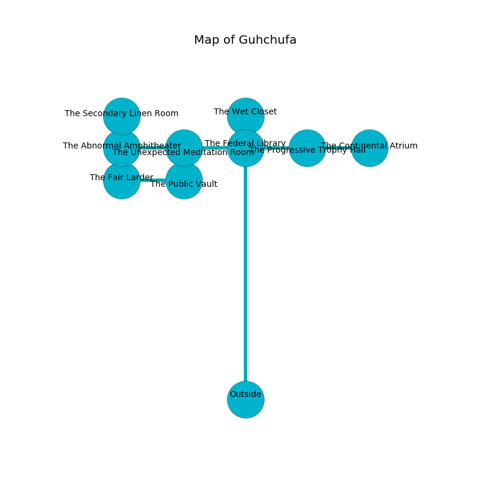

%Ruin Dogs

##Guhchufa
###Overview
Guhchufa is located on an obsidion rift. Parts of Guhchufa are frozen. A massive storm is happening outside. It is occupied by Thri-Kreens. Scarlet Benavides The Mean, a Gnoll Fang of Yeenoghu is here. The Thri-Kreens are ruled by Scarlet Benavides The Mean. She  is founding a new religion. 

###Artifact
####Dfaml Gufbedaeum

Dfaml Gufbedaeum looks like a smooth amulet. Psychic energy slips away from it. It is a bright black color. When worshipped it floats in the air. 

###Locations

####the federal library
The floor is flooded with five inch deep cool water. The obsidion walls are ruined. There are three Thri-Kreens here. Red lichens are growing in broken urns. The Thri-Kreens are performing a ritual. If not interrupted, a powerful monster will be summoned. 

* To the south is the entrance.
* To the east a hazy cavern connects to [the progressive trophy hall](#the-progressive-trophy-hall).
* To the north a dark walkway opens to [the wet closet](#the-wet-closet).
* To the west a narrow threshold leads to [the unexpected meditation room](#the-unexpected-meditation-room).

####the progressive trophy hall
The floor is bloodstained. 

* There is a sock here.
* To the east a hazy gap connects to [the continental atrium](#the-continental-atrium).
* To the west a hazy cavern connects to [the federal library](#the-federal-library).

####the unexpected meditation room
There is a Doppelganger here. The air smells like beeswax here. 

* To the south a small path connects to [the public vault](#the-public-vault).
* To the east a narrow threshold leads to [the federal library](#the-federal-library).
* To the west a narrow gap leads to [the abnormal amphitheater](#the-abnormal-amphitheater).

####the abnormal amphitheater
The air tastes like peanut butter here. 

* To the east a narrow gap leads to [the unexpected meditation room](#the-unexpected-meditation-room).
* To the north a small threshold opens to [the secondary linen room](#the-secondary-linen-room).

####the continental atrium
There are an Ogre Zombie, a Giant Elk, a Kuo-Toa, and an Orc here. 

* To the west a hazy gap opens to [the progressive trophy hall](#the-progressive-trophy-hall).

####the secondary linen room
Gray mushrooms are swaying in cracks in the floor. The floor is flooded with six inch deep lukewarm water. 

* To the south a small threshold leads to [the abnormal amphitheater](#the-abnormal-amphitheater).

####the wet closet
The wooden walls are bloodstained. There are a Gibbering Mouther, a Crocodile, a Deer, and a Gargoyle here. 

* [Scarlet Benavides The Mean](#Scarlet-Benavides-The-Mean) is here.
* To the south a dark walkway opens to [the federal library](#the-federal-library).

####the public vault
The brick walls are ruined. Red mushrooms are swaying in a patch on the floor. 

There is an engraving on a stone written in common. 

> Go away.
>

* There is a drake here.
* There is a cart here.
* [Dfaml Gufbedaeum](#Dfaml-Gufbedaeum) is here.
* To the north a small path connects to [the unexpected meditation room](#the-unexpected-meditation-room).
* To the west a hazy passageway connects to [the fair larder](#the-fair-larder).

####the fair larder
Yellow lichens are decaying from the walls. The brick walls are ruined. 

* To the east a hazy passageway connects to [the public vault](#the-public-vault).

