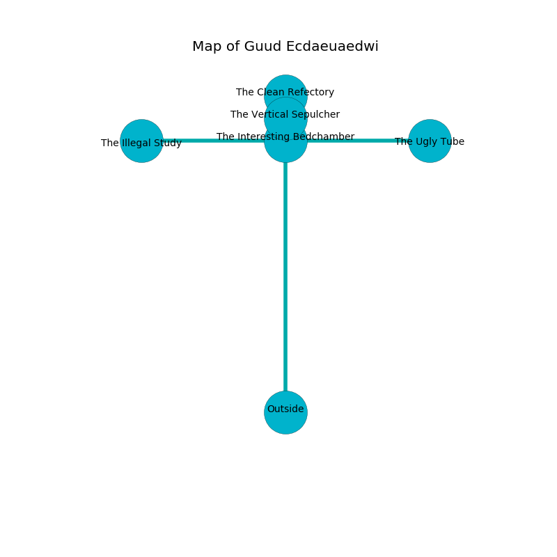

%Ruin Dogs

##Guud Ecdaeuaedwi
###Overview
Guud Ecdaeuaedwi is located in a spikey mountain. Some areas of it are somewhat hot. The ruin is collapsing slowly. It is occupied by Centaurs. Neal Ma The Callous, a Mind Flayer Arcanist is here. The Centaurs are the slaves of Neal Ma The Callous. He  is trying to discover [The Part-Time Lung](#The-Part-Time-Lung). 

###Artifact
####The Part-Time Lung

The Part-Time Lung looks like a hard amulet. Light slips towards it. It smells like rubber. When cradled it becomes a shielding force. 

###Locations

####the interesting bedchamber
Yellow mushrooms are sprouting from the ceiling. The air tastes like myrrh here. 

* [The Part-Time Lung](#The-Part-Time-Lung) is here.
* To the south is the entrance.
* To the east a dripping pathway opens to [the ugly tube](#the-ugly-tube).
* To the north a small opening leads to [the vertical sepulcher](#the-vertical-sepulcher).
* To the west a narrow cave connects to [the illegal study](#the-illegal-study).

####the vertical sepulcher
The obsidion walls are unsettled. The air tastes like hay here. 

There is an engraving on the floor written in Centaurs Script. 

> I am afraid.
>
> Do not try digging.
>

* To the south a small opening leads to [the interesting bedchamber](#the-interesting-bedchamber).
* To the north a torchlit threshold connects to [the clean refectory](#the-clean-refectory).

####the clean refectory
Yellow razorgrass is sprouting in a patch on the floor. The floor is smooth. There are five Centaurs here. The Centaurs are berserk with rage. 

* [Neal Ma The Callous](#Neal-Ma-The-Callous) is here.
* To the south a torchlit threshold opens to [the vertical sepulcher](#the-vertical-sepulcher).

####the illegal study
Red moss is growing in cracks in the floor. The air smells like orange here. There are five Centaurs here. The floor is sticky. One of the Centaurs is on watch, the rest are caring for babies. 

* To the east a narrow cave opens to [the interesting bedchamber](#the-interesting-bedchamber).

####the ugly tube
There is a trap here. When activated, a magical sound detector will swing a tripping chain. The obsidion walls are caving in. Yellow mushrooms are sprouting from the ceiling. 

* To the west a dripping pathway opens to [the interesting bedchamber](#the-interesting-bedchamber).

