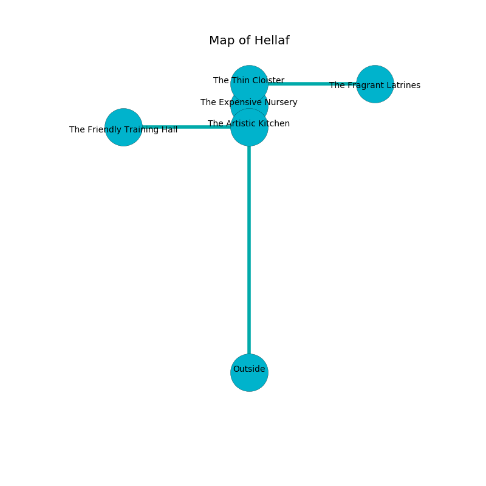

%Ruin Dogs

##Hellaf
###Overview
Hellaf is located under a flooded plain. Some areas of it are unbearably hot. The ruin is coming to life. It is occupied by Sahuagins. Andre Fortner The Sneaky, a Kuo-Toa Archpriest is here. The Sahuagins are ruled by Andre Fortner The Sneaky. He  is trying to steal [Aemdfulocdaeum](#Aemdfulocdaeum). 

###Artifact
####Aemdfulocdaeum

Aemdfulocdaeum is a powerful artifact in the shape of a glassy gem. It is a medium green color. When held it destroys itself. 

###Locations

####the artistic kitchen
Red mushrooms are decaying in cracks in the floor. 

* [Aemdfulocdaeum](#Aemdfulocdaeum) is here.
* To the south is the entrance.
* To the north a narrow pathway connects to [the expensive nursery](#the-expensive-nursery).
* To the west a long pathway connects to [the friendly training hall](#the-friendly-training-hall).

####the expensive nursery
There are three Sahuagin Priestesses here. The metallic walls are caving in. The floor is glossy. White ferns are decaying from the ceiling. The Sahuagins are fighting amongst themselves. 

* There is a face here.
* [Andre Fortner The Sneaky](#Andre-Fortner-The-Sneaky) is here.
* To the south a narrow pathway connects to [the artistic kitchen](#the-artistic-kitchen).
* To the north a hazy threshold leads to [the thin cloister](#the-thin-cloister).

####the thin cloister
There are three Sahuagin Priestesses here. The Sahuagins are willing to negotiate. 

* There is a roof here.
* There is an amulet here.
* To the south a hazy threshold connects to [the expensive nursery](#the-expensive-nursery).
* To the east a flooded opening leads to [the fragrant latrines](#the-fragrant-latrines).

####the fragrant latrines
The air tastes like sandalwood here. The concrete walls are caving in. The floor is cluttered with debris. Green ferns are decaying from the ceiling. 

* To the west a flooded opening connects to [the thin cloister](#the-thin-cloister).

####the friendly training hall
The air smells like sarsaparilla here. 

* To the east a long pathway opens to [the artistic kitchen](#the-artistic-kitchen).

