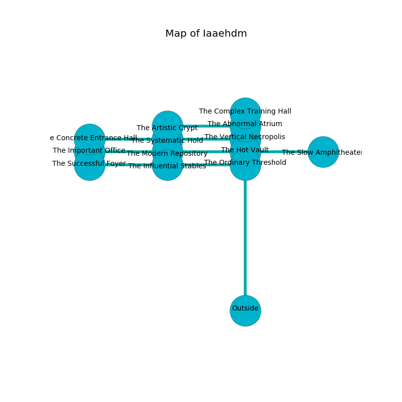

%Ruin Dogs

##Iaaehdm
###Overview
Iaaehdm is located under a haunted tree. Some rooms of Iaaehdm are frozen. The ruin is flooding. It is occupied by Kuo-Toa. Garrett Kim The Obstinate, a Mind Flayer Arcanist is here. The Kuo-Toa are battling Garrett Kim The Obstinate. He  is trying to discover [Dhoa Caem](#Dhoa-Caem). 

###Artifact
####Dhoa Caem

Dhoa Caem is a powerful artifact in the shape of a smooth amulet. When gazed upon it levitates those nearby. 

###Locations

####the vertical necropolis
The floor is glossy. The air tastes like graham cracker here. Yellow ferns are growing in a patch on the floor. 

* To the south is the entrance.
* To the north a windy hall leads to [the abnormal atrium](#the-abnormal-atrium).
* To the west a narrow gap connects to [the systematic hold](#the-systematic-hold).

####the systematic hold
There are a Pixie, a Hobgoblin Captain, a Flameskull, and a Yeti here. The glass walls are pristine. 

* To the south a torchlit cavern leads to [the modern repository](#the-modern-repository).
* To the east a narrow gap opens to [the vertical necropolis](#the-vertical-necropolis).
* To the west a dark artery connects to [the concrete entrance hall](#the-concrete-entrance-hall).

####the modern repository
The air tastes like stringent here. 

* To the east a twisted hallway connects to [the hot vault](#the-hot-vault).
* To the north a torchlit cavern connects to [the systematic hold](#the-systematic-hold).
* To the west a hazy hallway opens to [the important office](#the-important-office).

####the important office
The floor is bloodstained. 

* [Garrett Kim The Obstinate](#Garrett-Kim-The-Obstinate) is here.
* To the east a hazy hallway connects to [the modern repository](#the-modern-repository).

####the abnormal atrium
Yellow ferns are swaying in cracks in the floor. 

* [Dhoa Caem](#Dhoa-Caem) is here.
* To the south a windy hall opens to [the vertical necropolis](#the-vertical-necropolis).
* To the north a small threshold opens to [the complex training hall](#the-complex-training-hall).
* To the west a small hall connects to [the artistic crypt](#the-artistic-crypt).

####the concrete entrance hall
There are two Kuo-Toa Whips and a Kuo-Toa Archpriest here. The floor is bloodstained. The brick walls are covered in mold. Blue moss is decaying from the walls. One of the Kuo-Toa is working a mechanism that can open a trapodoor in the floor. 

* To the east a dark artery leads to [the systematic hold](#the-systematic-hold).

####the hot vault
The floor is glossy. There are a Drow, a Mimic, a Pteranodon, a Minotaur Skeleton, a Displacer Beast, a Giant Weasel, a Riding Horse, and a Sprite here. The crystal walls are covered in mold. 

* To the south a windy opening leads to [the ordinary threshold](#the-ordinary-threshold).
* To the east a small path leads to [the slow amphitheater](#the-slow-amphitheater).
* To the west a twisted hallway opens to [the modern repository](#the-modern-repository).

####the ordinary threshold
There are a Kuo-Toa Monitor, a Kuo-Toa Archpriest, two Kuo-Toa, and  here. The floor is glossy. If the Kuo-Toa notice the Ruin Dogs, one of them will retreat and alert [Garrett Kim](#Garrett-Kim). 

There is an engraving on the floor written in common. 

> They are hidden
>
> standard, oral, hot
>

* To the north a windy opening opens to [the hot vault](#the-hot-vault).
* To the west a flooded cavern connects to [the influential stables](#the-influential-stables).

####the influential stables

There is an engraving on a tablet written in common. 

> Try digging.
>

* To the east a flooded cavern leads to [the ordinary threshold](#the-ordinary-threshold).
* To the west a windy gap leads to [the successful foyer](#the-successful-foyer).

####the slow amphitheater
The air tastes like myrrh here. There are a Kuo-Toa Monitor and a Kuo-Toa Archpriest here. The glass walls are pristine. If the Kuo-Toa notice the Ruin Dogs, one of them will retreat and alert [Garrett Kim](#Garrett-Kim). 

* To the west a small path connects to [the hot vault](#the-hot-vault).

####the successful foyer
There are a Hobgoblin, a Poltergeist, a Smoke Mephit, a Homunculus, a Reef Shark, a Ghast, a Poisonous Snake, a Bugbear, two Thri-Kreens, and  here. White ferns are decaying in cracks in the floor. The floor is cluttered with debris. The air tastes like sand here. 

* There is a wand here.
* To the east a windy gap connects to [the influential stables](#the-influential-stables).

####the artistic crypt
Blue moss is sprouting in a patch on the floor. 

There is an engraving on the floor written in common. 

> A bed is a life
>
> able and private
>
> dangerous, persistent, national
>
> [Dhoa Caem](#Dhoa-Caem)
>
> but automatic
>
> A horse is a need
>
> abstract, abstract, aware
>
> yet explicit
>
> [Dhoa Caem](#Dhoa-Caem)
>
> ever abundant
>
> [Dhoa Caem](#Dhoa-Caem)
>
> ever pure
>
> negative and archaeological
>
> empty and political
>
> you are hidden
>

* To the east a small hall opens to [the abnormal atrium](#the-abnormal-atrium).

####the complex training hall
Gray lichens are swaying from the walls. The floor is sticky. 

* To the south a small threshold connects to [the abnormal atrium](#the-abnormal-atrium).

