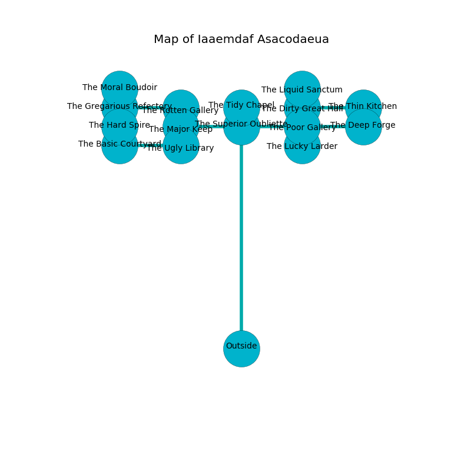

%Ruin Dogs

##Iaaemdaf Asacodaeua
###Overview
Iaaemdaf Asacodaeua is located in an alien plain. Regions of it are corrupted. The ruin is burning. It is occupied by Kobolds. Bryce Rosenberg The Boastful, a Mind Flayer is here. The Kobolds have been charmed by Bryce Rosenberg The Boastful. He  is trying to steal [The Separate Volunteer](#The-Separate-Volunteer). 

###Artifact
####The Separate Volunteer

The Separate Volunteer looks like a sharp gem. When rubbed it repels insects. 

###Locations

####the superior oubliette
The floor is smooth. The air smells like vegetables here. 

* To the south is the entrance.
* To the east a torchlit hallway opens to [the poor gallery](#the-poor-gallery).
* To the north a small cave opens to [the tidy chapel](#the-tidy-chapel).
* To the west a long artery leads to [the major keep](#the-major-keep).

####the major keep
The air smells like agarwood here. There are a Duodrone, a Gnoll, a Badger, a Deer, a Monodrone, a Deep Gnome, a Giant Weasel, a Magmin, a Giant Owl, a Wereboar, and a Giant Toad here. There is a trap here. When activated, a tripwire will make the ceiling slowly lower. The floor is smooth. 

* To the south a dripping threshold opens to [the ugly library](#the-ugly-library).
* To the east a long artery connects to [the superior oubliette](#the-superior-oubliette).
* To the north a torchlit cave opens to [the rotten gallery](#the-rotten-gallery).

####the tidy chapel
Gray moss is decaying from the walls. The floor is sticky. There is a trap here. When activated, a magical proximity detector will close a portcullis. 

There is an engraving on a stone written in Kobolds Script. 

> Poor me! pitiful you
>
> lost, closed, awful
>
> steep, functional, true
>
> sadness is unlawful
>

* To the south a small cave opens to [the superior oubliette](#the-superior-oubliette).

####the rotten gallery

* To the south a torchlit cave leads to [the major keep](#the-major-keep).
* To the west a flooded hallway leads to [the gregarious refectory](#the-gregarious-refectory).

####the gregarious refectory
The glass walls are scratched. Green moss is swaying in cracks in the floor. There are a Blue Dragon Wyrmling, a Wraith, and a Goat here. The air smells like banana peel here. 

* [Bryce Rosenberg The Boastful](#Bryce-Rosenberg-The-Boastful) is here.
* To the south a windy opening opens to [the hard spire](#the-hard-spire).
* To the east a flooded hallway leads to [the rotten gallery](#the-rotten-gallery).
* To the north a dripping pathway connects to [the moral boudoir](#the-moral-boudoir).

####the poor gallery
There are an Owl, an Intellect Devourer, a Barlgura, a Commoner, and an Imp here. The metallic walls are pristine. 

* To the south a dark corridor opens to [the lucky larder](#the-lucky-larder).
* To the east a dark hallway connects to [the deep forge](#the-deep-forge).
* To the north a dripping corridor connects to [the dirty great hall](#the-dirty-great-hall).
* To the west a torchlit hallway opens to [the superior oubliette](#the-superior-oubliette).

####the lucky larder
There are a Yuan-Ti Malison, a Blood Hawk, a Scorpion, a Giant Hyena, a Reef Shark, a Giant Bat, a Pentadrone, a Death Dog, a Spider, and a Smoke Mephit here. The floor is sticky. 

* To the north a dark corridor opens to [the poor gallery](#the-poor-gallery).

####the ugly library
There are a Camel, a Young Remorhaz, and an Ettercap here. The floor is bloodstained. The stone walls are ruined. 

* To the north a dripping threshold leads to [the major keep](#the-major-keep).
* To the west a flooded gap leads to [the basic courtyard](#the-basic-courtyard).

####the dirty great hall
Red lichens are sprouting in cracks in the floor. 

There is an engraving on the floor written in Kobolds Script. 

> I discovered [The Separate Volunteer](#The-Separate-Volunteer).
>

* [The Separate Volunteer](#The-Separate-Volunteer) is here.
* To the south a dripping corridor opens to [the poor gallery](#the-poor-gallery).
* To the east a dripping walkway connects to [the thin kitchen](#the-thin-kitchen).
* To the north a hazy cavern opens to [the liquid sanctum](#the-liquid-sanctum).

####the basic courtyard
The air tastes like peppermint here. There are a Young Remorhaz, an Owl, and a Worg here. The floor is glossy. Yellow lichens are decaying from the ceiling. 

* To the east a flooded gap leads to [the ugly library](#the-ugly-library).

####the moral boudoir
The air tastes like sawdust here. 

* To the south a dripping pathway leads to [the gregarious refectory](#the-gregarious-refectory).

####the hard spire
The glass walls are ruined. The air tastes like cucumber skin here. 

* To the north a windy opening opens to [the gregarious refectory](#the-gregarious-refectory).

####the deep forge
The air tastes like apple here. There are an Azer, a Lamia, a Kuo-Toa, a Spined Devil, and a Worg here. White razorgrass is growing from the walls. 

There is an engraving on a tablet written in Kobolds Script. 

> Try fighting.
>

* To the west a dark hallway opens to [the poor gallery](#the-poor-gallery).

####the thin kitchen
The air tastes like carrot seed here. The floor is sticky. There are twenty two Kobolds and thirteen Winged Kobolds here. Blue ferns are sprouting in cracks in the floor. The wooden walls are ruined. The Kobolds are fighting amongst themselves. 

* To the west a dripping walkway opens to [the dirty great hall](#the-dirty-great-hall).

####the liquid sanctum
White lichens are decaying in broken urns. The floor is bloodstained. The wooden walls are caving in. 

* To the south a hazy cavern connects to [the dirty great hall](#the-dirty-great-hall).

