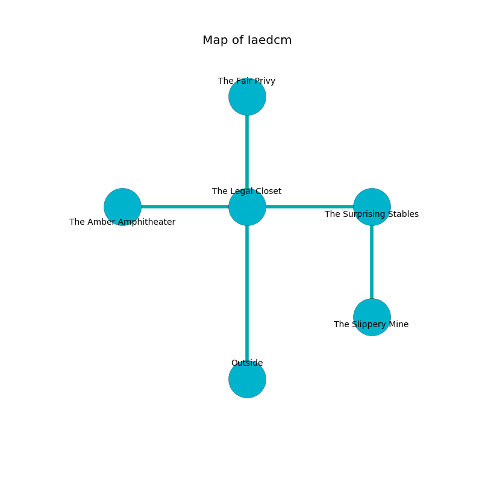

%Ruin Dogs

##Iaedcm
###Overview
Iaedcm is located in a flooded mountain. Some rooms of Iaedcm are cursed. The ruin is coming to life. It is occupied by Deep Gnomes. Gerard Pickett The Intolerant, a Fire Giant is here. The Deep Gnomes are ruled by Gerard Pickett The Intolerant. He  is trying to use [Ehfaabamd Ladefdofa](#Ehfaabamd-Ladefdofa). 

###Artifact
####Ehfaabamd Ladefdofa

Ehfaabamd Ladefdofa looks like a warm monument. It smells like yuzu. When carried it burns the mind. 

###Locations

####the legal closet
There are a Plesiosaurus, a Hyena, a Frost Giant, a Giant Bat, a Brass Dragon Wyrmling, and an Imp here. The floor is flooded with five inch deep lukewarm water. The concrete walls are caving in. 

* There is an icon here.
* There is a spear here.
* [Ehfaabamd Ladefdofa](#Ehfaabamd-Ladefdofa) is here.
* To the south is the entrance.
* To the east a twisted passageway connects to [the surprising stables](#the-surprising-stables).
* To the north a long cavern opens to [the fair privy](#the-fair-privy).
* To the west a torchlit hall leads to [the amber amphitheater](#the-amber-amphitheater).

####the amber amphitheater
There are twenty Deep Gnomes here. One of the Deep Gnomes is on watch, the rest are meditating. 

* There is a horn here.
* To the east a torchlit hall connects to [the legal closet](#the-legal-closet).

####the surprising stables
There is a trap here. When activated, a magical proximity detector will swing a tripping chain. The metallic walls are caving in. 

* There is a cheese here.
* To the south a long corridor opens to [the slippery mine](#the-slippery-mine).
* To the west a twisted passageway connects to [the legal closet](#the-legal-closet).

####the slippery mine
There are a Sprite, a Darkmantle, a Hobgoblin Captain, a Flameskull, a Giant Poisonous Snake, two Specters, and  here. The air smells like wormwood here. 

* To the north a long corridor leads to [the surprising stables](#the-surprising-stables).

####the fair privy
There are a Winter Wolf, a Bone Devil, a Deep Gnome, a Manticore, a Gelatinous Cube, and an Imp here. Green razorgrass is decaying in a patch on the floor. 

* [Gerard Pickett The Intolerant](#Gerard-Pickett-The-Intolerant) is here.
* To the south a long cavern connects to [the legal closet](#the-legal-closet).

