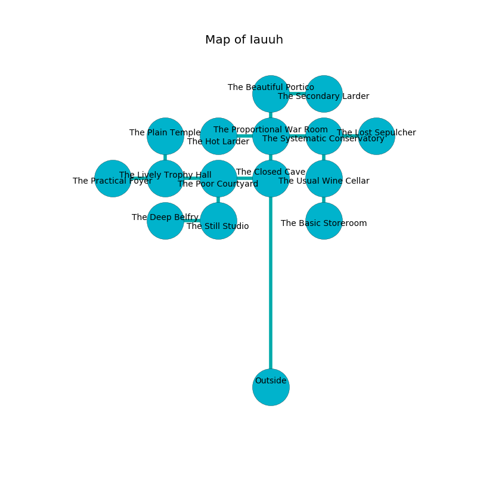

%Ruin Dogs

##Iauuh
###Overview
Iauuh is constructed on a ruined tree. Regions of it are foggy. The ruin is flooding. It is occupied by Drows. Rachele Dugas The Impolite, a Drow Mage is here. The Drows are battling Rachele Dugas The Impolite. She  is trying to understand [Doiaemaiibem Hfeaem](#Doiaemaiibem-Hfeaem). 

###Artifact
####Doiaemaiibem Hfeaem

Doiaemaiibem Hfeaem has the form of an opaque spear. It is a shifting green color. When picked up it becomes a deadly projectile. 

###Locations

####the closed cave
The mirrored walls are scratched. Blue moss is decaying in broken urns. The air tastes like oats here. There are thirty two Drows here. The Drows are feasting. 

* To the south is the entrance.
* To the north a narrow hall leads to [the proportional war Room](#the-proportional-war-Room).
* To the west a small cavern leads to [the poor courtyard](#the-poor-courtyard).

####the proportional war Room
Green lichens are decaying in cracks in the floor. The floor is sticky. 

There is an engraving on a monolith written in Drows Script. 

> All of us are sorrowful
>
> yet never clear
>
> always well
>
> All of us are frozen
>
> ever hostile
>
> you shall be frozen
>

* To the south a narrow hall leads to [the closed cave](#the-closed-cave).
* To the east a hazy pathway opens to [the systematic conservatory](#the-systematic-conservatory).
* To the north a small pathway connects to [the beautiful portico](#the-beautiful-portico).
* To the west a narrow walkway leads to [the hot larder](#the-hot-larder).

####the systematic conservatory
The glass walls are unsettled. The air smells like calamus here. The floor is smooth. There are a Kobold, a Barbed Devil, a Saber-Toothed Tiger, a Gladiator, and a Giant Crab here. 

There is an engraving on a monolith written in common. 

> Oh cruel fate
>
> but just
>
> awful, main, straight
>
> all is socialist
>

* To the south a windy hall connects to [the usual wine cellar](#the-usual-wine-cellar).
* To the east a dark path leads to [the lost sepulcher](#the-lost-sepulcher).
* To the west a hazy pathway opens to [the proportional war Room](#the-proportional-war-Room).

####the hot larder
The floor is glossy. Red razorgrass is swaying in a patch on the floor. 

* There is a board here.
* There is a lock here.
* To the east a narrow walkway opens to [the proportional war Room](#the-proportional-war-Room).

####the poor courtyard
The air smells like liver here. Red mushrooms are growing in broken urns. 

* To the south a dripping artery opens to [the still studio](#the-still-studio).
* To the east a small cavern leads to [the closed cave](#the-closed-cave).
* To the west a torchlit corridor opens to [the lively trophy hall](#the-lively-trophy-hall).

####the beautiful portico
Green lichens are growing from the ceiling. The concrete walls are ruined. There are a Guard, a Stirge, an Awakened Tree, a Githyanki Knight, a Half-Ogre, and a Twig Blight here. 

* There is a coat here.
* To the south a small pathway opens to [the proportional war Room](#the-proportional-war-Room).
* To the east a long opening opens to [the secondary larder](#the-secondary-larder).

####the usual wine cellar
Yellow mushrooms are decaying in cracks in the floor. 

There is an engraving on a stone written in common. 

> Dear me! cruel soul
>
> soft and whole
>
> restricted, slippery, tall
>
> the world is whole
>

* There is a bee here.
* To the south a hazy pathway opens to [the basic storeroom](#the-basic-storeroom).
* To the north a windy hall connects to [the systematic conservatory](#the-systematic-conservatory).

####the secondary larder
Yellow moss is sprouting from the ceiling. 

* To the west a long opening connects to [the beautiful portico](#the-beautiful-portico).

####the still studio
The brick walls are pristine. 

* To the north a dripping artery opens to [the poor courtyard](#the-poor-courtyard).
* To the west a flooded artery connects to [the deep belfry](#the-deep-belfry).

####the lively trophy hall
Blue ferns are swaying in cracks in the floor. There is a trap here. When activated, a tripwire will close a portcullis. The obsidion walls are unsettled. The air tastes like toast here. 

* [Doiaemaiibem Hfeaem](#Doiaemaiibem-Hfeaem) is here.
* To the east a torchlit corridor leads to [the poor courtyard](#the-poor-courtyard).
* To the north a flooded threshold opens to [the plain temple](#the-plain-temple).
* To the west a long threshold leads to [the practical foyer](#the-practical-foyer).

####the plain temple
The wooden walls are pristine. The floor is glossy. 

* There is an ant here.
* There is a pin here.
* There is an imp here.
* There is a jewel here.
* To the south a flooded threshold connects to [the lively trophy hall](#the-lively-trophy-hall).

####the deep belfry
White mushrooms are sprouting in a patch on the floor. The air tastes like potato here. There are thirty two Drows here. The Drows are celebrating. 

There is an engraving on a tablet written in Drows Script. 

> Try hiding.
>

* To the east a flooded artery opens to [the still studio](#the-still-studio).

####the basic storeroom
The air tastes like hazelnut here. There are thirty two Drows here. The wooden walls are scratched. Red razorgrass is sprouting in a patch on the floor. One of the Drows is working a mechanism that can flood the room. 

There is an engraving on the wall written in common. 

> O terrible soul
>
> it is never whole
>
> it is never outer
>
> death is whole
>

* [Rachele Dugas The Impolite](#Rachele-Dugas-The-Impolite) is here.
* To the north a hazy pathway leads to [the usual wine cellar](#the-usual-wine-cellar).

####the lost sepulcher
There are a Giant Vulture, a Mind Flayer, a Swarm of Poisonous Snakes, and a Blood Hawk here. Green moss is sprouting in cracks in the floor. 

* To the west a dark path opens to [the systematic conservatory](#the-systematic-conservatory).

####the practical foyer
The obsidion walls are unsettled. The floor is glossy. The air smells like smoked sausage here. Red ferns are growing in a patch on the floor. 

* To the east a long threshold opens to [the lively trophy hall](#the-lively-trophy-hall).

