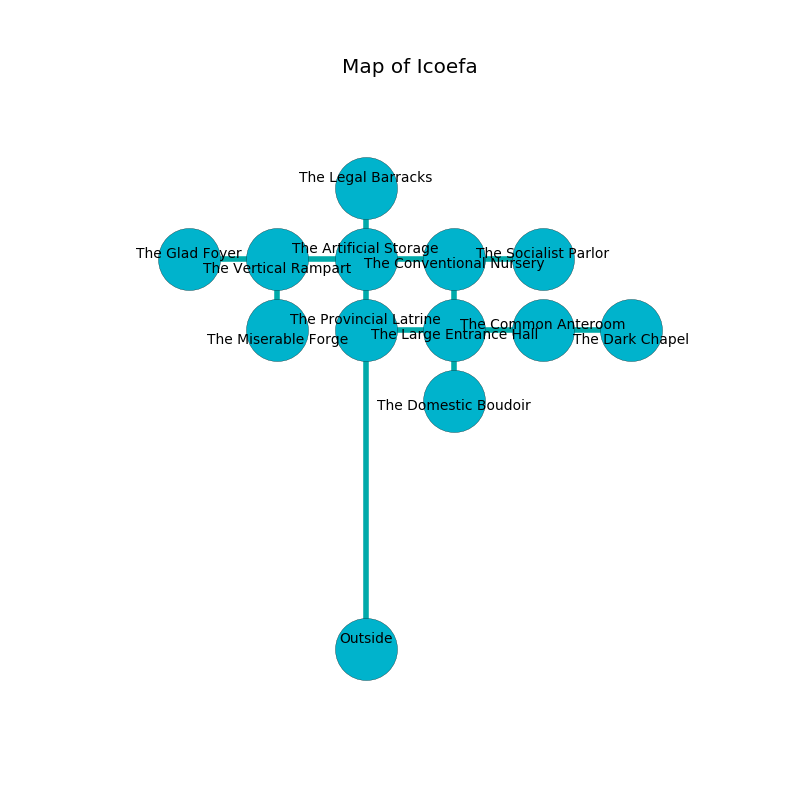

%Ruin Dogs

##Icoefa
###Overview
Icoefa is constructed on a broken city. Parts of it are foggy. A solar eclipse is happening outside. It is occupied by Kuo-Toa. Humberto Boren The Perverse, a Fire Giant is here. The Kuo-Toa are battling Humberto Boren The Perverse. He  is trying to find [The Important Matter](#The-Important-Matter). 

###Artifact
####The Important Matter

The Important Matter has the form of an opaque monument. Power shifts away from it. It smells like lily of the valley. When thrown it changes probabilities. 

###Locations

####the artificial storage
The air smells like melon here. The mirrored walls are caving in. The floor is sticky. 

There is an engraving on a stone written in common. 

> I am worshipping Icoefa.
>

* There is a coat here.
* To the south is the entrance.
* To the east a torchlit hall leads to [the conventional nursery](#the-conventional-nursery).
* To the north a twisted cavern opens to [the legal barracks](#the-legal-barracks).
* To the west a twisted cave leads to [the vertical rampart](#the-vertical-rampart).

####the conventional nursery
The wooden walls are ruined. The air tastes like the fresh outdoors here. Green lichens are decaying from the walls. 

* To the south a twisted opening opens to [the large entrance hall](#the-large-entrance-hall).
* To the east a dripping threshold connects to [the socialist parlor](#the-socialist-parlor).
* To the west a torchlit hall leads to [the artificial storage](#the-artificial-storage).

####the large entrance hall
Blue lichens are growing from the walls. There are a Griffon, a Death Slaad, a Thri-Kreen, and a Polar Bear here. The floor is flooded with nine inch deep cold water. The metallic walls are pristine. 

* To the south a twisted pathway leads to [the domestic boudoir](#the-domestic-boudoir).
* To the east a dripping walkway connects to [the common anteroom](#the-common-anteroom).
* To the north a twisted opening opens to [the conventional nursery](#the-conventional-nursery).
* To the west a flooded walkway opens to [the provincial latrine](#the-provincial-latrine).

####the domestic boudoir
Gray ferns are growing from the ceiling. The concrete walls are bloodstained. 

* To the north a twisted pathway leads to [the large entrance hall](#the-large-entrance-hall).

####the common anteroom
There are a Kuo-Toa Monitor, two Kuo-Toa Whips, a Kuo-Toa Archpriest, a Kuo-Toa, and  here. The floor is bloodstained. Yellow moss is swaying in broken urns. If the Kuo-Toa notice the Ruin Dogs, one of them will retreat and alert the others. 

* To the east a dripping corridor connects to [the dark chapel](#the-dark-chapel).
* To the west a dripping walkway connects to [the large entrance hall](#the-large-entrance-hall).

####the legal barracks
The floor is flooded with four inch deep cool water. The crystal walls are caving in. Gray mushrooms are swaying from the walls. 

There is an engraving on a tablet written in common. 

> All of us are sorrowful
>
> uniform, similar, foolish
>
> All of us are sorrowful
>

* There is a board here.
* To the south a twisted cavern connects to [the artificial storage](#the-artificial-storage).

####the dark chapel
The floor is cluttered with debris. Blue mushrooms are swaying from the ceiling. 

There is an engraving on a stone written in Kuo-Toa Script. 

> I was injured in this place.
>

* There is a sock here.
* There is a trousers here.
* To the west a dripping corridor opens to [the common anteroom](#the-common-anteroom).

####the provincial latrine
The brick walls are scratched. 

* To the east a flooded walkway connects to [the large entrance hall](#the-large-entrance-hall).

####the vertical rampart
The air tastes like yeast here. 

* [The Important Matter](#The-Important-Matter) is here.
* To the south a small pathway leads to [the miserable forge](#the-miserable-forge).
* To the east a twisted cave opens to [the artificial storage](#the-artificial-storage).
* To the west a dark artery opens to [the glad foyer](#the-glad-foyer).

####the socialist parlor
The floor is bloodstained. The obsidion walls are pristine. There are a Gnoll Fang of Yeenoghu, a Panther, a Mummy, and an Ettin here. 

* To the west a dripping threshold leads to [the conventional nursery](#the-conventional-nursery).

####the miserable forge
There are a Yochlol and a Grick Alpha here. 

There is an engraving on a monolith written in common. 

> A pocket is a secretary
>
> liquid and genetic
>
> you must never be cursed
>

* To the north a small pathway leads to [the vertical rampart](#the-vertical-rampart).

####the glad foyer
The floor is bloodstained. 

* [Humberto Boren The Perverse](#Humberto-Boren-The-Perverse) is here.
* To the east a dark artery leads to [the vertical rampart](#the-vertical-rampart).

