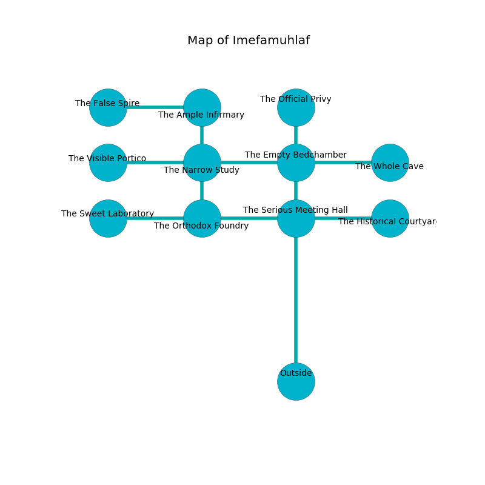

%Ruin Dogs

##Imefamuhlaf
###Overview
Imefamuhlaf is located on a spikey plain. Some areas of Imefamuhlaf are inaccessible. The ruin is coming to life. It is occupied by Dryads. Carmina Stitt The Gullible, a Lizardfolk Shaman is here. The Dryads are ruled by Carmina Stitt The Gullible. She  is founding a new religion. 

###Artifact
####The Alive World

The Alive World looks like a sharp blade. It smells like sweet pea. When gazed upon it burns the mind. 

###Locations

####the empty bedchamber
There are three Dryads here. Red ferns are growing from the ceiling. The air smells like herbs here. If the Dryads notice the Ruin Dogs, one of them will retreat and alert [Carmina Stitt](#Carmina-Stitt). 

* To the south is the entrance.
* To the east a twisted passageway opens to [the whole cave](#the-whole-cave).
* To the north a small path connects to [the official privy](#the-official-privy).
* To the west a dripping hallway leads to [the narrow study](#the-narrow-study).

####the official privy
There are three Dryads here. The air smells like clove here. The metallic walls are scratched. The floor is flooded with one inch deep cold water. The Dryads are berserk with rage. 

* There is a leprechaun here.
* To the south a small path connects to [the empty bedchamber](#the-empty-bedchamber).

####the narrow study
There are three Dryads here. The crystal walls are unsettled. There is a trap here. When activated, a magical sound detector will extend a spring loaded spear. If the Dryads notice the Ruin Dogs, one of them will retreat and alert [Carmina Stitt](#Carmina-Stitt). 

There is an engraving on the floor written in Dryads Script. 

> Try swimming.
>

* There is a stamp here.
* To the south a dark cavern leads to [the orthodox foundry](#the-orthodox-foundry).
* To the east a dripping hallway opens to [the empty bedchamber](#the-empty-bedchamber).
* To the north a hazy hallway connects to [the ample infirmary](#the-ample-infirmary).
* To the west a small path opens to [the visible portico](#the-visible-portico).

####the visible portico
The floor is flooded with three inch deep cool water. 

* To the east a small path opens to [the narrow study](#the-narrow-study).

####the orthodox foundry
The air smells like allspice here. There are two Black Bears and a Spectator here. The stone walls are unsettled. 

* [The Alive World](#The-Alive-World) is here.
* To the east a narrow passageway leads to [the serious meeting hall](#the-serious-meeting-hall).
* To the north a dark cavern connects to [the narrow study](#the-narrow-study).
* To the west a dripping cavern leads to [the sweet laboratory](#the-sweet-laboratory).

####the ample infirmary
There are a Tiger, a Sea Horse, a White Dragon Wyrmling, a Half-Ogre, a Panther, a Pony, and a Badger here. 

* There is a coat here.
* To the south a hazy hallway connects to [the narrow study](#the-narrow-study).
* To the west a hazy opening leads to [the false spire](#the-false-spire).

####the whole cave
The air smells like amber here. Blue razorgrass is growing from the ceiling. The floor is flooded with six inch deep lukewarm water. The obsidion walls are caving in. 

* [Carmina Stitt The Gullible](#Carmina-Stitt-The-Gullible) is here.
* To the west a twisted passageway leads to [the empty bedchamber](#the-empty-bedchamber).

####the serious meeting hall
The floor is flooded with one inch deep scalding water. 

* To the east a windy gap leads to [the historical courtyard](#the-historical-courtyard).
* To the west a narrow passageway connects to [the orthodox foundry](#the-orthodox-foundry).

####the historical courtyard
There are three Dryads here. The floor is smooth. The air smells like myrrh here. There is a trap here. When activated, a magical sound detector will fire an acid arrow. The Dryads are performing a ritual. If not interrupted, the ruin dogs will be weakened. 

There is an engraving on the wall written in Dryads Script. 

> Leave at once.
>

* There is a whistle here.
* To the west a windy gap leads to [the serious meeting hall](#the-serious-meeting-hall).

####the false spire
The floor is smooth. 

* There is a sceptre here.
* To the east a hazy opening connects to [the ample infirmary](#the-ample-infirmary).

####the sweet laboratory
The floor is smooth. Blue mushrooms are growing from the ceiling. The wooden walls are pristine. 

* To the east a dripping cavern leads to [the orthodox foundry](#the-orthodox-foundry).

