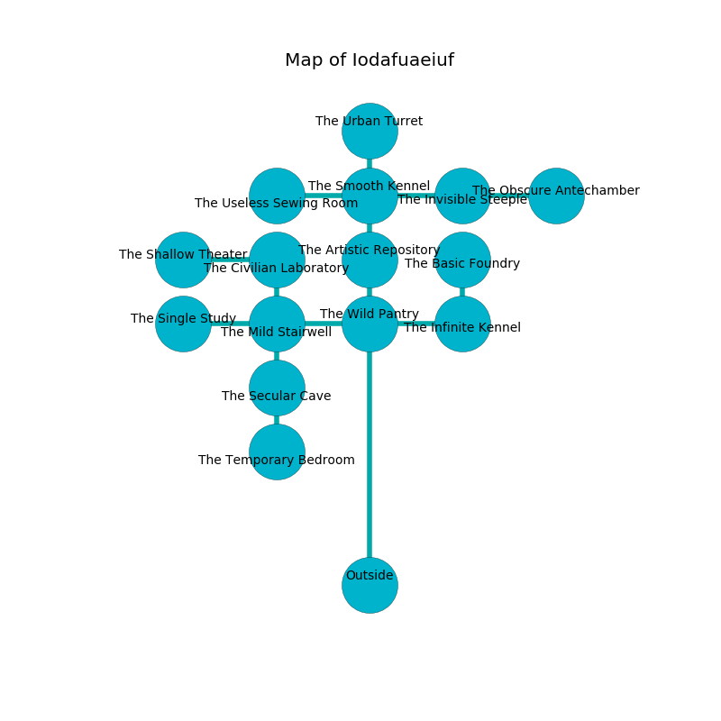

%Ruin Dogs

##Iodafuaeiuf
###Overview
Iodafuaeiuf is located in a flooded plain. Regions of Iodafuaeiuf are cursed. A lunar eclipse is happening outside. It is occupied by Thri-Kreens. Katina Bales The Deceitful, a Fire Giant is here. The Thri-Kreens are the slaves of Katina Bales The Deceitful. She  is trying to find [Dfaiaelamcwi](#Dfaiaelamcwi). 

###Artifact
####Dfaiaelamcwi

Dfaiaelamcwi looks like a mushy amulet. Psychic energy slips towards it. It is a light white color. When held it grants power to its owner. 

###Locations

####the wild pantry
The mirrored walls are ruined. There is a trap here. When activated, a magical rune will collapse a column. There are ten Thri-Kreens here. One of the Thri-Kreens is pointing a ballista at the entrance. 

There is an engraving on the wall written in Thri-Kreens Script. 

> Oh my! life is poor
>
> magnetic and charismatic
>
> generous, welcome, obscure
>
> cruelty is automatic
>

* To the south is the entrance.
* To the east a small cavern connects to [the infinite kennel](#the-infinite-kennel).
* To the north a small cave opens to [the artistic repository](#the-artistic-repository).
* To the west a hazy pathway leads to [the mild stairwell](#the-mild-stairwell).

####the mild stairwell
The stone walls are caving in. There are ten Thri-Kreens here. Red mushrooms are growing in a patch on the floor. One of the Thri-Kreens is pointing a ballista at the entrance. 

* To the south a narrow artery opens to [the secular cave](#the-secular-cave).
* To the east a hazy pathway opens to [the wild pantry](#the-wild-pantry).
* To the north a dark hallway leads to [the civilian laboratory](#the-civilian-laboratory).
* To the west a dripping opening leads to [the single study](#the-single-study).

####the civilian laboratory
The air smells like shellfish here. The wooden walls are covered in mold. The floor is cluttered with ashes. 

* [Dfaiaelamcwi](#Dfaiaelamcwi) is here.
* To the south a dark hallway leads to [the mild stairwell](#the-mild-stairwell).
* To the west a hazy hallway connects to [the shallow theater](#the-shallow-theater).

####the infinite kennel
White razorgrass is sprouting in broken urns. The air tastes like myrrh here. 

* There is a screw here.
* There is an amulet here.
* To the north a long threshold leads to [the basic foundry](#the-basic-foundry).
* To the west a small cavern leads to [the wild pantry](#the-wild-pantry).

####the single study
There are ten Thri-Kreens here. The air tastes like logenberry here. The floor is glossy. The Thri-Kreens are defending this room from intruders. 

* To the east a dripping opening opens to [the mild stairwell](#the-mild-stairwell).

####the artistic repository
The wooden walls are ruined. 

There is an engraving on the ceiling written in common. 

> Try cowering.
>

* To the south a small cave connects to [the wild pantry](#the-wild-pantry).
* To the north a dark walkway opens to [the smooth kennel](#the-smooth-kennel).

####the basic foundry
White mushrooms are decaying from the ceiling. The floor is sticky. 

* To the south a long threshold leads to [the infinite kennel](#the-infinite-kennel).

####the smooth kennel
The concrete walls are unsettled. The floor is flooded with one inch deep cool water. 

* To the south a dark walkway leads to [the artistic repository](#the-artistic-repository).
* To the east a narrow passageway leads to [the invisible steeple](#the-invisible-steeple).
* To the north a dark corridor opens to [the urban turret](#the-urban-turret).
* To the west a torchlit artery leads to [the useless sewing room](#the-useless-sewing-room).

####the urban turret
The crystal walls are bloodstained. The air tastes like tallow here. There is a trap here. When activated, a pressure plate will swing a tripping chain. The floor is sticky. 

There is an engraving on a stone written in Thri-Kreens Script. 

> A stick is a rib
>
> yet expected
>
> A town is an episode
>
> likely, pure, useless
>
> holy and still
>

* There is a lyre here.
* To the south a dark corridor connects to [the smooth kennel](#the-smooth-kennel).

####the invisible steeple
The floor is cluttered with ashes. 

* To the east a flooded path leads to [the obscure antechamber](#the-obscure-antechamber).
* To the west a narrow passageway connects to [the smooth kennel](#the-smooth-kennel).

####the obscure antechamber
There are ten Thri-Kreens here. The air smells like sarsaparilla here. The Thri-Kreens are performing a ritual. If not interrupted, the ruin dogs will be weakened. 

* To the west a flooded path connects to [the invisible steeple](#the-invisible-steeple).

####the secular cave
The floor is flooded with two inch deep scalding water. The air tastes like gasoline here. There are ten Thri-Kreens here. The Thri-Kreens are defending this room from intruders. 

There is an engraving on the wall written in common. 

> I thought about praying.
>

* To the south a narrow walkway connects to [the temporary bedroom](#the-temporary-bedroom).
* To the north a narrow artery leads to [the mild stairwell](#the-mild-stairwell).

####the temporary bedroom
The glass walls are bloodstained. Yellow lichens are growing from the ceiling. There are ten Thri-Kreens here. The air tastes like brown sugar here. The Thri-Kreens are willing to negotiate. 

* To the north a narrow walkway opens to [the secular cave](#the-secular-cave).

####the useless sewing room
The floor is bloodstained. 

* [Katina Bales The Deceitful](#Katina-Bales-The-Deceitful) is here.
* To the east a torchlit artery opens to [the smooth kennel](#the-smooth-kennel).

####the shallow theater
The crystal walls are unsettled. The floor is glossy. Gray razorgrass is sprouting from the walls. 

There is an engraving on the floor written in common. 

> A trap ahead.
>

* To the east a hazy hallway leads to [the civilian laboratory](#the-civilian-laboratory).

