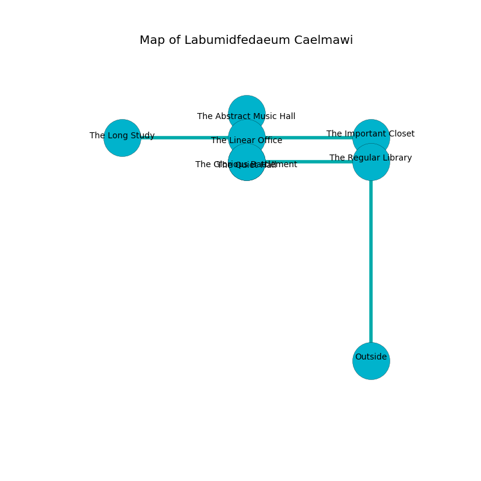

%Ruin Dogs

##Labumidfedaeum Caelmawi
###Overview
Labumidfedaeum Caelmawi is located in a ruined rift. Regions of Labumidfedaeum Caelmawi are flooded. A windstorm is happening outside. It is occupied by Lizardfolk. Monty Cartwright The Perverse, a Yuan-Ti Pureblood is here. The Lizardfolk have been charmed by Monty Cartwright The Perverse. He  is founding a new religion. 

###Artifact
####D-Imaefd

D-Imaefd is a powerful artifact in the shape of a smooth gem. It is a shifting orange color. It smells like cocoa. When cradled it becomes a force of destiny. 

###Locations

####the regular library
The air smells like fudge here. There are a Lizardfolk and a Lizardfolk Shaman here. Yellow razorgrass is swaying in broken urns. The Lizardfolk are performing a ritual. If not interrupted, [Monty Cartwright](#Monty-Cartwright) will be magically alarmed. 

* There is a nut here.
* There is a skull here.
* To the south is the entrance.
* To the north a dripping path leads to [the important closet](#the-important-closet).
* To the west a windy threshold opens to [the glorious battlement](#the-glorious-battlement).

####the important closet
There is a Pegasus here. The air smells like pimenta here. 

* There is a specter here.
* To the south a dripping path leads to [the regular library](#the-regular-library).
* To the west a small cavern leads to [the linear office](#the-linear-office).

####the linear office
The floor is smooth. Green ferns are swaying from the ceiling. The air smells like mango here. 

There is an engraving on the wall written in Lizardfolk Script. 

> Oh my! cruel you
>
> always due
>
> abundant and valid
>
> cruelty is new
>

* [D-Imaefd](#D-Imaefd) is here.
* [Monty Cartwright The Perverse](#Monty-Cartwright-The-Perverse) is here.
* To the south a windy path connects to [the quiet hall](#the-quiet-hall).
* To the east a small cavern opens to [the important closet](#the-important-closet).
* To the north a small path opens to [the abstract music hall](#the-abstract-music-hall).
* To the west a hazy corridor opens to [the long study](#the-long-study).

####the glorious battlement
There are a Quadrone and an Orc Eye of Gruumsh here. The floor is cluttered with debris. Red ferns are growing from the ceiling. 

* To the east a windy threshold opens to [the regular library](#the-regular-library).

####the abstract music hall
There are a Needle Blight and a Merrow here. The air smells like phenolic here. Yellow ferns are growing in cracks in the floor. 

* To the south a small path leads to [the linear office](#the-linear-office).

####the quiet hall
The concrete walls are pristine. Gray moss is decaying in broken urns. The floor is glossy. The air tastes like balsamic here. 

* To the north a windy path opens to [the linear office](#the-linear-office).

####the long study

* To the east a hazy corridor leads to [the linear office](#the-linear-office).

