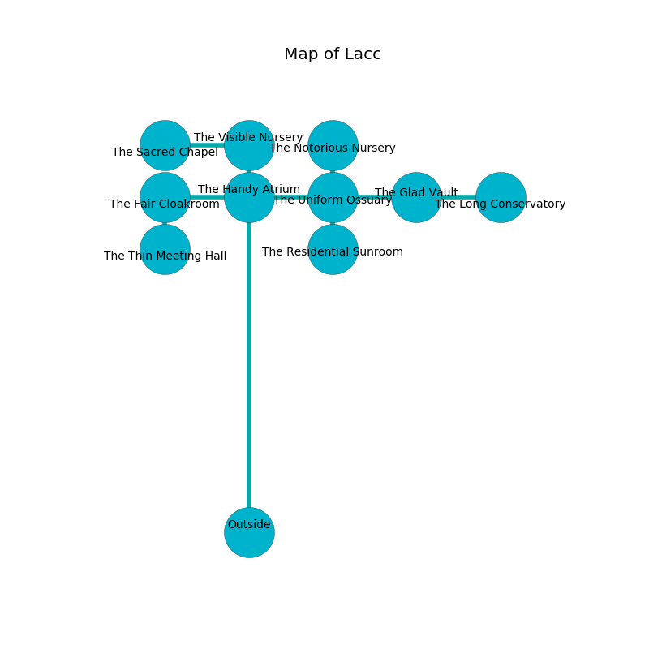

%Ruin Dogs

##Lacc
###Overview
Lacc is located under an alien plain. Regions of it are inaccessible. A blizzard is happening outside. It is occupied by Harpies. Marc Beckett The Self-Indulgent, a Hobgoblin Warlord is here. The Harpies are the soldiers of Marc Beckett The Self-Indulgent. He  is founding a new religion. 

###Artifact
####Coude

Coude is a powerful artifact in the shape of a hard prism. It is a light red color. When eaten it becomes a deadly projectile. 

###Locations

####the handy atrium
The floor is bloodstained. The brick walls are bloodstained. The air tastes like elderberry here. 

There is an engraving on the floor written in Harpies Script. 

> Try digging.
>

* There is a blade here.
* There is a spirit here.
* To the south is the entrance.
* To the east a twisted opening opens to [the uniform ossuary](#the-uniform-ossuary).
* To the north a flooded artery connects to [the visible nursery](#the-visible-nursery).
* To the west a dripping walkway opens to [the fair cloakroom](#the-fair-cloakroom).

####the uniform ossuary
There are six Harpies here. The floor is sticky. Yellow ferns are decaying in cracks in the floor. If the Harpies notice the Ruin Dogs, one of them will retreat and alert [Marc Beckett](#Marc-Beckett). 

There is an engraving on the wall written in common. 

> I am looting this place.
>
> I could not try giving up.
>

* There is a picture here.
* To the south a narrow pathway connects to [the residential sunroom](#the-residential-sunroom).
* To the east a dripping opening leads to [the glad vault](#the-glad-vault).
* To the north a dark path connects to [the notorious nursery](#the-notorious-nursery).
* To the west a twisted opening connects to [the handy atrium](#the-handy-atrium).

####the visible nursery
Yellow moss is sprouting in broken urns. The floor is smooth. There are six Harpies here. If the Harpies notice the Ruin Dogs, one of them will retreat and alert [Marc Beckett](#Marc-Beckett). 

* To the south a flooded artery opens to [the handy atrium](#the-handy-atrium).
* To the west a small cavern connects to [the sacred chapel](#the-sacred-chapel).

####the fair cloakroom
The air smells like sulfur here. The stone walls are unsettled. 

* To the south a torchlit walkway leads to [the thin meeting hall](#the-thin-meeting-hall).
* To the east a dripping walkway connects to [the handy atrium](#the-handy-atrium).

####the glad vault
Red lichens are growing in a patch on the floor. The air smells like coffee here. There are an Orc War Chief, a Githyanki Warrior, and a Duergar here. 

There is an engraving on the floor written in common. 

> Leave at once.
>

* [Coude](#Coude) is here.
* [Marc Beckett The Self-Indulgent](#Marc-Beckett-The-Self-Indulgent) is here.
* To the east a twisted hallway connects to [the long conservatory](#the-long-conservatory).
* To the west a dripping opening opens to [the uniform ossuary](#the-uniform-ossuary).

####the notorious nursery
There is a trap here. When activated, a magical proximity detector will make the walls close in. The air tastes like gooseberry here. Green mushrooms are swaying from the walls. 

* To the south a dark path leads to [the uniform ossuary](#the-uniform-ossuary).

####the sacred chapel
Blue lichens are decaying in cracks in the floor. There are a Xorn, an Ankylosaurus, a Young Faerie Dragon, a Giant Lizard, and a Swarm of Bats here. The floor is sticky. The air tastes like buttery	cabbage here. 

* To the east a small cavern opens to [the visible nursery](#the-visible-nursery).

####the thin meeting hall
There is a trap here. When activated, a pressure plate will launch a poison dart. There are a Sprite, an Orc War Chief, a Gray Ooze, a Giant Poisonous Snake, a Werewolf, and a Poisonous Snake here. 

There is an engraving on a tablet written in Harpies Script. 

> Poor me! cruel soul
>
> unlikely and whole
>
> powerful and expensive
>
> everything is comprehensive
>

* To the north a torchlit walkway leads to [the fair cloakroom](#the-fair-cloakroom).

####the residential sunroom
The floor is glossy. There are six Harpies here. The Harpies are performing a ritual. If not interrupted, a powerful monster will be summoned. 

There is an engraving on a stone written in common. 

> They are sorrowful
>
> abundant, uneasy, different
>
> yet never straight
>
> unanimous, magnetic, eternal
>
> bland and efficient
>
> All of us are envious
>
> rural, sexual, indoor
>
> A match is a disability
>
> dead, memorable, functional
>

* There is a plow here.
* To the north a narrow pathway connects to [the uniform ossuary](#the-uniform-ossuary).

####the long conservatory

* To the west a twisted hallway connects to [the glad vault](#the-glad-vault).

