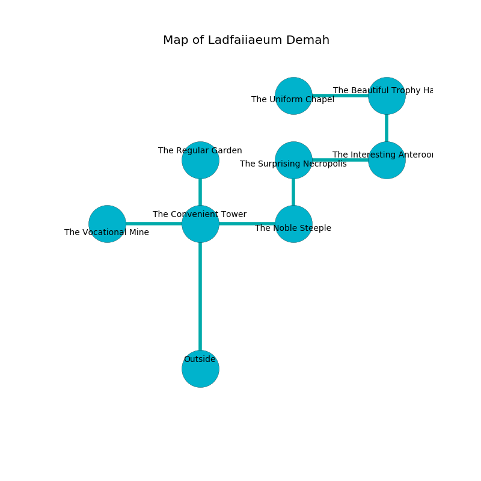

%Ruin Dogs

##Ladfaiiaeum Demah
###Overview
Ladfaiiaeum Demah is located under a ruined rift. Regions of it are incredibly cold. The ruin is burning. It is occupied by Lizardfolk. Alana Sepulveda The Silly, a Berserker is here. The Lizardfolk are the minions of Alana Sepulveda The Silly. She  is founding a new religion. 

###Artifact
####Faehmd Iaaemh Cumdecd

Faehmd Iaaemh Cumdecd looks like a wet amulet. It smells like violet. When rubbed it changes probabilities. 

###Locations

####the convenient tower
There is a trap here. When activated, a pressure plate will launch a blade. There are two Lizardfolk and a Lizardfolk Shaman here. The stone walls are ruined. Yellow ferns are decaying in broken urns. The air smells like cauliflower here. One of the Lizardfolk is pointing a ballista at the entrance. 

* [Faehmd Iaaemh Cumdecd](#Faehmd-Iaaemh-Cumdecd) is here.
* To the south is the entrance.
* To the east a long walkway opens to [the noble steeple](#the-noble-steeple).
* To the north a twisted walkway leads to [the regular garden](#the-regular-garden).
* To the west a torchlit passageway leads to [the vocational mine](#the-vocational-mine).

####the noble steeple
The floor is smooth. The air smells like acrylate here. The concrete walls are scratched. 

* To the north a windy corridor opens to [the surprising necropolis](#the-surprising-necropolis).
* To the west a long walkway connects to [the convenient tower](#the-convenient-tower).

####the surprising necropolis
The air smells like deertongue here. The crystal walls are scratched. There are a Lizardfolk and two Lizardfolk Shamans here. Yellow mushrooms are sprouting from the walls. The Lizardfolk are performing a ritual. If not interrupted, [Alana Sepulveda](#Alana-Sepulveda) will be magically alarmed. 

* To the south a windy corridor opens to [the noble steeple](#the-noble-steeple).
* To the east a torchlit gap connects to [the interesting anteroom](#the-interesting-anteroom).

####the vocational mine
The floor is glossy. There are two Lizardfolk and a Lizardfolk Shaman here. Gray razorgrass is sprouting from the ceiling. The Lizardfolk are meditating. 

There is an engraving on the ceiling written in common. 

> I discovered this place.
>
> Dig here.
>

* There is a spade here.
* To the east a torchlit passageway connects to [the convenient tower](#the-convenient-tower).

####the interesting anteroom
The crystal walls are pristine. The floor is bloodstained. 

* There is a bowl here.
* To the north a windy artery opens to [the beautiful trophy hall](#the-beautiful-trophy-hall).
* To the west a torchlit gap opens to [the surprising necropolis](#the-surprising-necropolis).

####the beautiful trophy hall
There are a Lizardfolk, a Black Bear, and a Githzerai Monk here. The floor is glossy. Yellow moss is sprouting from the walls. 

* To the south a windy artery connects to [the interesting anteroom](#the-interesting-anteroom).
* To the west a narrow corridor opens to [the uniform chapel](#the-uniform-chapel).

####the uniform chapel
The air tastes like rum here. The mirrored walls are bloodstained. The floor is cluttered with shells. 

* To the east a narrow corridor opens to [the beautiful trophy hall](#the-beautiful-trophy-hall).

####the regular garden
There are a Myconid Adult, a Yuan-Ti Malison, a Shrieker, and a Sea Horse here. 

* [Alana Sepulveda The Silly](#Alana-Sepulveda-The-Silly) is here.
* To the south a twisted walkway connects to [the convenient tower](#the-convenient-tower).

