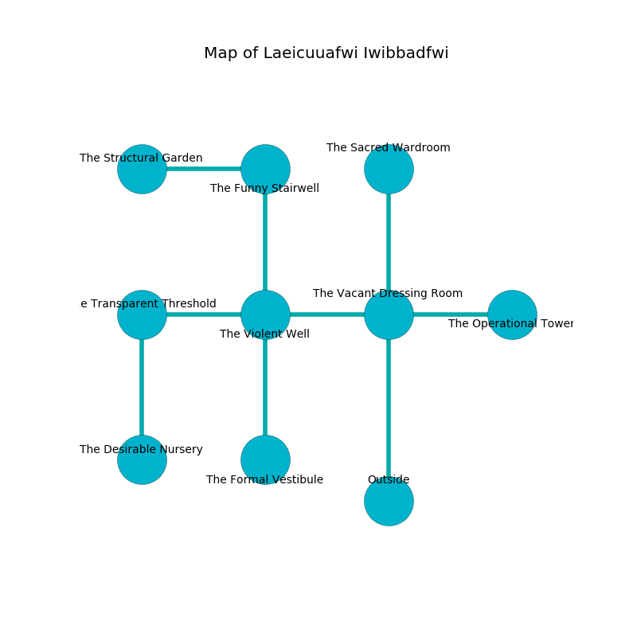

%Ruin Dogs

##Laeicuuafwi Iwibbadfwi
###Overview
Laeicuuafwi Iwibbadfwi is located under an obsidion mountain. Regions of it are frozen. The ruin is burning. It is occupied by Duergars. Lindsay Montano The Changeable, a Bearded Devil is here. The Duergars are the soldiers of Lindsay Montano The Changeable. He  is founding a new religion. 

###Artifact
####The Offensive Incentive

The Offensive Incentive looks like a cold prism. It is a shifting yellow color. When cradled it aids memory. 

###Locations

####the vacant dressing room
The brick walls are pristine. White mushrooms are swaying from the ceiling. There are three Duergars here. The Duergars are fighting amongst themselves. 

* There is a key here.
* To the south is the entrance.
* To the east a hazy passageway leads to [the operational tower](#the-operational-tower).
* To the north a long path opens to [the sacred wardroom](#the-sacred-wardroom).
* To the west a long walkway connects to [the violent well](#the-violent-well).

####the violent well
The air tastes like ambergris here. 

* To the south a small cave connects to [the formal vestibule](#the-formal-vestibule).
* To the east a long walkway connects to [the vacant dressing room](#the-vacant-dressing-room).
* To the north a twisted gap opens to [the funny stairwell](#the-funny-stairwell).
* To the west a dripping gap connects to [the transparent threshold](#the-transparent-threshold).

####the sacred wardroom
Green mushrooms are swaying in a patch on the floor. The air tastes like strawberry here. 

* There is a hammer here.
* There is a pendant here.
* There is a whistle here.
* To the south a long path connects to [the vacant dressing room](#the-vacant-dressing-room).

####the funny stairwell
Green ferns are swaying in cracks in the floor. There is a trap here. When activated, a magical sound detector will open a large pit in the floor. There are a Black Dragon Wyrmling, a Commoner, and a Gelatinous Cube here. 

* [The Offensive Incentive](#The-Offensive-Incentive) is here.
* To the south a twisted gap connects to [the violent well](#the-violent-well).
* To the west a flooded opening connects to [the structural garden](#the-structural-garden).

####the operational tower
The air tastes like urine here. The obsidion walls are ruined. The floor is bloodstained. 

* There is a gold coin here.
* To the west a hazy passageway leads to [the vacant dressing room](#the-vacant-dressing-room).

####the transparent threshold
There are a Half-Ogre and an Ogre here. There is a trap here. When activated, a magical rune will swing a tripping chain. White razorgrass is swaying in a patch on the floor. 

* To the south a twisted hall connects to [the desirable nursery](#the-desirable-nursery).
* To the east a dripping gap opens to [the violent well](#the-violent-well).

####the desirable nursery
The floor is flooded with nine inch deep lukewarm water. 

* To the north a twisted hall connects to [the transparent threshold](#the-transparent-threshold).

####the formal vestibule
The air smells like watercress here. The brick walls are ruined. The floor is sticky. 

* To the north a small cave connects to [the violent well](#the-violent-well).

####the structural garden
The air tastes like burnt sugar here. The floor is bloodstained. Blue mushrooms are decaying in a patch on the floor. There are three Duergars here. The Duergars are performing a ritual. If not interrupted, the Duergars will become more powerful. 

* There is a shirt here.
* There is a cow here.
* There is a sceptre here.
* [Lindsay Montano The Changeable](#Lindsay-Montano-The-Changeable) is here.
* To the east a flooded opening opens to [the funny stairwell](#the-funny-stairwell).

