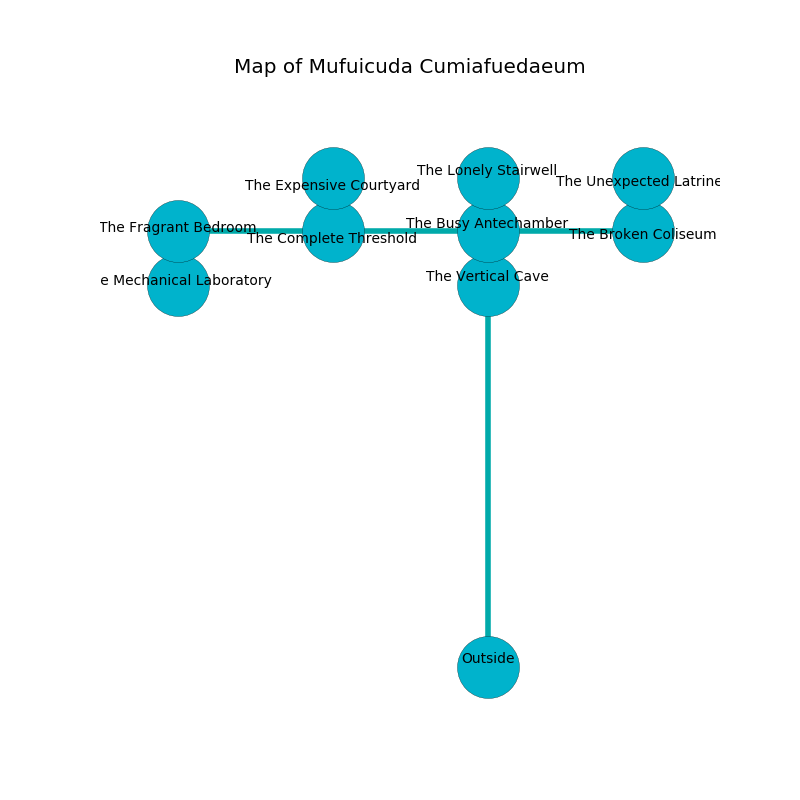

%Ruin Dogs

##Mufuicuda Cumiafuedaeum
###Overview
Mufuicuda Cumiafuedaeum is located on a haunted tree. Some rooms of it are unbearably cold. A massive storm is happening outside. It is occupied by Satyrs. Kent Gerard The Quick-Tempered, a Sahuagin Priestess is here. The Satyrs are the soldiers of Kent Gerard The Quick-Tempered. He  is trying to understand [Ladfaiiaeum Bemehabamd](#Ladfaiiaeum-Bemehabamd). 

###Artifact
####Ladfaiiaeum Bemehabamd

Ladfaiiaeum Bemehabamd looks like a hard monument. When cradled it makes its owner invisible. 

###Locations

####the vertical cave
Blue moss is swaying from the walls. 

* To the south is the entrance.
* To the north a small path leads to [the busy antechamber](#the-busy-antechamber).

####the busy antechamber
The wooden walls are unsettled. Yellow ferns are swaying in cracks in the floor. The air tastes like peanut here. 

There is an engraving on a tablet written in Satyrs Script. 

> [Ladfaiiaeum Bemehabamd](#Ladfaiiaeum-Bemehabamd)
>
> clear, enthusiastic, racial
>
> [Ladfaiiaeum Bemehabamd](#Ladfaiiaeum-Bemehabamd)
>
> always surprised
>

* There is a board here.
* There is a seed here.
* There is a stocking here.
* There is a spade here.
* To the south a small path connects to [the vertical cave](#the-vertical-cave).
* To the east a narrow cave connects to [the broken coliseum](#the-broken-coliseum).
* To the north a windy artery opens to [the lonely stairwell](#the-lonely-stairwell).
* To the west a dripping path connects to [the complete threshold](#the-complete-threshold).

####the complete threshold
White moss is decaying from the ceiling. The floor is bloodstained. 

There is an engraving on the ceiling written in Satyrs Script. 

> Maybe try praying.
>

* There is a flag here.
* There is a carriage here.
* There is a fish here.
* There is a crystal here.
* There is a belt here.
* To the east a dripping path leads to [the busy antechamber](#the-busy-antechamber).
* To the north a narrow hallway opens to [the expensive courtyard](#the-expensive-courtyard).
* To the west a long path opens to [the fragrant bedroom](#the-fragrant-bedroom).

####the fragrant bedroom
The glass walls are ruined. 

There is an engraving on a monolith written in common. 

> I tried cowering.
>

* To the south a narrow passageway connects to [the mechanical laboratory](#the-mechanical-laboratory).
* To the east a long path leads to [the complete threshold](#the-complete-threshold).

####the expensive courtyard
The air smells like tagette here. The floor is bloodstained. 

* [Kent Gerard The Quick-Tempered](#Kent-Gerard-The-Quick-Tempered) is here.
* To the south a narrow hallway connects to [the complete threshold](#the-complete-threshold).

####the broken coliseum
The wooden walls are ruined. 

* [Ladfaiiaeum Bemehabamd](#Ladfaiiaeum-Bemehabamd) is here.
* To the north a narrow hall leads to [the unexpected latrines](#the-unexpected-latrines).
* To the west a narrow cave connects to [the busy antechamber](#the-busy-antechamber).

####the lonely stairwell
Red ferns are growing in cracks in the floor. There are four Satyrs here. The floor is cluttered with rocks. The air tastes like tomato here. The Satyrs are willing to negotiate. 

* There is an ant here.
* To the south a windy artery connects to [the busy antechamber](#the-busy-antechamber).

####the mechanical laboratory
The air tastes like lobster here. The floor is sticky. 

* To the north a narrow passageway leads to [the fragrant bedroom](#the-fragrant-bedroom).

####the unexpected latrines
The floor is flooded with six inch deep lukewarm water. The brick walls are ruined. Blue moss is swaying in cracks in the floor. The air tastes like cranberry here. 

* To the south a narrow hall opens to [the broken coliseum](#the-broken-coliseum).

