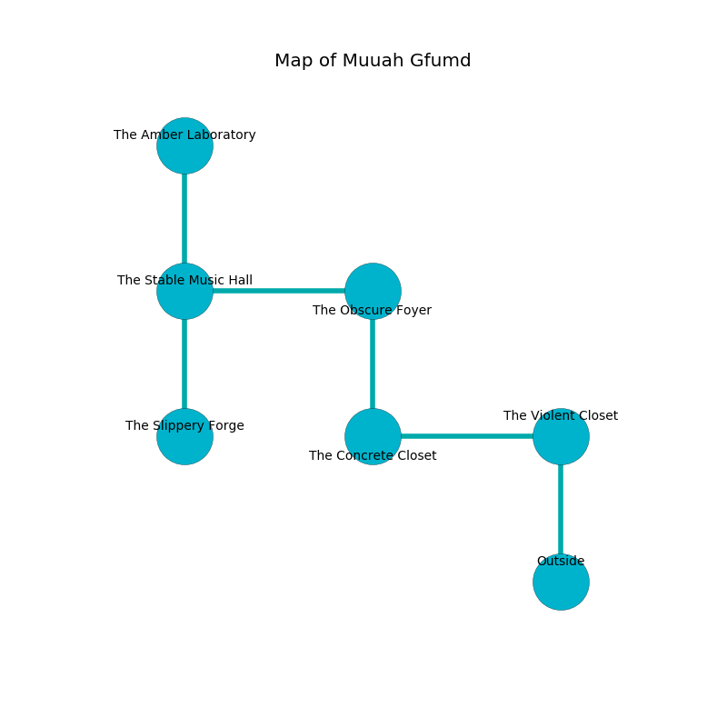

%Ruin Dogs

##Muuah Gfumd
###Overview
Muuah Gfumd is located under a flooded plain. Some areas of it are frozen. A solar eclipse is happening outside. It is occupied by Humans. Horacio Goss The Self-Centred, a Fire Giant is here. The Humans are the soldiers of Horacio Goss The Self-Centred. He  is trying to hide [The Quantitative Bronze](#The-Quantitative-Bronze). 

###Artifact
####The Quantitative Bronze

The Quantitative Bronze looks like a smooth cube. It smells like molasses. When held it destroys itself. 

###Locations

####the violent closet
White razorgrass is decaying in broken urns. 

* To the south is the entrance.
* To the west a torchlit hall opens to [the concrete closet](#the-concrete-closet).

####the concrete closet
There is a trap here. When activated, a pressure plate will fire a net. There are a Veteran, a Quasit, a Clay Golem, an Elk, a Ghast, and a Spined Devil here. The air smells like vegetables here. 

* [Horacio Goss The Self-Centred](#Horacio-Goss-The-Self-Centred) is here.
* To the east a torchlit hall opens to [the violent closet](#the-violent-closet).
* To the north a twisted cavern leads to [the obscure foyer](#the-obscure-foyer).

####the obscure foyer
The mirrored walls are ruined. The air tastes like pepper here. 

There is an engraving on a tablet written in common. 

> All of us are dying
>
> proud, childish, old
>
> plain, bold, thirsty
>

* There is a girl here.
* To the south a twisted cavern opens to [the concrete closet](#the-concrete-closet).
* To the west a hazy pathway leads to [the stable music hall](#the-stable-music-hall).

####the stable music hall
The air tastes like tobacco here. 

* [The Quantitative Bronze](#The-Quantitative-Bronze) is here.
* To the south a twisted artery connects to [the slippery forge](#the-slippery-forge).
* To the east a hazy pathway leads to [the obscure foyer](#the-obscure-foyer).
* To the north a dark cavern leads to [the amber laboratory](#the-amber-laboratory).

####the amber laboratory
There are a Berserker, two Gladiators, a Commoner, a Cult Fanatic, and  here. The floor is smooth. One of the Humans is working a mechanism that can engulf the room in a fiery blaze. 

* To the south a dark cavern opens to [the stable music hall](#the-stable-music-hall).

####the slippery forge
There are a Priest and an Assassin here. The floor is bloodstained. Gray lichens are swaying in a patch on the floor. The air smells like cognac here. The mirrored walls are covered in mold. The Humans are willing to fight to the death. 

There is an engraving on the floor written in common. 

> I worship [The Quantitative Bronze](#The-Quantitative-Bronze).
>
> Maybe try running.
>

* To the north a twisted artery opens to [the stable music hall](#the-stable-music-hall).

