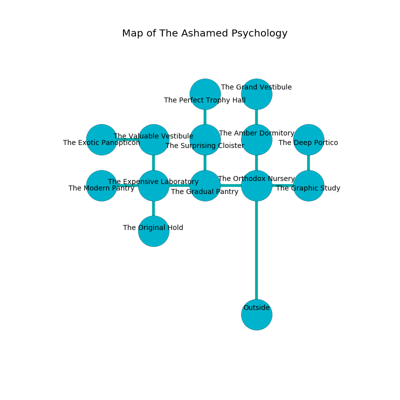

%Ruin Dogs

##The Ashamed Psychology
###Overview
The Ashamed Psychology is located in a volcanic city. Some areas of it are flooded. A blizzard is happening outside. It is occupied by Goblins. Francie Stidham The Boastful, a Gnoll Pack Lord is here. The Goblins are ruled by Francie Stidham The Boastful. She  is founding a new religion. 

###Artifact
####Ideca Hfeloeda

Ideca Hfeloeda looks like an opaque prism. It is a light purple color. Magic slides near it. When worshipped it flies into the air. 

###Locations

####the orthodox nursery
There are three Hobgoblins and two Goblins here. The air smells like gasoline here. One of the Goblins is working a mechanism that can launch acid at the Ruin Dogs. 

* To the south is the entrance.
* To the east a torchlit pathway connects to [the graphic study](#the-graphic-study).
* To the north a windy path leads to [the amber dormitory](#the-amber-dormitory).
* To the west a hazy passageway opens to [the gradual pantry](#the-gradual-pantry).

####the gradual pantry
There is a trap here. When activated, a magical proximity detector will cast a curse. 

* To the east a hazy passageway opens to [the orthodox nursery](#the-orthodox-nursery).
* To the north a windy corridor connects to [the surprising cloister](#the-surprising-cloister).
* To the west a long corridor leads to [the expensive laboratory](#the-expensive-laboratory).

####the surprising cloister
Blue moss is growing from the ceiling. The concrete walls are unsettled. There are two Hobgoblins and four Goblins here. The floor is flooded with nine inch deep hot water. One of the Goblins is on watch, the rest are celebrating. 

* To the south a windy corridor leads to [the gradual pantry](#the-gradual-pantry).
* To the north a hazy corridor opens to [the perfect trophy hall](#the-perfect-trophy-hall).

####the graphic study
The obsidion walls are scratched. There are a Black Bear, a Warhorse Skeleton, a Kuo-Toa, an Orc, a Wolf, and a Cat here. The air smells like rubber here. The floor is sticky. 

* To the north a long artery leads to [the deep portico](#the-deep-portico).
* To the west a torchlit pathway opens to [the orthodox nursery](#the-orthodox-nursery).

####the amber dormitory
Yellow razorgrass is decaying in a patch on the floor. There are a Giant Rat and a Rhinoceros here. 

There is an engraving on the floor written in common. 

> All of us are cursed
>
> bare and standard
>
> [Ideca Hfeloeda](#Ideca-Hfeloeda)
>
> yet emotional
>
> [Ideca Hfeloeda](#Ideca-Hfeloeda)
>
> open and incapable
>
> They are love
>
> open, frequent, quiet
>
> close and true
>
> yet never blank
>
> implicit, specified, secure
>
> All of us are cursed
>

* To the south a windy path connects to [the orthodox nursery](#the-orthodox-nursery).
* To the north a dripping threshold leads to [the grand vestibule](#the-grand-vestibule).

####the expensive laboratory
There are an Elk, a Constrictor Snake, and a Myconid Sovereign here. The floor is flooded with six inch deep scalding water. 

There is an engraving on the floor written in Goblins Script. 

> I am lost in The Ashamed Psychology.
>

* To the south a hazy hallway opens to [the original hold](#the-original-hold).
* To the east a long corridor opens to [the gradual pantry](#the-gradual-pantry).
* To the north a flooded walkway opens to [the valuable vestibule](#the-valuable-vestibule).
* To the west a long artery leads to [the modern pantry](#the-modern-pantry).

####the perfect trophy hall
Red moss is swaying in cracks in the floor. 

* To the south a hazy corridor leads to [the surprising cloister](#the-surprising-cloister).

####the grand vestibule
There are three Hobgoblins and two Goblins here. If the Goblins notice the Ruin Dogs, one of them will retreat and alert [Francie Stidham](#Francie-Stidham). 

* To the south a dripping threshold connects to [the amber dormitory](#the-amber-dormitory).

####the deep portico
Green razorgrass is decaying in broken urns. The floor is glossy. The air smells like burnt sugar here. The crystal walls are scratched. 

* To the south a long artery opens to [the graphic study](#the-graphic-study).

####the original hold
There is a Centaur here. White razorgrass is swaying from the walls. The floor is smooth. 

* [Francie Stidham The Boastful](#Francie-Stidham-The-Boastful) is here.
* To the north a hazy hallway connects to [the expensive laboratory](#the-expensive-laboratory).

####the valuable vestibule
There are two Hobgoblins and four Goblins here. The air smells like chemicals here. The Goblins are performing a ritual. If not interrupted, the ruin dogs will be weakened. 

* [Ideca Hfeloeda](#Ideca-Hfeloeda) is here.
* To the south a flooded walkway opens to [the expensive laboratory](#the-expensive-laboratory).
* To the west a long pathway connects to [the exotic panopticon](#the-exotic-panopticon).

####the modern pantry
The air smells like sap here. The obsidion walls are ruined. The floor is cluttered with bones. 

There is an engraving on a monolith written in common. 

> Hide here.
>

* To the east a long artery connects to [the expensive laboratory](#the-expensive-laboratory).

####the exotic panopticon
The floor is flooded with three inch deep lukewarm water. There are two Hobgoblins and four Goblins here. Yellow moss is swaying from the walls. The obsidion walls are pristine. There is a trap here. When activated, a pressure plate will launch a blade. The Goblins are willing to negotiate. 

* To the east a long pathway leads to [the valuable vestibule](#the-valuable-vestibule).

