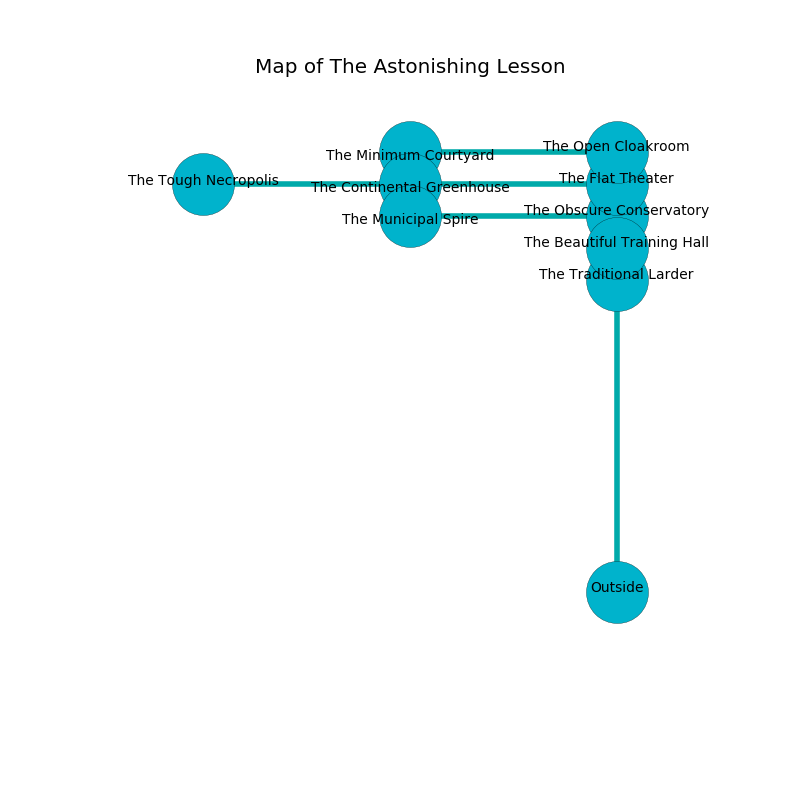

%Ruin Dogs

##The Astonishing Lesson
###Overview
The Astonishing Lesson is located in an alien mountain. Some rooms of it are cursed. A solar eclipse is happening outside. It is occupied by Lizardfolk. Patience Ridley The Ruthless, a Frost Giant is here. The Lizardfolk are battling Patience Ridley The Ruthless. She  is trying to discover [Doiaemaiibem Ceb](#Doiaemaiibem-Ceb). 

###Artifact
####Doiaemaiibem Ceb

Doiaemaiibem Ceb looks like a transparent sphere. It is a shifting yellow color. When smelled it tunnels into the earth. 

###Locations

####the flat theater
The brick walls are ruined. 

There is an engraving on the wall written in common. 

> I am the best.
>
> I could not try leaving.
>

* To the south is the entrance.
* To the north a long walkway leads to [the open cloakroom](#the-open-cloakroom).
* To the west a hazy pathway connects to [the continental greenhouse](#the-continental-greenhouse).

####the continental greenhouse
There are a Gibbering Mouther, a Drow Mage, and an Orog here. Gray lichens are sprouting from the walls. 

* To the south a windy artery leads to [the municipal spire](#the-municipal-spire).
* To the east a hazy pathway opens to [the flat theater](#the-flat-theater).
* To the west a small opening leads to [the tough necropolis](#the-tough-necropolis).

####the municipal spire
The floor is smooth. There are six Lizardfolk and two Lizardfolk Shamans here. The Lizardfolk are willing to negotiate. 

* To the east a narrow hall leads to [the obscure conservatory](#the-obscure-conservatory).
* To the north a windy artery leads to [the continental greenhouse](#the-continental-greenhouse).

####the obscure conservatory

There is an engraving on the floor written in common. 

> I am alone.
>

* To the south a narrow opening connects to [the beautiful training hall](#the-beautiful-training-hall).
* To the west a narrow hall opens to [the municipal spire](#the-municipal-spire).

####the open cloakroom
White razorgrass is swaying in a patch on the floor. The air smells like immortelle here. The stone walls are ruined. 

* To the south a long walkway leads to [the flat theater](#the-flat-theater).
* To the west a dripping threshold leads to [the minimum courtyard](#the-minimum-courtyard).

####the tough necropolis
Green ferns are decaying in broken urns. There are a Black Bear, a Fire Snake, a Giant Crab, an Ankheg, a Displacer Beast, a Giant fire beetle, a Pony, and an Axe Beak here. The metallic walls are caving in. 

* There is a spoon here.
* To the east a small opening opens to [the continental greenhouse](#the-continental-greenhouse).

####the minimum courtyard
There are six Lizardfolk and two Lizardfolk Shamans here. Red moss is growing in cracks in the floor. The Lizardfolk are willing to negotiate. 

There is an engraving on the wall written in common. 

> A spring is a classroom
>
> relevant, loose, proper
>

* There is a cake here.
* [Patience Ridley The Ruthless](#Patience-Ridley-The-Ruthless) is here.
* To the east a dripping threshold connects to [the open cloakroom](#the-open-cloakroom).

####the beautiful training hall
The floor is bloodstained. Green lichens are sprouting from the ceiling. 

* [Doiaemaiibem Ceb](#Doiaemaiibem-Ceb) is here.
* To the south a long path connects to [the traditional larder](#the-traditional-larder).
* To the north a narrow opening connects to [the obscure conservatory](#the-obscure-conservatory).

####the traditional larder
Yellow mushrooms are swaying in broken urns. 

* To the north a long path leads to [the beautiful training hall](#the-beautiful-training-hall).

