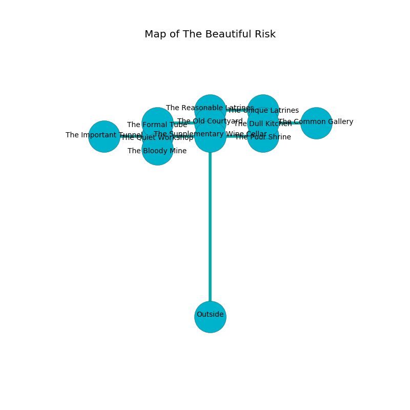

%Ruin Dogs

##The Beautiful Risk
###Overview
The Beautiful Risk is constructed on a volcanic mountain. Some areas of The Beautiful Risk are flooded. The ruin is flooding. It is occupied by Deep Gnomes. Byron Kaufman The Foolish, a Cloud Giant is here. The Deep Gnomes are battling Byron Kaufman The Foolish. He  is founding a new religion. 

###Artifact
####The Strict Account

The Strict Account has the form of a smooth figurine. It is a pale orange color. It smells like taco. When touched it dissappears. 

###Locations

####the supplementary wine cellar
The air tastes like bay here. 

* To the south is the entrance.
* To the east a twisted cave leads to [the poor shrine](#the-poor-shrine).
* To the north a dripping cave connects to [the old courtyard](#the-old-courtyard).
* To the west a narrow cave leads to [the quiet workshop](#the-quiet-workshop).

####the old courtyard
The metallic walls are unsettled. The floor is cluttered with ashes. 

* To the south a dripping cave opens to [the supplementary wine cellar](#the-supplementary-wine-cellar).
* To the north a hazy artery leads to [the reasonable latrines](#the-reasonable-latrines).
* To the west a dark opening leads to [the formal tube](#the-formal-tube).

####the quiet workshop
The floor is bloodstained. There are twenty Deep Gnomes here. The Deep Gnomes are sleeping. 

* There is an egg here.
* There is a dress here.
* To the south a dark pathway connects to [the bloody mine](#the-bloody-mine).
* To the east a narrow cave opens to [the supplementary wine cellar](#the-supplementary-wine-cellar).
* To the west a dripping path connects to [the important tunnel](#the-important-tunnel).

####the bloody mine
The air smells like sassafrass here. The floor is smooth. 

There is an engraving on a stone written in Deep Gnomes Script. 

> Oh my! meak god
>
> it is never fast
>
> basic, external, odd
>
> cruelty is past
>

* There is a crystal here.
* There is a basin here.
* To the north a dark pathway connects to [the quiet workshop](#the-quiet-workshop).

####the poor shrine
Red moss is swaying in broken urns. 

* There is a spirit here.
* There is a pig here.
* To the north a small path leads to [the dull kitchen](#the-dull-kitchen).
* To the west a twisted cave connects to [the supplementary wine cellar](#the-supplementary-wine-cellar).

####the reasonable latrines
The brick walls are bloodstained. The air smells like calamus here. There are twenty Deep Gnomes here. Yellow moss is swaying from the ceiling. The floor is smooth. One of the Deep Gnomes is on watch, the rest are fighting amongst themselves. 

* [The Strict Account](#The-Strict-Account) is here.
* To the south a hazy artery opens to [the old courtyard](#the-old-courtyard).
* To the east a twisted path leads to [the unique latrines](#the-unique-latrines).

####the important tunnel
Red lichens are growing from the walls. The air tastes like rhubarb here. The floor is flooded with two inch deep cool water. 

* To the east a dripping path leads to [the quiet workshop](#the-quiet-workshop).

####the dull kitchen
There is a trap here. When activated, a magical proximity detector will make the ceiling slowly lower. Green lichens are decaying in a patch on the floor. 

* To the south a small path opens to [the poor shrine](#the-poor-shrine).
* To the east a flooded threshold connects to [the common gallery](#the-common-gallery).

####the formal tube
The mirrored walls are scratched. The air smells like cooked onion here. 

There is an engraving on a tablet written in Deep Gnomes Script. 

> Oh my! weak we
>
> objective, colourful, free
>
> yet never middle-class
>
> the world is last
>

* [Byron Kaufman The Foolish](#Byron-Kaufman-The-Foolish) is here.
* To the east a dark opening connects to [the old courtyard](#the-old-courtyard).

####the common gallery
Green razorgrass is swaying in cracks in the floor. The air tastes like neroli here. 

* To the west a flooded threshold leads to [the dull kitchen](#the-dull-kitchen).

####the unique latrines
Gray moss is swaying in a patch on the floor. 

There is an engraving on a monolith written in Deep Gnomes Script. 

> I worship [The Strict Account](#The-Strict-Account).
>
> Leave now.
>

* There is a nut here.
* There is a dragon here.
* To the west a twisted path leads to [the reasonable latrines](#the-reasonable-latrines).

