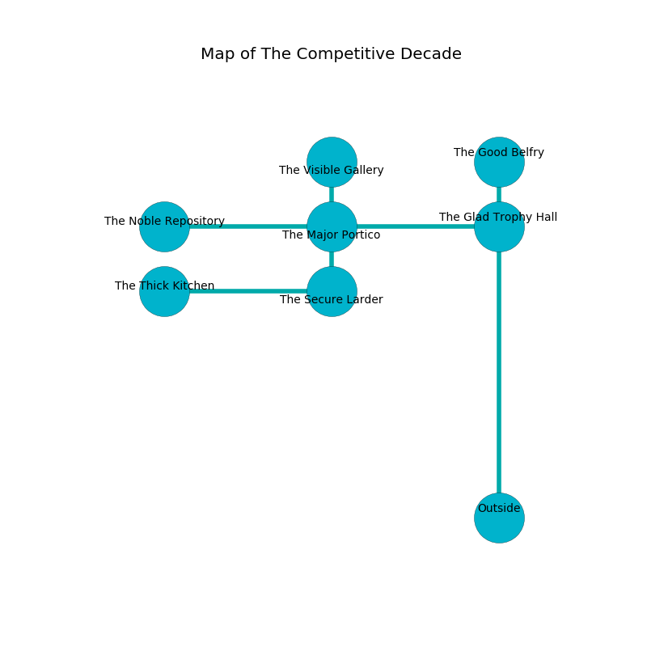

%Ruin Dogs

##The Competitive Decade
###Overview
The Competitive Decade is located in a crystal mountain. Parts of The Competitive Decade are cursed. The ruin is collapsing slowly. It is occupied by Kobolds. Cornelius Majors The Indiscreet, a Yuan-Ti Abomination is here. The Kobolds are the slaves of Cornelius Majors The Indiscreet. He  is founding a new religion. 

###Artifact
####Daeicoaed

Daeicoaed has the form of a mushy spear. Light shifts near it. It smells like soap. When cradled it grants psychic powers. 

###Locations

####the glad trophy hall
The floor is bloodstained. 

There is an engraving on a tablet written in common. 

> Oh my! terrible fate
>
> always great
>
> ever long
>
> cruelty is wrong
>

* [Daeicoaed](#Daeicoaed) is here.
* To the south is the entrance.
* To the north a windy cavern opens to [the good belfry](#the-good-belfry).
* To the west a small threshold opens to [the major portico](#the-major-portico).

####the major portico
The air tastes like mango here. The obsidion walls are bloodstained. There are a Bandit Captain, a Giant Ape, an Aarakocra, and a Shadow here. 

There is an engraving on a stone written in Kobolds Script. 

> O meak soul
>
> competitive and whole
>
> it is never academic
>
> all is whole
>

* There is a bottle here.
* There is a horse here.
* To the south a narrow hallway opens to [the secure larder](#the-secure-larder).
* To the east a small threshold connects to [the glad trophy hall](#the-glad-trophy-hall).
* To the north a long walkway connects to [the visible gallery](#the-visible-gallery).
* To the west a dripping path leads to [the noble repository](#the-noble-repository).

####the noble repository
The floor is glossy. The metallic walls are caving in. The air smells like opoponax here. There are thirteen Kobolds and twenty two Winged Kobolds here. The Kobolds are crazy with bloodlust. 

There is an engraving on a stone written in Kobolds Script. 

> A knot is a pneumonia
>
> forward and definite
>
> funny and wet
>
> yet never express
>
> A pig is a definition
>
> ever feminine
>
> A nail is a lunch
>
> yet usual
>
> rich, unpleasant, legal
>
> regular, past, patient
>
> A knot is a pneumonia
>

* To the east a dripping path leads to [the major portico](#the-major-portico).

####the secure larder
The air tastes like wasabi here. White razorgrass is swaying from the ceiling. There are fifteen Kobolds and twenty one Winged Kobolds here. The floor is smooth. The Kobolds are performing a ritual. If not interrupted, a powerful monster will be summoned. 

There is an engraving on a tablet written in common. 

> I am lost in The Competitive Decade.
>
> I could not try dying.
>

* There is a cup here.
* To the north a narrow hallway leads to [the major portico](#the-major-portico).
* To the west a narrow walkway opens to [the thick kitchen](#the-thick-kitchen).

####the thick kitchen
There are a Slaad Tadpole, a Rug of Smothering, a Vampire Spawn, a Bronze Dragon Wyrmling, and a Frog here. Red lichens are sprouting in cracks in the floor. The air tastes like pumpkin here. The crystal walls are covered in mold. 

There is an engraving on the ceiling written in common. 

> Run away.
>

* To the east a narrow walkway connects to [the secure larder](#the-secure-larder).

####the visible gallery
Red lichens are sprouting in a patch on the floor. There are a Blink Dog, a Priest, a Shadow Demon, and a Gnoll Pack Lord here. 

* There is a basket here.
* To the south a long walkway opens to [the major portico](#the-major-portico).

####the good belfry
The metallic walls are unsettled. The floor is smooth. 

* There is a hoard here.
* There is a card here.
* [Cornelius Majors The Indiscreet](#Cornelius-Majors-The-Indiscreet) is here.
* To the south a windy cavern leads to [the glad trophy hall](#the-glad-trophy-hall).

