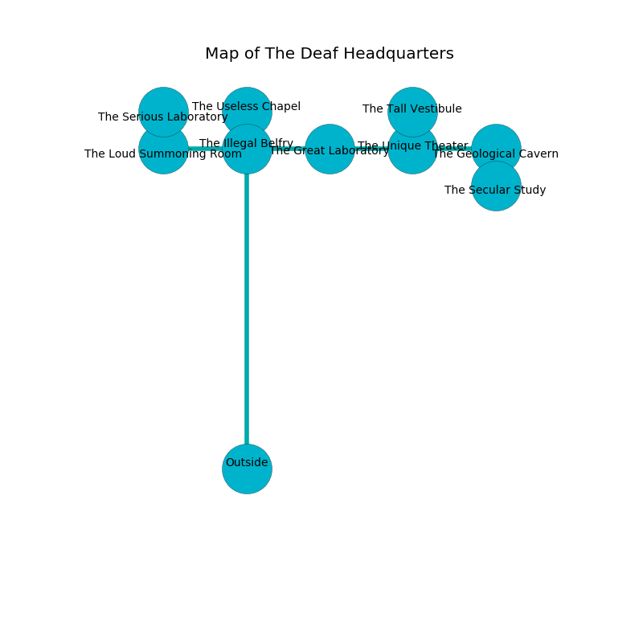

%Ruin Dogs

##The Deaf Headquarters
###Overview
The Deaf Headquarters is located in a crystal plain. Some areas of it are flooded. The ruin is collapsing slowly. It is occupied by Sahuagin. Homer Jeffries The Nervous, a Drow Priestess of Lolth is here. The Sahuagin are the minions of Homer Jeffries The Nervous. He  is trying to recover [The Wild Month](#The-Wild-Month). 

###Artifact
####The Wild Month

The Wild Month has the form of a soft spear. It is a bright green color. It smells like leather. When smelled it flies into the air. 

###Locations

####the illegal belfry
There are two Sahuagin and two Sahuagin Barons here. Green ferns are swaying in broken urns. The Sahuagin are celebrating. 

There is an engraving on a stone written in common. 

> I am seeking [The Wild Month](#The-Wild-Month).
>
> I could not try giving up.
>

* To the south is the entrance.
* To the east a torchlit threshold opens to [the great laboratory](#the-great-laboratory).
* To the north a flooded path connects to [the useless chapel](#the-useless-chapel).
* To the west a twisted cave leads to [the loud summoning room](#the-loud-summoning-room).

####the useless chapel
The floor is smooth. The glass walls are pristine. Green razorgrass is sprouting from the ceiling. 

There is an engraving on the floor written in common. 

> A boat is a participant
>
> adequate and organic
>
> visible and loose
>
> A store is a sail
>
> ever urban
>
> you will be eaten
>

* [Homer Jeffries The Nervous](#Homer-Jeffries-The-Nervous) is here.
* To the south a flooded path opens to [the illegal belfry](#the-illegal-belfry).

####the loud summoning room
Green ferns are growing in a patch on the floor. 

* There is a shoe here.
* To the east a twisted cave connects to [the illegal belfry](#the-illegal-belfry).
* To the north a torchlit hallway leads to [the serious laboratory](#the-serious-laboratory).

####the great laboratory
The air tastes like oak wood here. 

* To the east a narrow passageway opens to [the unique theater](#the-unique-theater).
* To the west a torchlit threshold opens to [the illegal belfry](#the-illegal-belfry).

####the unique theater
There is a trap here. When activated, a magical rune will fire a net. The crystal walls are ruined. 

* [The Wild Month](#The-Wild-Month) is here.
* To the east a narrow pathway connects to [the geological cavern](#the-geological-cavern).
* To the north a twisted threshold opens to [the tall vestibule](#the-tall-vestibule).
* To the west a narrow passageway leads to [the great laboratory](#the-great-laboratory).

####the geological cavern
The air smells like patchouli here. The floor is glossy. There are a Sahuagin and two Sahuagin Barons here. One of the Sahuagin is working a mechanism that can flood the room. 

* There is a fish here.
* To the south a torchlit path opens to [the secular study](#the-secular-study).
* To the west a narrow pathway opens to [the unique theater](#the-unique-theater).

####the serious laboratory
White moss is swaying from the ceiling. The floor is smooth. There are two Sahuagin and two Sahuagin Barons here. One of the Sahuagin is on watch, the rest are sleeping. 

* To the south a torchlit hallway opens to [the loud summoning room](#the-loud-summoning-room).

####the secular study
The floor is bloodstained. White lichens are swaying in a patch on the floor. The brick walls are unsettled. There are three Sahuagin and two Sahuagin Barons here. The air smells like root here. The Sahuagin are willing to negotiate. 

* To the north a torchlit path leads to [the geological cavern](#the-geological-cavern).

####the tall vestibule
The floor is cluttered with bones. Yellow mushrooms are growing in a patch on the floor. 

There is an engraving on a monolith written in Sahuagin Script. 

> O terrible god
>
> residential, spatial, unfair
>
> it is always odd
>
> nothing is unaware
>

* There is a portrait here.
* To the south a twisted threshold connects to [the unique theater](#the-unique-theater).

