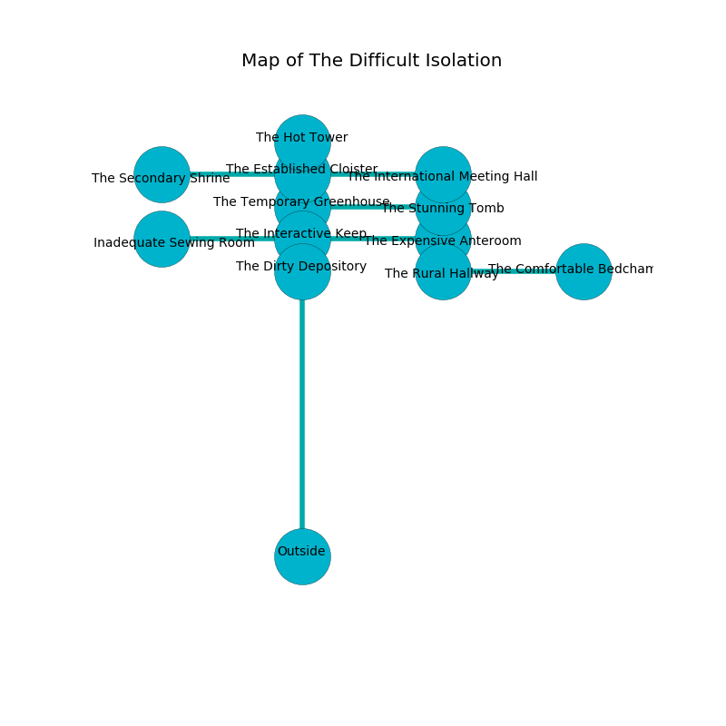

%Ruin Dogs

##The Difficult Isolation
###Overview
The Difficult Isolation is located in a flooded city. Some rooms of it are cursed. A lunar eclipse is happening outside. It is occupied by Troglodytes. Mayme Honeycutt The Flirtatious, a Kuo-Toa Whip is here. The Troglodytes are the minions of Mayme Honeycutt The Flirtatious. She  is trying to research [Cmaed](#Cmaed). 

###Artifact
####Cmaed

Cmaed has the form of a hard spear. It is a sickly gray color. It smells like strawberry. Air pours near it. When thrown it becomes a shielding force. 

###Locations

####the dirty depository
Red razorgrass is growing from the walls. The crystal walls are scratched. There are eight Troglodytes here. The air smells like acacia here. The Troglodytes are crazy with bloodlust. 

There is an engraving on the wall written in Troglodytes Script. 

> I am lost in The Difficult Isolation.
>
> I tried fighting.
>

* To the south is the entrance.
* To the north a windy cave opens to [the interactive keep](#the-interactive-keep).

####the interactive keep
Green lichens are swaying from the ceiling. 

There is an engraving on a tablet written in common. 

> O sad you
>
> unlike, latest, new
>
> progressive, alive, secular
>
> hope is molecular
>

* To the south a windy cave opens to [the dirty depository](#the-dirty-depository).
* To the east a windy cavern connects to [the expensive anteroom](#the-expensive-anteroom).
* To the north a long passageway connects to [the temporary greenhouse](#the-temporary-greenhouse).
* To the west a hazy corridor leads to [the inadequate sewing room](#the-inadequate-sewing-room).

####the temporary greenhouse
White moss is decaying from the ceiling. There are eight Troglodytes here. The air smells like oakmoss here. The Troglodytes are willing to negotiate. 

* There is a wand here.
* To the south a long passageway connects to [the interactive keep](#the-interactive-keep).
* To the east a narrow passageway connects to [the stunning tomb](#the-stunning-tomb).
* To the north a dripping hall opens to [the established cloister](#the-established-cloister).

####the stunning tomb
The floor is bloodstained. The air smells like roasted chicken here. Blue lichens are sprouting in a patch on the floor. There are a Giant Boar and a Kuo-Toa Whip here. 

* To the west a narrow passageway connects to [the temporary greenhouse](#the-temporary-greenhouse).

####the established cloister
The air smells like char here. 

* [Cmaed](#Cmaed) is here.
* To the south a dripping hall connects to [the temporary greenhouse](#the-temporary-greenhouse).
* To the east a windy gap leads to [the international meeting hall](#the-international-meeting-hall).
* To the north a narrow pathway leads to [the hot tower](#the-hot-tower).
* To the west a twisted path connects to [the secondary shrine](#the-secondary-shrine).

####the expensive anteroom
The air tastes like stringent here. The floor is bloodstained. There are eight Troglodytes here. The Troglodytes are willing to negotiate. 

* To the south a torchlit corridor opens to [the rural hallway](#the-rural-hallway).
* To the west a windy cavern leads to [the interactive keep](#the-interactive-keep).

####the rural hallway
There are a Hunter Shark and a Black Bear here. 

* To the east a torchlit threshold leads to [the comfortable bedchamber](#the-comfortable-bedchamber).
* To the north a torchlit corridor opens to [the expensive anteroom](#the-expensive-anteroom).

####the international meeting hall
There is a Gnoll Pack Lord here. Red ferns are swaying from the walls. 

* To the west a windy gap connects to [the established cloister](#the-established-cloister).

####the inadequate sewing room
The air tastes like foliage here. Blue lichens are swaying in broken urns. The stone walls are ruined. 

* To the east a hazy corridor connects to [the interactive keep](#the-interactive-keep).

####the comfortable bedchamber
The floor is cluttered with debris. The air tastes like apple skin here. 

* [Mayme Honeycutt The Flirtatious](#Mayme-Honeycutt-The-Flirtatious) is here.
* To the west a torchlit threshold leads to [the rural hallway](#the-rural-hallway).

####the hot tower
The glass walls are ruined. Gray ferns are growing from the walls. There are eight Troglodytes here. The floor is glossy. If the Troglodytes notice the Ruin Dogs, one of them will retreat and alert [Mayme Honeycutt](#Mayme-Honeycutt). 

* There is a table here.
* To the south a narrow pathway connects to [the established cloister](#the-established-cloister).

####the secondary shrine
There is a trap here. When activated, a tripwire will launch a hail of needles. There is a Rhinoceros here. 

* To the east a twisted path connects to [the established cloister](#the-established-cloister).

