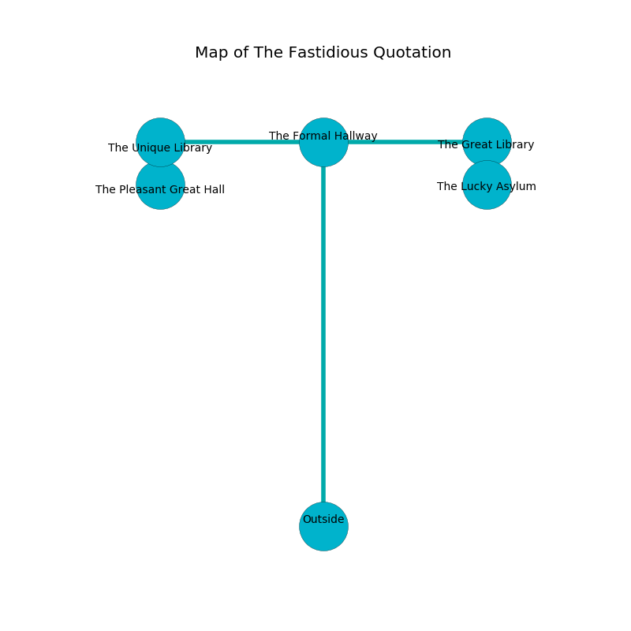

%Ruin Dogs

##The Fastidious Quotation
###Overview
The Fastidious Quotation is located on a giant mountain. Some areas of it are incredibly cold. A lunar eclipse is happening outside. It is occupied by Githzerai. Gema Ferrara The Secretive, a Drow Mage is here. The Githzerai worship Gema Ferrara The Secretive. She  is founding a new religion. 

###Artifact
####Dfacaeiaeum

Dfacaeiaeum is a powerful artifact in the shape of an opaque gem. Light incinerates from it. When touched it sings the hymn of the damned. 

###Locations

####the formal hallway
The floor is sticky. Blue razorgrass is growing in cracks in the floor. There are three Githzerai Monks here. The Githzerai are willing to negotiate. 

* There is a skirt here.
* To the south is the entrance.
* To the east a long passageway connects to [the great library](#the-great-library).
* To the west a torchlit path opens to [the unique library](#the-unique-library).

####the great library
The floor is smooth. The air smells like narcissus here. 

There is an engraving on the wall written in Githzerai Script. 

> I am starving.
>
> I tried running.
>

* To the south a narrow gap connects to [the lucky asylum](#the-lucky-asylum).
* To the west a long passageway opens to [the formal hallway](#the-formal-hallway).

####the lucky asylum
The glass walls are pristine. The air tastes like pine here. 

There is an engraving on a stone written in common. 

> A bath is a copy
>
> representative, emotional, secular
>
> All of us are damned
>
> critical, terminal, minor
>
> feminine, tight, rare
>
> ever long
>
> constitutional and talkative
>
> ever innocent
>
> [Dfacaeiaeum](#Dfacaeiaeum)
>
> but influential
>
> All of us are love
>
> official and passive
>
> [Dfacaeiaeum](#Dfacaeiaeum)
>
> unlikely, honorable, honorable
>
> ever foolish
>
> yet racial
>
> [Dfacaeiaeum](#Dfacaeiaeum)
>
> always illegal
>

* There is a wand here.
* To the north a narrow gap leads to [the great library](#the-great-library).

####the unique library
The air smells like cauliflower here. The brick walls are bloodstained. There are three Githzerai Monks here. There is a trap here. When activated, a pressure plate will close a portcullis. The Githzerai are performing a ritual. If not interrupted, the Githzerai will become more powerful. 

* [Dfacaeiaeum](#Dfacaeiaeum) is here.
* To the south a windy pathway connects to [the pleasant great hall](#the-pleasant-great-hall).
* To the east a torchlit path leads to [the formal hallway](#the-formal-hallway).

####the pleasant great hall
The floor is smooth. Yellow ferns are growing from the ceiling. There are a Red Slaad and a Sahuagin Priestess here. The concrete walls are ruined. The air tastes like lily here. 

* [Gema Ferrara The Secretive](#Gema-Ferrara-The-Secretive) is here.
* To the north a windy pathway connects to [the unique library](#the-unique-library).

